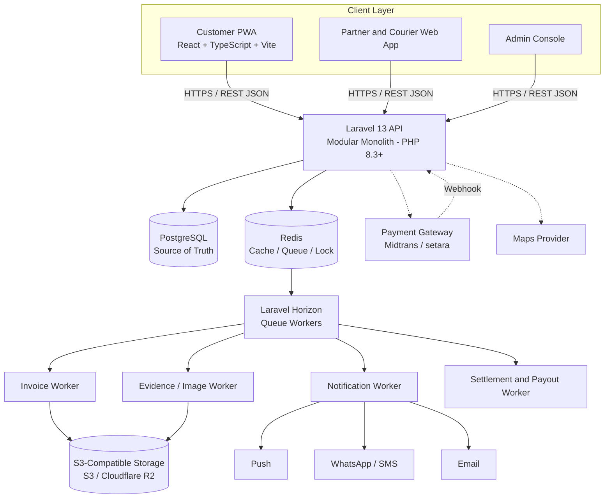
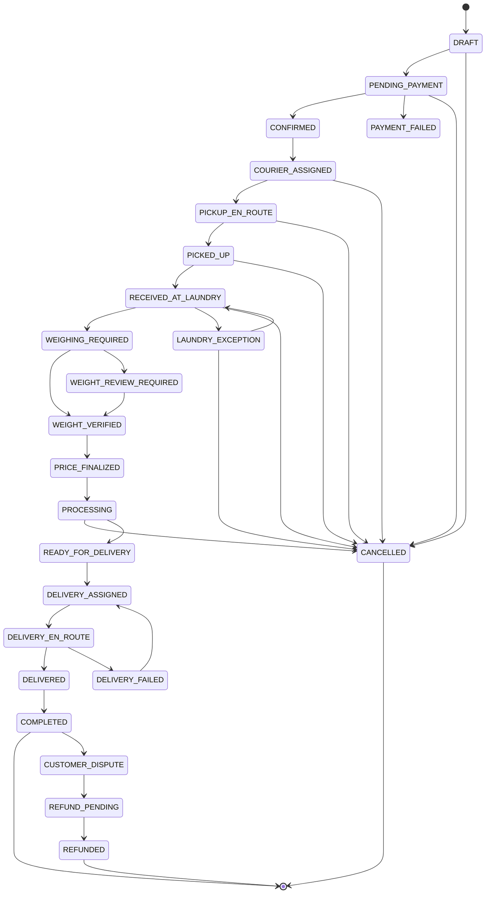
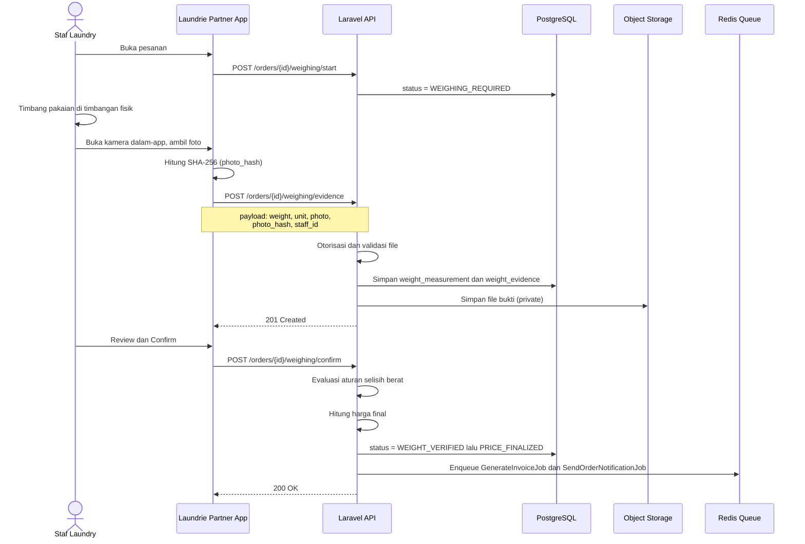
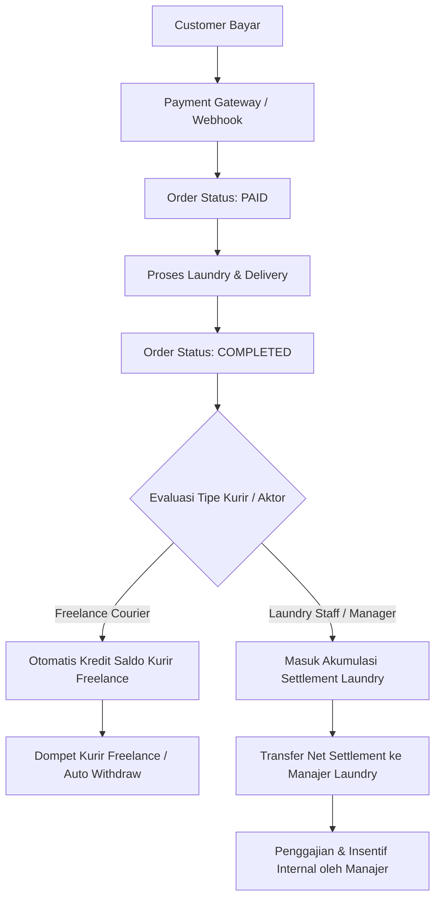
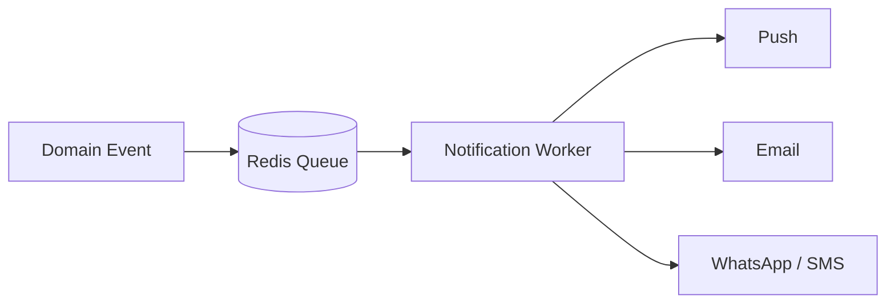

# Architecture Document — Laundrie

| | |
|---|---|
| **Produk** | Laundrie — Penjemputan, Pengantaran & Marketplace Laundry |
| **Diturunkan dari** | PRD Laundrie v3.1 (22 Agustus 2026) |
| **Versi dokumen** | 2.2 — Profil onboarding, lowongan Staff, lamaran Staff/Courier |
| **Status** | Living document — perbarui setiap ada keputusan arsitektur baru |
| **Gaya arsitektur** | Modular Monolith |
| **Terakhir diperbarui** | 23 Agustus 2026 |
| **Dokumen terkait** | `PRD.md` (apa & kenapa) · `schema.md` (bentuk data — sumber tunggal) · `Design.md` (tampilan & UX) · `Rules.md` (rambu AI/engineering) |

> **Catatan reorganisasi.** Dokumen ini menata ulang architecture.md v1.0 mengikuti prinsip *satu domain, satu sumber kebenaran*: seluruh definisi kolom tabel (dulu di §7.3) dipindahkan sepenuhnya ke `schema.md`. Bagian ini hanya menyimpan ringkasan entitas dan ERD — untuk nama kolom, tipe, nullable, default, dan enum, **selalu rujuk `schema.md`**, jangan diketik ulang di sini agar tidak ada dua sumber yang bisa saling bertentangan.

## Cara Membaca Dokumen Ini

PRD menjelaskan **apa** yang harus dibangun dan **mengapa**. Dokumen ini menerjemahkannya menjadi **bagaimana** sistem disusun secara teknis: komponen, batas domain, kontrak API, dan keputusan non-fungsional. Struktur tabel detail ada di `schema.md`; daftar layar UI ada di `Design.md`; rencana tim dan KPI bisnis ada di `PRD.md`.

## Daftar Isi

1. Ringkasan Sistem
2. Prinsip dan Batasan Arsitektur
3. Aktor dan System Context
4. Keputusan Teknologi
5. Diagram Arsitektur Tingkat Tinggi
6. Modular Monolith: Batas Domain
7. Ringkasan Entitas Data (detail di `schema.md`)
8. Order Lifecycle (State Machine)
9. Arsitektur API
10. Subsistem Bukti Berat (Trust Layer)
11. Object Storage dan Media
12. Arsitektur Pembayaran
13. Arsitektur Notifikasi
14. Background Processing
15. Autentikasi dan Otorisasi
16. Keamanan
17. Non-Functional Requirements
18. Strategi Pengujian
19. Struktur Repository dan Deployment
20. Evolusi Arsitektur Masa Depan
21. Risiko Teknis dan Mitigasi
22. Referensi

---

## 1. Ringkasan Sistem

Laundrie adalah platform orkestrasi tiga pihak (pelanggan, laundry laundry, kurir) yang meniru kemudahan model pesan-antar makanan, dengan satu pembeda utama: **setiap pesanan berbasis berat harus memiliki bukti foto penimbangan yang tidak dapat diubah** sebelum harga difinalisasi.

Secara arsitektur, sistem ini adalah:

- **Satu backend Laravel** yang diorganisasi per-domain (bukan per-microservice).
- **Satu database transaksional (PostgreSQL)** sebagai source of truth — struktur lengkap di `schema.md`.
- **Redis** untuk queue, cache, dan lock — bukan sumber kebenaran bisnis.
- **Object storage S3-compatible** untuk semua media (bukti, invoice, dokumen).
- Frontend **React/TypeScript/Vite** sebagai PWA untuk pelanggan, dan aplikasi web yang sama untuk laundry/kurir.

Kompleksitas terbesar bukan pada teknologi, tapi pada **menjaga integritas alur operasional**: order → dispatch → pickup → intake → weighing evidence → price finalization → processing → delivery → completion, dengan audit trail penuh di setiap langkah.

---

## 2. Prinsip dan Batasan Arsitektur

### 2.1 Prinsip

| Prinsip | Implikasi Teknis |
|---|---|
| **Monolith-first, extract when proven** | Satu Laravel app dengan batas domain jelas (Bagian 6); ekstraksi ke service terpisah hanya setelah ada bottleneck yang terukur. |
| **Evidence over assertion** | Fakta operasional kritis (berat, pickup, delivery) wajib punya catatan sistem + bukti, bukan sekadar status flag. |
| **Riwayat immutable** | Status pesanan dan bukti yang sudah dikonfirmasi bersifat append-only; koreksi = record baru + invalidasi record lama, bukan overwrite. |
| **Boring technology di core** | Redis, bukan Kafka. Laravel, bukan Go. Sampai data skala membuktikan sebaliknya. |
| **Server adalah otoritas** | Otorisasi, finalisasi harga, dan status pembayaran selalu ditegakkan di server. Tampilan sukses di client tidak pernah jadi source of truth. |
| **Mobile-first untuk permukaan operasional** | Checkout pelanggan, layar penimbangan laundry, dan alur kurir dirancang untuk layar HP dan minim mengetik. |
| **Trust adalah infrastruktur** | Audit trail, hashing, dan timestamp adalah bagian dari desain sistem inti, bukan tooling admin tambahan belakangan. |

### 2.2 Di Luar Cakupan Arsitektur MVP

Komponen berikut secara sengaja **tidak** dirancang di MVP ini, dan tidak boleh diam-diam masuk lewat "sekalian aja" (lihat `Rules.md` §2):

- Dekomposisi microservices penuh / Kafka event streaming
- Service Go untuk dispatch/tracking (lihat Bagian 20 untuk kondisi pemicunya)
- Optimasi rute real-time / algoritma dispatch lanjutan
- Integrasi timbangan digital (Bluetooth/USB/networked API)
- Machine learning untuk pricing atau deteksi fraud
- Multi-region / multi-currency / multi-tax-jurisdiction
- Warehouse management penuh, robotic automation, deteksi kerusakan/bahan otomatis

---

## 3. Aktor dan System Context

| Aktor | Interaksi Utama dengan Sistem |
|---|---|
| Customer | Browse, order, pay, track, review, complain |
| Laundry Manager / Owner | User pada `laundries.user_id`; otomatis Manager dan memiliki semua kemampuan Staff + kemampuan manajerial |
| Laundry Staff | User yang ditambahkan Manager ke laundry; semua staff memiliki pekerjaan operasional umum yang sama |
| Laundry Staff Courier | Manager/Staff yang memiliki profil `courier_type = laundry_staff` pada laundry tersebut |
| Freelance Courier | User dengan profil `courier_type = freelance`; tidak terikat laundry tertentu |
| Operations Admin | Kelola order, laundry, courier, sengketa |
| Finance Admin | Payment, refund, settlement, rekonsiliasi |
| Super Admin | Konfigurasi dan keamanan tingkat sistem |

Otorisasi untuk seluruh aktor **wajib ditegakkan di server**; menyembunyikan elemen UI di frontend bukan kontrol keamanan.

### 3.1 Model Ownership, Staff, dan Courier

- `laundries.user_id` adalah **Owner sekaligus Manager otomatis**.
- Owner/Manager tidak perlu dibuat sebagai row `staff`.
- Manager memiliki **semua kemampuan operasional Staff**.
- Manager dapat menambahkan atau mengaitkan akun `users` lain sebagai Staff pada laundry miliknya.
- Semua Staff menggunakan `staff.role = STAFF`; role tidak membedakan penerimaan dan pemrosesan.
- Staff memiliki kemampuan operasional umum yang sama dan tidak memiliki kemampuan manajerial.
- Kemampuan manajerial minimal meliputi pengelolaan Staff, layanan, harga, profil/konfigurasi laundry, dan laporan yang diizinkan produk.
- Hanya Manager/Owner yang boleh membuat atau mengubah harga. Server wajib menolak mutation harga dari Staff.
- Manager atau Staff dapat memiliki profil Courier `courier_type = laundry_staff` menggunakan akun user yang sama.
- Freelance Courier memiliki `courier_type = freelance` dan `laundry_id = NULL`.


### 3.2 Onboarding dari Profil User

Profil user menjadi pusat entry point role tambahan. User yang belum memiliki laundry/staff/courier dapat memilih:

```text
Profil
├── Buat Laundry
├── Gabung sebagai Staff
└── Daftar sebagai Courier
    ├── Freelance
    └── Staff Laundry
```

Aturan:
- `Buat Laundry` membuat/menyelesaikan onboarding `laundries`; setelah laundry dimiliki, `laundries.user_id` otomatis menjadi Owner/Manager.
- `Gabung sebagai Staff` tidak langsung membuat row `staff`; user memilih lowongan `staff_openings`, membuat `staff_applications`, lalu Manager laundry menerima/menolak. Setelah diterima, sistem membuat membership `staff.role = STAFF`.
- Discovery Staff menampilkan lowongan dengan `status = OPEN` dan dapat juga menampilkan laundry yang mempunyai indikasi kebutuhan staff berbasis metrik agregat operasional. Metrik kebutuhan tidak boleh dibuat sebagai status database baru.
- `Daftar sebagai Courier → Freelance` membuat/menyelesaikan profil `couriers` dengan `courier_type = freelance`, `laundry_id = NULL`, kemudian melalui verifikasi.
- `Daftar sebagai Courier → Staff Laundry` menampilkan lowongan yang menerima kandidat `staff_courier`. User melamar melalui `staff_applications.application_type = staff_courier`; setelah accepted, sistem membuat membership Staff dan profil courier laundry setelah data courier/verifikasi lengkap.
- User yang sudah Staff dapat mengaktifkan profil courier laundry melalui flow Manager atau flow profil yang dibatasi pada laundry tempat user menjadi Staff.
- Satu user dapat menjadi Customer, Staff, dan Courier sekaligus. Satu akun tidak perlu diduplikasi.


**Sistem eksternal:**

| Sistem | Peran |
|---|---|
| Payment gateway (Midtrans atau setara) | Memproses pembayaran, mengirim webhook status |
| Maps provider (Google Maps/Mapbox atau setara) | Geocoding alamat, kalkulasi jarak untuk pricing/dispatch |
| Push notification provider | Notifikasi in-app/mobile |
| WhatsApp/SMS gateway | Notifikasi operasional kritis |
| Email provider | Invoice, struk, notifikasi non-urgent |
| Object storage (S3/R2) | Penyimpanan bukti, invoice, dokumen laundry |

---

## 4. Keputusan Teknologi

| Layer | Keputusan MVP | Alasan |
|---|---|---|
| Frontend / PWA | React + TypeScript + Vite | Pengembangan cepat, mobile-first, satu codebase untuk customer/laundry/courier UI |
| State management | Ringan, sesuai kebutuhan (lihat `Rules.md` §6) | Hindari kompleksitas state management berat di MVP |
| Styling | Tailwind CSS | Konsisten dengan `Design.md`, cepat untuk UI operasional |
| Backend | Laravel 13 / PHP 8.3+ | Application framework matang, delivery MVP cepat: auth, ORM, queue, validation sudah tersedia |
| Arsitektur backend | Modular monolith | Deployment sederhana, batas domain jelas, siap diekstrak nanti |
| Auth | Laravel Sanctum | Cocok untuk pola SPA + PWA + mobile client berbasis token |
| Database | PostgreSQL | Integritas transaksi, relasi matang, JSONB untuk metadata fleksibel |
| Queue & cache | Redis + Laravel Horizon | Cukup untuk volume MVP, visibilitas queue operasional |
| Object storage | S3-compatible (S3 / Cloudflare R2) | Media dan invoice tahan lama, terpisah dari database |
| Payment | Midtrans atau setara | Integrasi pembayaran lokal Indonesia |
| Maps | Google Maps / Mapbox atau setara | Alamat dan kalkulasi jarak operasional |
| Realtime | WebSocket — nanti | Hanya jika kebutuhan operasional terbukti (mis. live tracking kurir) |
| Go | Kandidat service khusus masa depan | Diperkenalkan setelah kebutuhan scaling terukur (Bagian 20) |
| Kafka | Event streaming masa depan | Hanya setelah kebutuhan event terdistribusi nyata (Bagian 20) |

---

## 5. Diagram Arsitektur Tingkat Tinggi



Poin penting dari diagram ini:

- Semua client (customer, laundry, courier, admin) berbicara ke **satu** REST API — tidak ada BFF terpisah per client di MVP.
- Redis **tidak pernah** menjadi tempat penyimpanan permanen data pesanan/pembayaran — hanya cache, queue, dan lock.
- Semua proses berat (generate invoice PDF, proses gambar bukti, kirim notifikasi, hitung settlement) berjalan **asynchronous** lewat queue worker, supaya request pelanggan tidak tertahan.

---

## 6. Modular Monolith: Batas Domain

Kode backend diorganisasi per-domain, bukan satu folder `controllers/` raksasa:

```
app/Domain/
  Auth/
  Customer/
  Laundry/
  Courier/
  Order/
  Pricing/
  Weighing/
  Evidence/
  Payment/
  Invoice/
  Notification/
  Complaint/
  Settlement/
  Admin/
```

| Domain | Tanggung Jawab |
|---|---|
| Auth | Autentikasi dan manajemen sesi/token lintas semua tipe aktor |
| Customer | Profil pelanggan, alamat, preferensi notifikasi |
| Laundry | Onboarding/verifikasi laundry, layanan, manajemen Staff, dan pengelolaan owner/Staff access |
| Courier | Onboarding/verifikasi courier, profil `laundry_staff`/`freelance`, ketersediaan, dispatch eligibility |
| Order | Siklus hidup pesanan, state machine, order item |
| Pricing | Kalkulasi harga estimasi/final, katalog layanan dan harga |
| Weighing | Alur penimbangan, pencatatan berat estimasi vs aktual |
| Evidence | Penyimpanan dan validasi bukti foto, hashing, immutability |
| Payment | Integrasi payment gateway, webhook, status pembayaran, refund |
| Invoice | Pembuatan invoice, penomoran, agregasi data final |
| Notification | Orkestrasi notifikasi lintas channel |
| Complaint | Alur komplain dan sengketa pelanggan |
| Settlement | Perhitungan payout laundry dan kurir |
| Admin | Tooling operasional lintas-domain: override, investigasi, konfigurasi |

Batas domain ini yang membuat ekstraksi ke service terpisah (Bagian 20) memungkinkan di masa depan **tanpa** memaksa microservices sejak hari pertama — setiap domain sudah punya boundary logis, tinggal dipindah jika perlu.

### 6.1 Alur Request per Layer

Setiap domain mengikuti alur yang sama, dari request masuk sampai response keluar:

```
Route (routes/api.php, per domain)
  → Form Request (validasi input — Rules.md §3)
    → Controller (tipis: terima request, panggil service, bentuk response)
      → Policy (otorisasi — Bagian 15.3, ditegakkan sebelum service dipanggil)
        → Service/Action class (logika bisnis domain, mis. WeighingService, PricingService)
          → Eloquent Model (akses data, lihat schema.md untuk struktur)
        ← Event/Job di-dispatch ke queue untuk proses async (Bagian 14)
      ← Response di-serialize via API Resource (bentuk JSON konsisten)
```

- **Route** hanya mendaftarkan endpoint dan middleware (auth, rate limit) — tidak ada logika di sini.
- **Controller** tidak boleh berisi query Eloquent langsung atau aturan bisnis — itu tanggung jawab **Service/Action class** di dalam domain terkait (`app/Domain/<Domain>/Actions/` atau `Services/`).
- **Model** hanya untuk relasi, accessor/mutator, dan scope query — bukan tempat aturan bisnis kompleks.
- Untuk operasi yang melibatkan proses berat (generate invoice, kirim notifikasi, proses gambar), Controller/Service men-dispatch **Job** ke queue (Bagian 14) alih-alih memprosesnya sinkron dalam request.
- Frontend (React/TS) mengikuti pola serupa per fitur: `api/` (panggilan HTTP) → `hooks/` (state & side-effect, mis. `useOrderStatus()`) → komponen (murni presentasi) — lihat struktur folder di Bagian 19.

---

## 7. Ringkasan Entitas Data

> **Struktur lengkap (kolom, tipe, nullable, default, enum, index) ada di `schema.md` — jangan diduplikasi di sini.** Bagian ini hanya peta domain-ke-tabel dan ERD tingkat tinggi supaya arsitektur dan data tetap terhubung secara naratif.

| Entitas | Domain Pemilik | Lihat detail |
|---|---|---|
| `users`, `customers`, `staff`, `staff_openings`, `staff_applications`, `couriers`, `admin_users` | Auth / Customer / Laundry / Courier / Admin | `schema.md` §4.1–4.6, §4.27 |
| `laundries`, `services`, `service_prices` | Laundry | `schema.md` §4.7–4.9 |
| `addresses` | Customer (khusus — alamat operasional laundry disimpan tersendiri di `laundries`, terpisah dari alamat pribadi manajer) | `schema.md` §4.10 |
| `orders`, `order_items`, `order_status_histories` | Order | `schema.md` §4.11–4.13 |
| `weight_measurements`, `weight_evidences` | Weighing / Evidence | `schema.md` §4.14–4.15 |
| `payments`, `refunds`, `invoices`, `settlements` | Payment / Invoice / Settlement | `schema.md` §4.16–4.19 |
| `courier_jobs` | Courier | `schema.md` §4.20 |
| `complaints`, `dispute_evidence`, `reviews`, `notifications` | Complaint / Notification | `schema.md` §4.21–4.24 |
| `audit_logs`, `admin_users` | Admin/Platform | `schema.md` §4.25, §4.27 |
| `verification_documents` | Laundry / Courier | `schema.md` §4.26 |

### 7.1 Relasi User dan Laundry

Arsitektur mengikuti `schema.md` versi terbaru: `branches` tidak lagi menjadi domain atau entitas terpisah. `partners` juga tidak digunakan; konsep mitra direpresentasikan langsung oleh `laundries`.

Relasi kepemilikan utama:

```text
USER 0..1 ───────── 1 LAUNDRY
```

Aturan implementasi:
- Satu `user` dapat memiliki **0 atau 1 laundry**.
- Setiap `laundry` wajib memiliki **1 user pemilik**.
- `laundries.user_id` harus `NOT NULL` dan `UNIQUE`.
- Semua data operasional yang sebelumnya bergantung pada `branch_id` sekarang menggunakan `laundry_id`.
- `services`, `service_prices`, `staff`, `orders`, `weight_measurements`, `weight_evidences`, `settlements`, dan proses operasional lain mengacu langsung ke `laundries`.
- Tidak ada `BranchService`, `BranchPolicy`, atau repository/service khusus `Branch` di application layer.

Contoh boundary ownership:

```text
User
 └── Laundry (optional, max 1)
      ├── Services
      ├── Service Prices
      ├── Staff
      ├── Orders
      ├── Weight Measurements
      ├── Weight Evidences
      └── Settlements
```

### ERD Tingkat Tinggi

> **Perbaikan R5 (audit dokumentasi 22 Agu 2026).** Diagram ERD sebelumnya disalin ulang identik di sini dan di `schema.md` §2 — dua sumber yang berpotensi drift (dan sudah mulai terjadi di tabel Hak Akses, lihat §15.1). Mengikuti prinsip *satu domain, satu sumber kebenaran* yang sudah dipakai untuk kolom tabel, ERD sekarang **hanya ada di `schema.md` §2** (sumber tunggal struktur data). **Lihat ERD lengkap di `schema.md` §2** — sudah termasuk entitas `VERIFICATION_DOCUMENT` (K3) dan sudah mencerminkan bahwa `BRANCH` tidak lagi terhubung ke `ADDRESS` (K2).

`orders.actual_weight` boleh didenormalisasi dari `weight_measurements` untuk kemudahan query, tetapi penulisannya wajib lewat domain Weighing agar tidak ada dua source of truth yang bisa berbeda nilai (lihat `Rules.md` §3).

---

## 8. Order Lifecycle (State Machine)

### 8.1 Diagram Status



> Nilai status yang sah didaftarkan di `schema.md` §5. Diagram ini adalah **aturan transisi** (bukan sekadar daftar nilai) — sumber tunggal untuk state machine ada di sini, bukan di schema.md.
>
> **Perbaikan K1 (audit dokumentasi 22 Agu 2026).** Sebelumnya diagram ini hanya punya edge `CANCELLED` dari `DRAFT` dan `PENDING_PAYMENT`, padahal kebijakan bisnis di §8.3/`PRD.md` §12 eksplisit mengizinkan pembatalan (berbayar/dengan kebijakan operasional) setelah kurir ditugaskan sampai processing dimulai. Backend yang dibangun sesuai diagram lama akan **menolak** pembatalan yang seharusnya diizinkan. Edge `→ CANCELLED` ditambahkan dari `COURIER_ASSIGNED`, `PICKUP_EN_ROUTE`, `PICKED_UP`, `RECEIVED_AT_LAUNDRY`, dan `PROCESSING`, plus dua jalur keluar untuk `LAUNDRY_EXCEPTION` yang sebelumnya buntu (lihat §8.3 untuk aturan tiap edge).

### 8.2 Aturan Transisi

Backend **wajib** menegakkan transisi valid — ini bukan validasi UI:

- `PROCESSING → COMPLETED` tidak boleh terjadi tanpa event delivery yang diperlukan.
- `RECEIVED_AT_LAUNDRY → PROCESSING` tidak boleh terjadi untuk layanan berbasis berat sampai bukti penimbangan dikonfirmasi — **kecuali** override admin, yang harus tercatat eksplisit di `audit_logs`.
- `PROCESSING → CANCELLED` **hanya** lewat override admin/support (kebijakan §8.3), tercatat eksplisit di `audit_logs` dan `order_status_histories.reason` — bukan tombol swalayan pelanggan.
- `LAUNDRY_EXCEPTION → RECEIVED_AT_LAUNDRY` dipakai ketika pengecualian terselesaikan secara operasional (mis. staf salah scan order) dan alur kembali normal. `LAUNDRY_EXCEPTION → CANCELLED` dipakai ketika pengecualian tidak dapat diselesaikan (mis. paket rusak/hilang di gudang laundry). Kedua transisi wajib mengisi `order_status_histories.reason`.
- Setiap transisi menulis satu baris ke `order_status_histories` (`schema.md` §4.13), bukan hanya meng-update kolom `status`.

### 8.3 Aturan Pembatalan

> **Perbaikan R5 (audit dokumentasi 22 Agu 2026).** Tabel kebijakan pembatalan sebelumnya disalin identik di sini dan di `PRD.md` §12 — dua sumber yang bisa saling drift. **`PRD.md` §12 adalah sumber tunggal** untuk kebijakan bisnisnya (kapan boleh, kapan berbayar); bagian ini hanya memetakan kebijakan itu ke implementasi teknis:

| Fase | Kebijakan Bisnis (`PRD.md` §12) | Edge State Machine (§8.1) |
|---|---|---|
| Sebelum kurir ditugaskan | Pelanggan bebas membatalkan | `DRAFT`/`PENDING_PAYMENT` → `CANCELLED` |
| Setelah dispatch pickup | Bisa dikenai biaya | `COURIER_ASSIGNED`/`PICKUP_EN_ROUTE`/`PICKED_UP` → `CANCELLED` |
| Setelah laundry menerima pakaian | Perlu kebijakan operasional (refund parsial dsb.) | `RECEIVED_AT_LAUNDRY`/`PARTNER_EXCEPTION` → `CANCELLED` |
| Setelah processing dimulai | Umumnya tidak diizinkan kecuali via admin/support | `PROCESSING` → `CANCELLED` (wajib override admin, lihat §8.2) |

Biaya pembatalan **tidak** disimpan sebagai kolom terpisah atau status baru (mis. bukan `CANCELLED_WITH_FEE`) — dicatat di `order_status_histories.metadata` pada baris transisi tersebut (lihat `schema.md` §4.13). Aturan ini harus dapat dikonfigurasi (bukan hardcode di kode aplikasi).

### 8.4 Model Courier dan Dispatch (MVP)

Laundrie mendukung dua tipe Courier:

1. `laundry_staff` — Manager/Staff aktif dari laundry tertentu yang memiliki profil courier dan `laundry_id` sesuai laundry.
2. `freelance` — courier platform yang tidak terikat pada laundry (`laundry_id = NULL`).

Satu user dapat menjadi Manager/Staff sekaligus Courier dengan akun yang sama.

Penugasan courier MVP memakai aturan sederhana, bukan optimizer:

```
kandidat = courier yang memenuhi syarat availability
        DAN service_area mencakup lokasi pickup/delivery
        DAN job aktif saat ini < kapasitas
        DAN (courier_type = freelance
             ATAU courier.laundry_id = order.laundry_id)

dispatch policy kemudian menentukan urutan kandidat:
1. laundry_staff dari laundry order, bila policy mengutamakannya
2. freelance courier
3. jarak perkiraan
```

Urutan `laundry_staff` vs `freelance` adalah dispatch policy, bukan hardcode state machine. Policy dapat dikonfigurasi tanpa mengubah histori courier job yang sudah ditugaskan.

Optimasi rute/batching lanjutan sengaja ditunda sampai volume transaksi membenarkannya (lihat Bagian 20).

---

## 9. Arsitektur API

### 9.1 Konvensi

- RESTful, JSON, di-versi sejak awal: `/api/v1/...`
- Autentikasi via Bearer token (Sanctum); role/permission dicek di setiap endpoint melalui policy (Bagian 15).
- Endpoint list wajib pagination (Bagian 17, `Rules.md` §2).
- Endpoint kritis wajib idempotent terhadap request duplikat (Bagian 14.3).

### 9.2.x Profile / Recruitment API

Kontrak endpoint tingkat tinggi:

```text
GET    /api/v1/profile/options
POST   /api/v1/profile/laundry
GET    /api/v1/staff-openings
POST   /api/v1/staff-openings/{openingId}/apply
GET    /api/v1/me/staff-applications
POST   /api/v1/staff-applications/{applicationId}/withdraw
POST   /api/v1/profile/courier/freelance
POST   /api/v1/profile/courier/staff
```

Manager-only:

```text
POST   /api/v1/laundry/staff-openings
PATCH  /api/v1/laundry/staff-openings/{openingId}
POST   /api/v1/laundry/staff-openings/{openingId}/close
GET    /api/v1/laundry/staff-applications
POST   /api/v1/laundry/staff-applications/{applicationId}/accept
POST   /api/v1/laundry/staff-applications/{applicationId}/reject
```

Nama endpoint adalah kontrak arsitektur tingkat tinggi; implementasi final harus mengikuti convention route repository dan policy.

### 9.2 Route Groups

```
/api/v1/auth
/api/v1/customers
/api/v1/laundries
/api/v1/laundries
/api/v1/services
/api/v1/orders
/api/v1/payments
/api/v1/courier
/api/v1/evidence
/api/v1/invoices
/api/v1/complaints
/api/v1/admin
```

### 9.2.1 Endpoint API Admin Portal (`/api/v1/admin/*`)

Seluruh endpoint Admin dilindungi oleh middleware `auth:sanctum` dan policy RBAC spesifik (`OperationsAdminPolicy`, `FinanceAdminPolicy`, `SuperAdminPolicy`):

```text
POST   /api/v1/admin/auth/login                       → Auth login khusus admin portal
GET    /api/v1/admin/dashboard                        → Analytics & KPI platform real-time
GET    /api/v1/admin/orders                           → Monitoring seluruh pesanan platform
POST   /api/v1/admin/orders/{id}/override             → Manual override status order (wajib reason)
GET    /api/v1/admin/laundries                        → Monitoring & daftar laundry mitra
POST   /api/v1/admin/laundries/{id}/verify            → Perubahan status laundry (VERIFIED/REJECTED/SUSPENDED)
GET    /api/v1/admin/couriers                         → Monitoring & daftar kurir platform
POST   /api/v1/admin/couriers/{id}/verify             → Perubahan status kurir (VERIFIED/REJECTED/SUSPENDED)
POST   /api/v1/admin/verification-documents/{id}/review → Persetujuan/penolakan dokumen verifikasi
GET    /api/v1/admin/evidence/anomalies               → Monitoring kepatuhan & anomali bukti penimbangan
GET    /api/v1/admin/complaints                       → Manajemen sengketa & komplain pelanggan
POST   /api/v1/admin/complaints/{id}/resolve          → Keputusan arbitrase sengketa (RESOLVED/REJECTED)
GET    /api/v1/admin/payments                         → Monitoring transaksi pembayaran & webhook status
GET    /api/v1/admin/refunds                          → Peninjauan antrean permohonan refund
POST   /api/v1/admin/refunds/{id}/approve             → Persetujuan & eksekusi refund dana via gateway
GET    /api/v1/admin/settlements                      → Peninjauan kalkulasi settlement laundry
POST   /api/v1/admin/settlements/{id}/approve         → Pengesahan settlement & jadwal payout
POST   /api/v1/admin/settlements/{id}/pay             → Konfirmasi eksekusi pencairan saldo
GET    /api/v1/admin/audit-logs                       → Inspeksi jejak audit sistem (`audit_logs`)
GET    /api/v1/admin/settings                         → Pembacaan parameter dinamis platform
PUT    /api/v1/admin/settings                         → Pembaruan parameter dinamis platform (Super Admin)
GET    /api/v1/admin/users                            → Kelola daftar akun & status pengguna
PATCH  /api/v1/admin/users/{id}/role                  → Pengaturan role & privilege pengguna (Super Admin)
```

### 9.3 Contoh Alur — Pesanan

```
POST /api/v1/orders                    → order dibuat (DRAFT)
POST /api/v1/orders/{id}/confirm        → payment/confirmation → dispatch → laundry intake
```

### 9.4 Contoh Alur — Bukti Penimbangan

```
POST /api/v1/orders/{order}/weighing/start
POST /api/v1/orders/{order}/weighing/evidence
POST /api/v1/orders/{order}/weighing/confirm
GET  /api/v1/orders/{order}/weighing
```

Detail lengkap subsistem ini ada di Bagian 10.

---

## 10. Subsistem Bukti Berat (Trust Layer)

Ini adalah **bagian paling kritis** dari seluruh arsitektur — pembeda produk (bukan Kafka, bukan Go, bukan microservices) adalah alur operasional yang bisa dipercaya dengan bukti transparan. Order tidak boleh mencapai `PRICE_FINALIZED` tanpa melewati subsistem ini secara benar.

### 10.1 Skema Data

Lihat `schema.md` §4.14 (`weight_measurements`) dan §4.15 (`weight_evidences`) untuk daftar kolom lengkap. `latitude`/`longitude` hanya disimpan jika ada justifikasi hukum/operasional yang jelas (Bagian 16.3).

### 10.2 Alur Capture

Alur wajib di UI (kamera dalam-app, **bukan** upload dari galeri, untuk mengurangi reuse foto lama yang tidak relevan — ini bukan mencegah kecurangan sepenuhnya, hanya menaikkan biayanya):

```
Open order → Start weighing → Open camera → Capture photo → Preview → Confirm → Submit evidence
```



### 10.3 Immutability dan Alur Koreksi

Setelah bukti dikonfirmasi, record **tidak boleh diedit diam-diam** (lihat `Rules.md` §2). Jika terjadi kesalahan (mis. kamera terhalang), alurnya adalah membuat record baru, bukan menimpa yang lama:

```
Measurement #1 → status: SUPERSEDED
Evidence #1     → status: INVALIDATED, reason: "Camera obstructed"

Measurement #2 → status: RECORDED (baris baru, measurement_type = actual)
Evidence #2     → status: CONFIRMED (measurement_id menunjuk ke Measurement #2)
```

Kedua pasang record dipertahankan untuk keperluan audit. Field bukti kritis bersifat append-only pasca-konfirmasi (constraint aplikasi, lihat `schema.md` §4.15).

> **Perbaikan S1 (audit dokumentasi 22 Agu 2026).** Sebelumnya tidak jelas apakah Evidence #2 memakai `measurement_id` yang sama dengan Evidence #1 (yang akan melanggar kardinalitas `WEIGHT_MEASUREMENT ||--o| WEIGHT_EVIDENCE` di ERD — satu measurement maksimal satu evidence) atau membuat baris measurement baru. Diputuskan: **koreksi selalu membuat pasangan measurement+evidence baru**, bukan menumpang measurement lama. Baris `weight_measurements` lama ditandai `status = SUPERSEDED` (nilai baru, lihat `schema.md` §4.14).

### 10.4 Integritas Kriptografis dan Watermark

- Setiap file bukti di-hash dengan **SHA-256** saat capture → `photo_hash`. Ini memberi verifikasi integritas file — **bukan** bukti bahwa timbangan fisiknya sendiri akurat.
- Representasi bukti (ditampilkan ke pelanggan) diberi watermark dengan metadata dari catatan sistem — bukan teks manual dari staf (lihat contoh tampilan di `Design.md` §3).
- File asli dan versi tampilan/watermark dikelola sesuai kebijakan retensi (Bagian 16.4), disimpan terpisah dari file asli yang immutable.

### 10.5 Storage dan Akses

- File bukti disimpan di object storage **private** (S3/R2), bukan public bucket.
- Akses ke bukti asli selalu lewat **signed URL berumur pendek** setelah otorisasi Laravel — tidak ada URL publik permanen.

```
Customer/staff request evidence → Laravel authorization → Generate short-lived signed URL → Object storage
```

### 10.6 Aturan Selisih Berat

Ambang selisih dapat dikonfigurasi; nilai berikut adalah default awal, dikalibrasi ulang dari data pilot:

| Selisih dari Estimasi | Tindakan |
|---|---|
| ≤ 10% | Alur normal — finalisasi otomatis |
| > 10% | Notifikasi pelanggan |
| > 30% | Review manual / konfirmasi eksplisit pelanggan |

```
weight_difference_pct = (actual − estimated) / estimated × 100
```

> **Perbaikan S2 (audit dokumentasi 22 Agu 2026) — siapa yang "review manual".** Frasa "review manual / konfirmasi eksplisit pelanggan" sebelumnya tidak memisahkan dua aktor yang mungkin. Ditegaskan: **pelanggan selalu yang pertama diminta konfirmasi** saat selisih >30% (tombol `Konfirmasi`/`Ajukan keberatan` di `Design.md` §7.1 layar 12) — order tertahan di `WEIGHT_REVIEW_REQUIRED` sampai pelanggan merespons. **Admin masuk hanya jika pelanggan mengajukan keberatan** (menjadi komplain, lihat `Design.md` §7.4), bukan sebagai jalur review paralel untuk setiap kasus >30%. Karena itu, MVP sengaja **tidak** perlu layar admin "tinjau selisih berat pending" terpisah — cukup lewat modul Komplain yang sudah ada.

Dikelompokkan per laundry, staff, service, dan tanggal untuk kebutuhan monitoring (10.7).

### 10.7 Audit Trail, Monitoring Kepatuhan, dan Anomali

Setiap event kritis dicatat dengan aktor, timestamp, aksi, entity target, metadata, dan sumber (skema di `audit_logs`, `schema.md` §4.25).

Dashboard kepatuhan bukti operasional memantau (ditampilkan di `Design.md` §7.4 layar "Kepatuhan Bukti"):

```
Evidence Compliance Rate    = valid evidence orders / applicable orders
Weight Dispute Rate         = weight-related disputes / completed orders
Average Weight Variance     = average |actual − estimated| percentage
Evidence Invalidation Rate  = invalidated evidence / submitted evidence
```

Sinyal yang perlu ditinjau manusia (bukan tuduhan otomatis): variansi berat sangat tinggi *atau* sangat rendah secara konsisten, tingkat invalidasi bukti tinggi, kegagalan capture berulang, timestamp mencurigakan, override manual berlebihan, konsentrasi sengketa tidak wajar — disegmentasi per laundry dan staf.

### 10.8 Postur Anti-Fraud

Kontrol yang dipakai bersama-sama (tidak ada satupun yang menjamin sendirian): kamera dalam-app, hash bukti, timestamp sistem, record immutable, identitas staf, metadata perangkat, dashboard anomali, review admin, dan (masa depan) integrasi timbangan digital.

---

## 11. Object Storage dan Media

Semua media disimpan di object storage S3-compatible (S3 atau Cloudflare R2): foto penimbangan, foto kerusakan, bukti pickup/delivery, invoice PDF, dan dokumen verifikasi laundry. **Database hanya menyimpan object key dan metadata**, tidak pernah file biner besar.

Alur upload umum:

```
Mobile camera → Client-side validation → Authenticated upload →
Object storage (temporary/private) → Backend records metadata →
Hash verification → Evidence confirmation → Immutable record
```

Ketentuan keamanan upload spesifik ada di `Rules.md` §4.1. Pola signed-URL untuk bukti berat ada di Bagian 10.5 — pola yang sama berlaku untuk seluruh media privat lain.

---

## 12. Arsitektur Pembayaran

### 12.1 Prinsip Inti

Backend menyimpan payment intent/referensi, relasi order, jumlah, mata uang, status, referensi respons gateway, dan timestamp (`schema.md` §4.16). **Tampilan sukses pembayaran di client tidak pernah menjadi source of truth** — status resmi hanya berubah lewat webhook yang tervalidasi di server.

### 12.2 Status Pembayaran

```
PENDING → AUTHORIZED → PAID
        → FAILED
        → EXPIRED
PAID → REFUND_PENDING → REFUNDED / PARTIALLY_REFUNDED
```

### 12.3 Webhook

```
Payment Gateway → Webhook → Laravel →
Signature/authenticity validation → Idempotent payment update → Order state update
```

Webhook duplikat **tidak boleh** menghasilkan tagihan atau perubahan status ganda — lihat Bagian 14.3.

### 12.4 Refund

Data wajib per refund ada di `schema.md` §4.17 (`refunds`). Seluruh permintaan refund harus dapat diaudit.

### 12.5 Settlement Mitra dan Pendapatan Kurir

```text
Partner payable = Gross customer payment
                 − platform commission
                 − discounts funded by platform
                 ± delivery/platform adjustments

Courier payout  = Base delivery fee
                 + distance/zone adjustment
                 + peak bonus (jika aktif)
                 − deductions
```

Aturan settlement harus dapat dikonfigurasi **dan diberi versi**, supaya perhitungan historis tidak berubah ketika aturan baru diterapkan.

### 12.5.1 Alur Keuangan Berdasarkan Tipe Kurir & Peran

Alur pencairan pendapatan dan hak keuangan dipisahkan secara lugas berdasarkan peranan dan tipe kurir:

1. **Freelance Courier (`courier_type = freelance`):**
   - **Mekanisme:** Payout otomatis per pesanan.
   - **Pemicu (Trigger):** Segera setelah status order mencapai **`COMPLETED`** (setelah delivery sukses dan terkonfirmasi).
   - **Alur Data:** Event `OrderCompleted` memicu `CourierPayoutJob` → menghitung `Courier payout` → mengkreditkan saldo wallet/rekening pencairan Kurir Freelance.
   - **Pencairan:** Kurir Freelance dapat menarik dana (*withdraw*) secara mandiri atau via jadwal pencairan otomatis platform.

2. **Laundry Staff Courier (`courier_type = laundry_staff`) & Staff Laundry:**
   - **Mekanisme:** Tergantung Manajer Laundry (dikendalikan via Settlement Laundry).
   - **Pemicu (Trigger):** Payout per-order oleh platform **TIDAK** diberikan langsung ke rekening pribadi `laundry_staff`.
   - **Alur Data:** Seluruh pendapatan order (termasuk porsi ongkos pengantaran internal) masuk ke dalam komputasi **Settlement Laundry** (`settlements`).
   - **Penggajian / Pembagian Hasil:** Manajer Laundry menerima akumulasi Settlement Laundry secara periodik, kemudian mengalokasikan gaji, bonus, atau pembagian hasil internal kepada `laundry_staff` dan Staff Laundry sesuai kebijakan operasional masing-masing laundry. Platform tidak memotong atau mentransfer saldo otomatis ke individu `laundry_staff`.

3. **Mitra Laundry (Owner / Manager):**
   - **Mekanisme:** Pencairan settlement periodik (`settlements`).
   - **Alur Data:** Platfrom menghitung `Partner payable` untuk semua pesanan `COMPLETED` dalam satu periode (misal mingguan/dua mingguan) → mentransfer dana net ke rekening Laundry yang terverifikasi.

### 12.5.2 Diagram Alur Keuangan (Financial Flow)



---

## 13. Arsitektur Notifikasi

Channel: push notification, WhatsApp/SMS untuk event operasional kritis, email untuk invoice/struk.



Event pemicu utama meliputi: order dikonfirmasi, kurir ditugaskan/tiba, pakaian dijemput/diterima, penimbangan selesai, harga final tersedia, processing dimulai, siap diantar, delivery ditugaskan/selesai, event payment/refund, dan update sengketa.

---

## 14. Background Processing

### 14.1 Peran Redis

```
Laravel
  ├── PostgreSQL → durable business data (source of truth)
  └── Redis
       ├── Queue
       ├── Cache
       └── Lock
```

Redis **bukan** sumber kebenaran utama untuk order atau pembayaran — kalau Redis di-flush, tidak boleh ada data bisnis yang hilang, hanya job yang tertunda/di-retry.

### 14.2 Daftar Job

| Job | Tujuan |
|---|---|
| `GenerateInvoiceJob` | Generate PDF invoice pasca `PRICE_FINALIZED`, simpan ke object storage |
| `SendOrderNotificationJob` | Kirim notifikasi perubahan status order |
| `SendPaymentNotificationJob` | Kirim notifikasi event pembayaran |
| `ProcessEvidenceImageJob` | Proses gambar bukti (resize, watermark) |
| `GenerateSignedEvidenceVariantJob` | Buat varian bukti bertanda-air untuk tampilan pelanggan |
| `LaundrySettlementJob` | Hitung settlement laundry per periode |
| `CourierPayoutJob` | Hitung payout kurir per periode |
| `CleanupTemporaryUploadsJob` | Bersihkan upload sementara yang tidak dikonfirmasi |

Semua job harus **retry-able dan idempotent** — lihat 14.3.

### 14.3 Idempotensi

Endpoint dan job berikut wajib idempotent terhadap request/eksekusi duplikat, supaya retry tidak menghasilkan efek bisnis ganda (lihat `Rules.md` §3):

- Webhook pembayaran
- Konfirmasi pesanan
- Konfirmasi bukti penimbangan
- Pembuatan refund
- Aksi penugasan kurir

### 14.4 Scheduled Job

Laravel Scheduler menangani: deteksi order stale, pembayaran kedaluwarsa, pembersihan order belum dibayar, pengingat notifikasi, generasi settlement, agregasi analitik harian, dan pembersihan upload sementara.

---

## 15. Autentikasi dan Otorisasi

### 15.1 Role dan Hak Akses

| Role | Hak Akses Utama |
|---|---|
| User | Kelola profil dan dapat mengambil capability tambahan: Owner/Manager, Staff, atau Courier sesuai flow onboarding |
| Laundry Staff | Semua operasi laundry yang diperbolehkan: terima, timbang, upload bukti, proses, update status |
| Laundry Manager / Owner | Semua kemampuan Staff + kelola laundry, Staff, layanan, harga, pesanan, laporan |
| Laundry Staff Courier | Semua kemampuan Staff + Courier bila profil `laundry_staff` aktif |
| Freelance Courier | Lihat job yang ditugaskan, pickup, delivery, upload bukti, pendapatan |
| Operations Admin (`admin_users`) | Moderasi mitra/kurir, verifikasi dokumen, override order ter-audit, arbitrase sengketa (`complaints`), kepatuhan bukti penimbangan |
| Finance Admin (`admin_users`) | Monitoring transaksi pembayaran, eksekusi refund (`refunds`), pengesahan & payout settlement mitra (`settlements`), rekonsiliasi |
| Super Admin (`admin_users`) | Konfigurasi aturan dinamis platform, manajemen akses pengguna & role RBAC (`admin_users`), audit log penuh (`audit_logs`) |

**Hak akses wajib ditegakkan di server.** Menyembunyikan elemen di frontend bukan kontrol keamanan.

### 15.2 Kontrol Autentikasi

Password hashing yang aman, kedaluwarsa session/token, verifikasi email/nomor telepon jika diperlukan, MFA opsional untuk role berhak istimewa, rate limiting login, manajemen perangkat/session untuk role sensitif.

### 15.3 Otorisasi Berbasis Policy

Contoh aturan: user hanya melihat lamaran staff miliknya sendiri; Manager hanya melihat dan memutuskan lamaran untuk laundry miliknya; hanya Manager yang dapat membuka/menutup lowongan; hanya user yang belum aktif sebagai Staff pada laundry tersebut yang dapat melamar; Staff hanya mengelola order laundry tempat ia terdaftar; Manager mengelola seluruh order laundry miliknya; laundry_staff courier hanya mengakses job yang ditugaskan kepadanya dan terkait laundry-nya; freelance courier hanya mengakses job yang ditugaskan kepadanya; admin mengakses lintas platform sesuai role.

---

## 16. Keamanan

Persyaratan minimum, keamanan upload file, dan privasi/retensi data dipindahkan ke `Rules.md` §4 sebagai daftar yang mengikat langsung — bagian ini menyimpan konteks arsitekturalnya:

### 16.3 Privasi

Sistem menangani data pribadi: nama, nomor telepon, alamat, riwayat pesanan, referensi pembayaran, gambar bukti. Akses dibatasi berdasarkan role dan kebutuhan bisnis. Metadata lokasi (`latitude`/`longitude` pada evidence/address) harus opsional dan diminimalkan kecuali benar-benar diperlukan untuk fitur operasional tertentu.

### 16.4 Retensi Data

Kebijakan retensi perlu ditetapkan **sebelum go-live** untuk: invoice, foto bukti, bukti kurir, audit log, catatan pembayaran, dan komplain — mengikuti persyaratan hukum, akuntansi, kontraktual, dan operasional yang berlaku.

---

## 17. Non-Functional Requirements

### 17.1 Performa (target engineering, bukan jaminan)

Response API normal umumnya di bawah 500ms (di luar latensi provider eksternal); upload gambar asynchronous; generasi invoice tidak boleh menghambat checkout/pemesanan; endpoint list wajib pagination; query database wajib terindeks dan dipantau (lihat `schema.md` §6).

### 17.2 Ketersediaan

Environment produksi dipantau; backup otomatis; health check; monitoring queue; prosedur dasar pemulihan insiden. Investasi infrastruktur multi-region ditunda sampai bisnis benar-benar membutuhkannya.

### 17.3 Observability

Pantau: error API, kegagalan queue, kegagalan webhook pembayaran, kegagalan upload bukti, kegagalan generasi invoice, performa database, error storage, kegagalan notifikasi. Gunakan structured logging dengan request ID/order ID untuk tracing lintas layanan.

### 17.4 Idempotensi

Lihat Bagian 14.3.

---

## 18. Strategi Pengujian

| Level | Cakupan |
|---|---|
| Unit | Aturan harga, kalkulasi selisih berat, transisi status, hak akses, kalkulasi settlement |
| Feature/API | Pembuatan order, webhook payment, alur penimbangan, konfirmasi bukti, trigger invoice, alur komplain |
| Integrasi | Sandbox payment gateway, object storage, Redis queue, provider notifikasi |
| End-to-End | Alur penuh: order → payment → pickup → laundry intake → weighing evidence → processing → delivery → completion |

Aturan minimum test per jenis perubahan ada di `Rules.md` §7.

---

## 19. Struktur Repository dan Deployment

Sistem menggunakan struktur monorepo dengan **5 aplikasi frontend terpisah** sesuai role pengguna dan **1 service backend API terpadu**:

```text
laundrie/
├── apps/
│   ├── web-customer/       # Aplikasi Web/PWA khusus Customer
│   ├── web-manager/        # Dashboard Web/Desktop khusus Manager Laundry
│   ├── web-staff/          # Aplikasi Operasional PWA khusus Staff Laundry
│   ├── web-courier/        # Aplikasi PWA khusus Courier (Pickup & Delivery)
│   ├── web-admin/          # Portal Dashboard khusus Platform Admin
│   │
│   └── api/                # Unified Laravel 13 Modular Monolith API Backend
│       ├── app/
│       │   └── Domain/
│       │       ├── Auth/
│       │       ├── Customer/
│       │       ├── Laundry/
│       │       ├── Courier/
│       │       ├── Order/
│       │       ├── Pricing/
│       │       ├── Weighing/
│       │       ├── Evidence/
│       │       ├── Payment/
│       │       ├── Invoice/
│       │       ├── Notification/
│       │       ├── Complaint/
│       │       ├── Settlement/
│       │       └── Admin/
│       ├── routes/
│       └── tests/
│
├── infrastructure/
│   ├── docker/
│   └── nginx/
│
├── docs/
│   ├── PRD.md
│   ├── architecture.md    ← dokumen ini
│   ├── schema.md
│   ├── Design.md
│   └── Rules.md
│
└── README.md
```

Detail deployment (topologi container, CI/CD, environment) belum dispesifikasikan selain penyediaan folder `infrastructure/docker/` dan `infrastructure/nginx/` — runbook operasional sebaiknya disusun terpisah begitu keputusan itu diambil.

---

## 20. Evolusi Arsitektur Masa Depan

### 20.1 Kenapa Bukan Kafka di MVP

Kafka relevan ketika platform butuh event streaming durable berskala besar lintas banyak service dan consumer independen. Untuk MVP, Kafka hanya menambah beban operasional (cluster, topic, consumer, monitoring, deployment) tanpa masalah bisnis yang membenarkannya. Pemicu untuk mempertimbangkannya kembali:

```
Multiple independent services
+ high event volume
+ replayable event streams
+ analytics/event consumers
+ operational need for distributed event architecture
```

### 20.2 Kenapa Bukan Go untuk Backend MVP

Go kuat untuk service concurrent, tapi memakainya sebagai seluruh backend MVP berarti membangun ulang infrastruktur aplikasi yang sudah disediakan Laravel (auth, CRUD, validasi, ORM, queue, notifikasi, scheduled task). Prioritas MVP adalah memvalidasi bisnis, meluncurkan alur operasional, dan mengumpulkan data — bukan memaksimalkan concurrency yang belum terbukti dibutuhkan.

### 20.3 Kandidat Service Go Masa Depan

1. Dispatch kurir
2. Pemrosesan lokasi real-time
3. Optimasi rute
4. Gateway tracking volume tinggi
5. Worker pemrosesan gambar (jika beban CPU meningkat)

```
Laravel → Dispatch API/Event → Go Dispatch Service →
Courier availability → Location/route calculations
```

Batas service baru dibuat berdasarkan **masalah scaling yang nyata**, bukan preferensi teknologi.

### 20.4 Realtime

WebSocket ditunda sampai kebutuhan operasional terbukti (mis. live tracking kurir pada volume tinggi) — bukan default MVP.

### 20.5 Integrasi Timbangan Digital

```
Digital Scale → Weight reading → Laundrie app → Verified measurement → Evidence capture
```

Ini mengurangi input manual dan meningkatkan integritas pengukuran — pelengkap, bukan pengganti, subsistem bukti di Bagian 10.

---

## 21. Risiko Teknis dan Mitigasi

| Risiko | Mitigasi Arsitektur |
|---|---|
| Bukti berat menambah friksi operasional bagi staf | Alur kamera satu-ketukan, metadata otomatis, minim mengetik, integrasi timbangan digital di masa depan (20.5) |
| Fraud tetap mungkin terjadi meski ada kontrol | Kombinasi evidence + audit trail + monitoring anomali (10.7–10.8); bukan solusi tunggal |
| Engineering menjadi terlalu kompleks terlalu dini | Modular monolith, Redis alih-alih Kafka, Laravel alih-alih Go prematur; ekstraksi service hanya setelah kebutuhan terukur (Bagian 20) |

Risiko bisnis (permintaan pasar, adopsi laundry, ekonomi kurir) dibahas di `PRD.md` §23 dan sengaja tidak diulang di sini karena bukan risiko arsitektur.

---

## 22. Riwayat Keputusan Role & Courier

- 23 Agu 2026 — `laundries.user_id` ditetapkan sebagai Owner/Manager otomatis.
- 23 Agu 2026 — `staff.role` disederhanakan menjadi `STAFF`; pekerjaan operasional tidak dipisah berdasarkan role.
- 23 Agu 2026 — Manager memiliki semua kapabilitas Staff dan tambahan kapabilitas manajerial.
- 23 Agu 2026 — Courier mendukung `laundry_staff` dan `freelance`; Staff/Manager dapat menjadi courier tanpa akun kedua.
- 23 Agu 2026 — Dispatch memperhitungkan keterikatan courier ke laundry.

---

## 22.1 Riwayat Perubahan Onboarding

- 23 Agu 2026 — Profil user ditetapkan sebagai entry point untuk membuat laundry, mencari lowongan Staff, dan mendaftar sebagai Courier.
- 23 Agu 2026 — `staff_openings` dan `staff_applications` diperkenalkan; application `staff_courier` menjadi jalur join Staff + Courier.
- 23 Agu 2026 — Discovery kebutuhan staff dapat menggunakan lowongan eksplisit dan metrik agregat; metrik agregat tidak menjadi status baru.

---

## 23. Referensi

- `PRD.md` — kenapa produk ini dibangun, fitur, KPI, fase implementasi.
- `schema.md` — struktur tabel lengkap, ERD detail, konvensi penamaan, index. **Sumber tunggal struktur data.**
- `Design.md` — prinsip visual, design tokens, komponen UI, daftar layar per aktor beserta tombol dan data yang ditampilkan.
- `Rules.md` — larangan/kewajiban eksplisit untuk AI dan tim engineering.

Dokumen ini diperbarui setiap kali ada keputusan arsitektur baru, dan ditinjau ulang setiap kali PRD naik versi.
