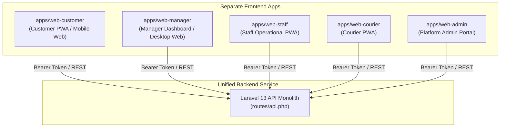

# Design.md — Laundrie

| | |
|---|---|
| **Produk** | Laundrie — Penjemputan, Pengantaran & Marketplace Laundry |
| **Versi dokumen** | 3.3 — Tambah prinsip desain, tokens lengkap, komponen, mapping state, accessibility, dari v3.1 |
| **Status** | Living document |
| **Terakhir diperbarui** | 23 Agustus 2026 |
| **Dokumen terkait** | `PRD.md` · `architecture.md` · `schema.md` · `Rules.md` |

> **Source of truth UI:** `schema.md` menentukan data, `architecture.md` menentukan state machine/authorization contract, dan Design.md menentukan bagaimana data serta aksi tersebut ditampilkan.
>
> **Aturan utama:** Design.md tidak boleh memperkenalkan tabel, field, role, status order, atau entitas yang tidak ada di `schema.md`/`architecture.md`. Jika kebutuhan UI membutuhkan data baru, keputusan tersebut harus dibuat di schema/architecture terlebih dahulu.

---

# 1. Model Role & Access

## 1.1 Model organisasi Laundry

```text
USER
 │
 ├── Customer
 │
 ├── LAUNDRY OWNER / MANAGER
 │       │
 │       └── LAUNDRY
 │             ├── Staff
 │             ├── Staff
 │             └── Staff
 │
 └── Courier
        ├── laundry_staff
        └── freelance
```

### Owner / Manager

`laundries.user_id` adalah user pemilik laundry.

User tersebut **otomatis Manager**. Tidak ada flow "tambahkan diri sebagai staff" dan tidak ada kebutuhan membuat row `staff` untuk owner.

Manager memiliki:

- seluruh kemampuan operasional Staff;
- pengelolaan Staff;
- pengelolaan layanan;
- pengelolaan harga;
- pengelolaan profil/konfigurasi laundry;
- laporan/settlement sesuai permission.

### Staff

Semua staff menggunakan:

```text
staff.role = STAFF
```

Tidak ada lagi:

```text
PENERIMAAN
PEMROSESAN
MANAJER
```

Semua Staff memiliki pekerjaan operasional umum yang sama. Role tidak menentukan apakah seseorang melakukan intake, weighing, processing, atau pekerjaan operasional lain.

Staff **tidak** memiliki kemampuan manajerial.

### Courier capability

Courier bukan role pekerjaan yang menggantikan Staff. Courier adalah profil/kapabilitas tambahan.

#### Laundry Staff Courier

```text
User
 ├── Staff @ Laundry A
 └── Courier
      └── courier_type = laundry_staff
      └── laundry_id = Laundry A
```

Manager juga boleh memiliki profil courier.

#### Freelance Courier

```text
User
 └── Courier
      └── courier_type = freelance
      └── laundry_id = NULL
```

Freelance Courier dapat menerima job dari laundry yang dipilih dispatch policy.

### 1.5 Platform Admin

Staf internal platform mengoperasikan `apps/web-admin` dan terdaftar pada entitas `admin_users` (`schema.md` §4.27):

```text
User
 └── Admin User (admin_users)
      ├── role = OPERATIONS_ADMIN
      ├── role = FINANCE_ADMIN
      └── role = SUPER_ADMIN
```

- **Operations Admin (`OPERATIONS_ADMIN`)**: Moderasi mitra & kurir, review dokumen verifikasi, manual override order ter-audit, arbitrase sengketa (`complaints`), pengawasan kepatuhan bukti penimbangan.
- **Finance Admin (`FINANCE_ADMIN`)**: Monitoring transaksi pembayaran, persetujuan & eksekusi refund (`refunds`), persetujuan & eksekusi payout settlement mitra (`settlements`).
- **Super Admin (`SUPER_ADMIN`)**: Konfigurasi parameter dinamis platform, manajemen hak akses pengguna (RBAC), inspeksi audit log penuh (`audit_logs`).

---

# 2. Permission Matrix

## 2.1 Laundry & Logistics Operations Matrix

| Fitur | Manager/Owner | Staff | Staff Courier | Freelance Courier |
|---|:---:|:---:|:---:|:---:|
| Dashboard laundry | ✓ | ✓ | ✓ | — |
| Lihat order laundry | ✓ | ✓ | ✓ | job yang ditugaskan |
| Terima order | ✓ | ✓ | ✓ | — |
| Weighing | ✓ | ✓ | ✓ | — |
| Upload weight evidence | ✓ | ✓ | ✓ | — |
| Processing | ✓ | ✓ | ✓ | — |
| Tandai siap delivery | ✓ | ✓ | ✓ | — |
| Kelola Staff | ✓ | — | — | — |
| Tambah Staff | ✓ | — | — | — |
| Nonaktifkan Staff | ✓ | — | — | — |
| Kelola layanan | ✓ | — | — | — |
| Tambah layanan | ✓ | — | — | — |
| Ubah harga | ✓ | — | — | — |
| Lihat histori harga | ✓ | read-only bila diperlukan | read-only bila diperlukan | — |
| Edit profil laundry | ✓ | — | — | — |
| Settlement laundry | ✓ | —/read-only | —/read-only | — |
| Pickup | bila memiliki courier profile | bila memiliki courier profile | ✓ | ✓ |
| Delivery | bila memiliki courier profile | bila memiliki courier profile | ✓ | ✓ |
| Lihat pendapatan courier | bila courier profile | bila courier profile | ✓ | ✓ |

## 2.2 Platform Admin Permission Matrix (`apps/web-admin`)

| Fitur Admin Console | Operations Admin | Finance Admin | Super Admin |
|---|:---:|:---:|:---:|
| Operational Dashboard & Analytics | ✓ | ✓ | ✓ |
| Order List & Timeline Investigation | ✓ | ✓ | ✓ |
| Manual Order State Override (Audit Log + Reason) | ✓ | — | ✓ |
| Moderasi & Verification Docs Review (Laundry & Courier) | ✓ | — | ✓ |
| Evidence Anomaly & Invalidation Audit | ✓ | — | ✓ |
| Dispute Arbitration & Complaint Resolution | ✓ | — | ✓ |
| Payment Transactions & Webhook Verification | — | ✓ | ✓ |
| Refund Approval & Gateway Execution | — | ✓ | ✓ |
| Settlement Payout Approval & Execution | — | ✓ | ✓ |
| System Audit Trail Inspection (`audit_logs`) | read-only | read-only | ✓ (Full Audit) |
| Dynamic Platform Configs & System Parameters | — | — | ✓ |
| User RBAC Assignment & Account Banning | — | — | ✓ |

> **Server-side authorization wajib menjadi enforcement.** Menyembunyikan elemen di frontend hanya meningkatkan UX.

---

# 3. Design Tokens

## 3.1 Color

| Token | Value | Usage |
|---|---|---|
| Primary | `#0E7490` | CTA utama |
| On Primary | `#FFFFFF` | teks di CTA |
| Primary Container | `#C5EAF4` | selected/chip |
| Secondary | `#4A636C` | teks sekunder |
| Surface | `#FAFDFF` | background |
| Surface Container | `#F0F9FC` | card |
| Error | `#BA1A1A` | destructive/error |
| Outline | `#6F797E` | border |
| On Surface | `#181C1E` | teks utama |

## 3.2 Typography

- Plus Jakarta Sans untuk headline dan angka utama.
- Inter untuk body/UI.
- Harga menggunakan `tabular-nums`.
- Berat selalu ditampilkan dengan unit `KG`.

## 3.3 Layout

- Mobile-first.
- Touch target minimum 48px.
- Desktop menggunakan sidebar untuk Laundry/Admin.
- Customer menggunakan bottom navigation.
- CTA operasional berada di area yang mudah dijangkau ibu jari.

---

# 4. Shared Components

## 4.1 Button

### Primary

Untuk aksi utama screen.

Contoh:

```text
Simpan
Konfirmasi
Tambah Staff
Tambah Layanan
Ubah Harga
Terima Job
Selesaikan Pickup
Selesaikan Delivery
```

### Secondary

Untuk aksi alternatif.

### Destructive

Untuk:

```text
Nonaktifkan Staff
Nonaktifkan Layanan
Suspend Courier
Cancel Order
Reject Verification
Invalidate Evidence
Refund
```

### Permission behavior

Jika user Staff membuka screen manajerial:

- idealnya route tidak tersedia;
- jika screen read-only dibutuhkan, data dapat dilihat tanpa mutation;
- tombol mutation manager tidak ditampilkan;
- backend tetap menolak mutation.

---

# 5. Customer Navigation

```text
Beranda
Pesanan
Notifikasi
Profil
```

Aksi contextual:

```text
Cari Laundry
Pilih Layanan
Checkout
Bayar
Tracking
Lihat Evidence
Invoice
Komplain
Review
```

---

# 6. Customer Screens

## 6.1 Login / Register

### Data

- email/phone
- password
- error auth

### Tombol

- `Masuk`
- `Daftar`
- `Lupa Password`
- `Tampilkan Password`

---

## 6.2 Beranda

### Data

- customer name
- avatar
- alamat default
- laundry tersedia
- order berjalan

### Laundry card

- `business_name`
- `address_line`
- `status`
- layanan tersedia
- harga aktif bila tersedia

### Order card

- `order_number`
- status UI
- estimated weight
- actual weight
- estimated total
- final total

### Tombol

- `Ganti Alamat`
- `Cari Laundry`
- `Lihat Pesanan`
- `Lihat Tracking`
- avatar → `Profil`

---

## 6.3 Search Laundry

### Data

- business name
- address
- operational status
- service
- pricing
- rating/jarak bila API menyediakan

### Tombol

- `Filter`
- `Urutkan`
- `Lihat Detail`

---

## 6.4 Detail Laundry

### Data

- business name
- legal name bila relevan
- address
- status
- operating hours
- services
- active prices
- estimated duration
- reviews bila tersedia

### Tombol

- `Pilih Layanan`
- `Lihat Ulasan`
- `Hubungi Laundry` bila kontak diizinkan

Tidak pernah menampilkan `branch`.

---

## 6.5 Service Selection

### Data

- service name
- service type
- pricing model
- active price
- minimum charge
- unit
- estimated duration

### Input

- quantity / estimated weight

### Tombol

- `Tambah`
- `Kurangi`
- `Lanjut`

---

## 6.6 Address

> **Alamat Pribadi User (Customer):** Layanan/menu ini khusus mengelola daftar alamat pribadi milik user (digunakan saat memesan sebagai customer). Alamat operasional laundry **tidak** dikelola di sini, melainkan dikelola secara terpisah pada entitas Profil Laundry (`laundries.address_line`).

### Data

- label
- recipient name
- phone
- address
- latitude/longitude
- delivery notes
- default

### Tombol

- `Pilih`
- `Tambah Alamat`
- `Edit`
- `Jadikan Default`

---

## 6.7 Pickup Scheduling

### Data

- date
- pickup start
- pickup end
- availability yang dikembalikan backend

### Tombol

- pilih slot
- `Konfirmasi Jadwal`
- `Kembali`

---

## 6.8 Checkout

### Data

- laundry
- items
- address
- estimated weight
- pickup schedule
- estimated total
- cost breakdown

### Warning

> Harga final dapat berubah setelah penerimaan dan penimbangan laundry untuk layanan berbasis berat.

### Tombol

- `Ubah Laundry`
- `Ubah Layanan`
- `Ubah Alamat`
- `Ubah Jadwal`
- `Konfirmasi & Bayar`

---

## 6.9 Payment

### Data

- amount
- provider
- provider reference bila aman
- status
- paid_at

### Tombol

- `Bayar Sekarang`
- `Pilih Metode Lain`

Payment success hanya ditampilkan setelah server mengonfirmasi status.

---

## 6.10 Tracking

### Data

- order number
- status
- schedule
- estimated/actual weight
- estimated/final total
- status timeline

### Tombol kondisional

- `Lihat Bukti Berat`
- `Lihat Invoice`
- `Hubungi Kurir`
- `Hubungi Laundry`
- `Ajukan Komplain`
- `Batalkan Pesanan`

Tombol Cancel hanya muncul bila transition diizinkan server.

---

## 6.11 Weight Evidence

### Data

- estimated weight
- actual weight
- variance
- evidence photo
- captured_at
- confirmed_at
- evidence status
- staff identity bila diizinkan

### Tombol

- `Konfirmasi`
- `Ajukan Keberatan`

Evidence `CONFIRMED` read-only.

Koreksi:

```text
Evidence lama
→ INVALIDATED
→ Evidence baru
→ CONFIRMED
```

---

## 6.12 Invoice

### Data

- invoice number
- order
- laundry
- items
- estimated/actual weight
- subtotal
- fee
- discount
- tax
- total
- payment status
- evidence

### Tombol

- `Unduh PDF`
- `Bagikan`
- `Ajukan Komplain`

---

## 6.13 Complaint

### Data

Category:

```text
weight_price
item_lost
item_damaged
late_pickup
late_delivery
quality
wrong_order
payment
```

### Tombol

- `Ajukan Komplain`
- `Tambahkan Bukti`
- `Lihat Status`

---

## 6.14 Review

Tersedia setelah `COMPLETED`.

Target:

```text
laundry
courier
```

### Tombol

- `Kirim Ulasan`
- `Lewati`

---

## 6.15 Profile

### Data

- name
- phone
- email
- avatar
- cover
- notification preferences

### Tombol

- `Edit Profil`
- `Ubah Foto Profil`
- `Ubah Foto Latar`
- `Kelola Alamat`
- `Kelola Notifikasi`
- `Keluar`

---

# 7. Laundry Application

## 7.1 Navigation

```text
Dashboard
Pesanan
Penerimaan
Penimbangan
Pemrosesan
Siap Diantar
Staff
Layanan & Harga
Settlement
Laporan
Profil
```

Menu manajerial hanya diberikan kepada Manager.

Staff tetap dapat melihat menu operasional yang memang dibutuhkan.

---

# 8. Laundry Dashboard

## 8.1 Manager Dashboard

### KPI

- order aktif
- order perlu weighing
- weight review
- processing
- ready delivery
- evidence compliance
- settlement

### Tombol

- `Pesanan`
- `Penerimaan`
- `Penimbangan`
- `Pemrosesan`
- `Staff`
- `Layanan & Harga`
- `Settlement`
- `Laporan`

Manager dapat membuka seluruh dashboard.

---

## 8.2 Staff Dashboard

Dashboard Staff berfokus pada pekerjaan operasional:

- order aktif
- weighing required
- processing
- ready delivery
- pekerjaan courier bila user memiliki profile `laundry_staff`

### Tidak ada tombol:

- `Kelola Staff`
- `Ubah Harga`
- `Kelola Layanan`
- `Konfigurasi Laundry`

---

# 9. Laundry Orders

## 9.1 Order List

### Data

- order number
- customer
- service
- status
- estimated weight
- actual weight
- estimated total
- final total
- schedule

### Filter

- status
- date
- order number
- customer
- service

### Tombol

- `Lihat Detail`

Action transition hanya muncul sesuai state machine.

---

# 10. Order Detail Laundry

### Sections

```text
Order
Customer
Order Items
Weight
Evidence
Payment
Timeline
Courier Job
```

### Tombol operational

- `Terima Pesanan`
- `Mulai Timbang`
- `Konfirmasi Berat`
- `Mulai Proses`
- `Tandai Siap Diantar`
- `Laporkan Kendala`

Tombol disediakan sesuai state server.

---

# 11. Penerimaan

### Data

- order number
- customer
- estimated weight
- schedule
- address operational

### Tombol

- `Scan / Verifikasi Order`
- `Konfirmasi Penerimaan`
- `Mulai Timbang`

Semua Staff dapat melakukan flow ini.

---

# 12. Penimbangan

### Flow

```text
Order
→ Estimated Weight
→ Input Actual
→ Camera
→ Capture
→ Preview
→ Verify
→ Submit
```

### Data

- estimated
- actual
- unit
- evidence status
- variance
- current price

### Tombol

- `Ambil Foto Timbangan`
- `Ambil Ulang`
- `Konfirmasi Berat`
- `Batal`

Semua Staff dapat melakukan weighing.

---

# 13. Processing

Tidak ada sub-status backend:

```text
SORTING
WASHING
DRYING
FOLDING
```

UI menggunakan status `PROCESSING`.

### Data

- order number
- service
- actual weight
- processing age
- exception bila ada

### Tombol

- `Tandai Siap Diantar`
- `Laporkan Kendala`
- `Lihat Detail`

Manager dan Staff dapat mengoperasikan proses.

---

# 14. Staff Management — Manager Only

## 14.1 Staff List

### Data

- name
- phone/email yang diizinkan
- status
- joined date
- courier profile status

Contoh:

```text
Andi   Aktif   Staff
Budi   Aktif   Staff • Courier
Citra  Nonaktif Staff
```

### Tombol Manager

- `Tambah Staff`
- `Lihat Detail`
- `Aktifkan`
- `Nonaktifkan`
- `Aktifkan sebagai Courier`
- `Kelola Courier`

### Staff

Tidak melihat tombol ini.

---

## 14.2 Tambah Staff

Manager memasukkan/mengundang akun user lain.

### Input

- user identifier yang didukung
- confirmation

### Tombol

- `Tambahkan Staff`
- `Batal`

Sistem membuat membership pada:

```text
staff.user_id
staff.laundry_id
staff.role = STAFF
```

Tidak ada pilihan role Penerimaan/Pemrosesan/Manager.

---

## 14.3 Staff Detail

### Data

- user name
- contact
- status
- role = STAFF
- courier profile bila tersedia
- active jobs

### Tombol Manager

- `Aktifkan`
- `Nonaktifkan`
- `Aktifkan sebagai Courier`
- `Lihat Pekerjaan Courier`

Tidak ada `Promote to Manager`, karena Owner/Manager ditentukan oleh `laundries.user_id`.

---

# 15. Staff Courier Management — Manager

Manager dapat mengaktifkan kemampuan courier untuk Staff.

## 15.1 Aktifkan Courier

### Data

- staff user
- laundry
- vehicle type
- service area
- verification requirement
- current courier status

### Tombol

- `Aktifkan sebagai Courier`
- `Batal`

Setelah berhasil:

```text
courier_type = laundry_staff
laundry_id = current laundry
```

Tidak dibuat akun `users` baru.

---

## 15.2 Courier Staff Detail

### Data

- staff name
- courier type = `laundry_staff`
- laundry
- vehicle
- service area
- availability
- verification status
- active jobs

### Tombol

- `Tersedia`
- `Tidak Tersedia`
- `Lihat Pekerjaan`
- `Nonaktifkan Profil Courier`

Staff tetap mempunyai semua fungsi Staff.

---

# 16. Layanan & Harga — Manager Only

## 16.1 Service List

### Data

- service name
- service type
- pricing model
- active price
- unit
- minimum charge
- duration
- status

### Manager buttons

- `Tambah Layanan`
- `Edit Layanan`
- `Ubah Harga`
- `Lihat Riwayat Harga`
- `Nonaktifkan`

### Staff view

Staff dapat melihat harga aktif bila dibutuhkan untuk pekerjaan, tetapi:

```text
Tambah Layanan  ❌
Edit Layanan    ❌
Ubah Harga      ❌
Nonaktifkan     ❌
```

---

## 16.2 Edit Harga

Hanya Manager.

### Data

- service
- current price
- new price
- effective date

### Tombol

- `Simpan Harga Baru`
- `Batal`

Sistem membuat row baru pada `service_prices`.

Tidak mengedit histori harga lama.

---

## 16.3 Price History

### Data

- base price
- price per unit
- minimum charge
- valid from
- valid until

### Tombol

- `Kembali`

Staff tidak membutuhkan mutation control di halaman ini.

---

# 17. Settlement Laundry

Manager only.

### Data

- period
- gross
- platform commission
- platform discount
- adjustments
- net payable
- status
- paid at

### Tombol

- `Lihat Rincian`
- `Unduh`

Staff tidak memiliki akses penuh settlement.

---

# 18. Laundry Profile

Manager only untuk mutation.

### Data

- business name
- legal name
- address (alamat operasional laundry tersendiri `laundries.address_line` — terpisah dari alamat pribadi manajer)
- latitude
- longitude
- operating hours
- capacity
- phone/email
- status

### Tombol

- `Edit Profil`
- `Unggah Dokumen`
- `Kirim Verifikasi`

Staff hanya dapat melihat data yang diperlukan untuk operasional.

---

# 19. Courier Application

Courier application memiliki dua sumber user:

```text
Laundry Staff Courier
Freelance Courier
```

Keduanya memakai domain/job yang sama.

---

# 20. Courier Availability

### Data

- name
- courier type
- laundry bila laundry_staff
- vehicle
- service area
- status

### Buttons

- `Tersedia`
- `Tidak Tersedia`

Freelance:

```text
laundry = —
type = freelance
```

Laundry staff:

```text
laundry = Laundry A
type = laundry_staff
```

---

# 21. Courier Job List

### Data

- order number
- job type
- courier type
- laundry
- address sesuai otorisasi
- schedule
- status

### Tombol

- `Lihat Detail`
- `Terima`
- `Tolak`

Status `REJECTED` tidak mengubah job lama. Dispatch membuat job baru bila perlu.

---

# 22. Courier Job Detail

### Data

- order number
- job type
- status
- laundry
- customer
- location
- recipient
- schedule
- notes

### Buttons

- `Navigasi`
- `Konfirmasi Kedatangan`
- `Verifikasi Kode`
- `Ambil Foto Bukti`
- `Selesaikan Pekerjaan`

Untuk Staff Courier, layar juga dapat menyediakan akses kembali ke order/laundry operations sesuai permission.

---

# 23. Pickup

### Flow

```text
Assigned
→ Accept
→ En Route
→ Arrive
→ Verify
→ Pickup Complete
```

### Bukti

- pickup proof photo
- timestamp
- job id

### Tombol

- `Navigasi`
- `Verifikasi Kode`
- `Ambil Foto`
- `Selesaikan Pickup`

---

# 24. Delivery

### Flow

```text
Assigned
→ En Route
→ Arrive
→ Verify Recipient
→ Delivery Complete
```

### Tombol

- `Navigasi`
- `Verifikasi Kode`
- `Ambil Foto Bukti Delivery`
- `Selesaikan Pengantaran`
- `Gagal Mengantar`

---

# 25. Freelance Courier Onboarding

## Data

- identity
- phone
- vehicle
- service area
- verification documents
- payout information

### CTA

- `Daftar sebagai Courier`
- `Unggah Dokumen`
- `Kirim Verifikasi`

Freelance tidak memiliki `laundry_id`.

---

# 26. Laundry Staff Courier Activation

Flow:

```text
Manager membuka Staff
→ pilih Staff
→ Aktifkan sebagai Courier
→ isi vehicle/service area
→ verifikasi bila required
→ Courier ACTIVE
```

Staff tidak membuat akun baru.

---

# 27. Dispatch UI / Admin

### Candidate information

Admin dapat melihat:

```text
Courier
Type:
  laundry_staff | freelance

Laundry:
  Laundry A | —

Availability
Distance
Active Jobs
Status
```

### Dispatch policy

UI tidak mengasumsikan laundry_staff selalu lebih diprioritaskan.

Policy server menentukan kandidat dan urutan.

---

# 28. Platform Admin Console (`apps/web-admin`)

Aplikasi `apps/web-admin` dirancang khusus untuk tim internal platform (Operations Admin, Finance Admin, Super Admin). Menggunakan layout desktop 12-column grid dengan sidebar navigasi terproteksi RBAC server-side.

## 28.1 Admin Navigation & Layout Structure

```text
Sidebar Navigation:
- 📊 Dashboard Operasional & Analytics
- 📦 Manajemen Pesanan & Override
- 🧺 Moderasi Laundry Mitra
- 🛵 Moderasi Kurir (Staff & Freelance)
- ⚖️ Kepatuhan Bukti & Anomali
- 🚨 Pusat Sengketa & Komplain
- 💳 Pembayaran & Pengembalian Dana (Refund)
- 💰 Settlement Laundry & Rekonsiliasi
- 📝 Jurnal Audit Log Sistem
- ⚙️ Konfigurasi Aturan & Parameter Platform
- 👥 Manajemen Pengguna & Hak Akses (RBAC)
```

Header menampilkan: Identitas Admin aktif, badge role (`Operations Admin` / `Finance Admin` / `Super Admin`), counter notifikasi antrean sengketa, dan kontrol `Keluar`.

---

## 28.2 Admin Screen 1: Dashboard Operasional & Analytics

### Data
- Active Orders Count (real-time per status)
- Pending Verification Docs (laundry & kurir baru)
- Open Complaints / Disputes Count (high priority highlighted)
- Evidence Anomaly Rate (% variansi berat >30% & invalidasi)
- Daily Platform GMV (Gross Merchandise Value)
- Total Pending Settlement Payout

### Controls & Filters
- Filter rentang waktu (Hari ini, 7 hari, 30 hari, kustom)
- Filter area operasional

### Tombol / CTA
- `Refresh Metrics`
- `Ekspor Analytics`
- `Unduh Laporan Harian`

---

## 28.3 Admin Screen 2: Orders Management & Manual Override Audit

### Data
- Tabel pesanan platform (`orders`, `laundries`, `customers`, `couriers`, status order, berat estimasi vs aktual, total biaya, timestamp)
- Timeline histori status (`order_status_histories`)
- Bukti penimbangan terkait (`weight_evidences`)

### Controls & Filters
- Search by order_number, nama customer, atau nama laundry
- Filter status order (multi-select)
- Filter bendera anomali (*flagged orders*)

### Tombol / CTA
- `Lihat Timeline Lengkap`
- `Lihat Bukti Foto & Timbangan`
- `Manual State Override` (Membuka dialog override; wajib memilih status tujuan & mengisi `reason` tertulis yang mencatat `audit_logs`)
- `Tugaskan Ulang Kurir`
- `Unduh Riwayat Pesanan`

---

## 28.4 Admin Screen 3: Laundry Moderasi & Review Verifikasi Dokumen

### Data
- Antrean moderasi laundry (`laundries`, data manajer `laundries.user_id`, alamat operasional `address_line`, jam operasional)
- Dokumen verifikasi (`verification_documents`: KTP, NIB, foto tempat bisnis, status, tanggal pengajuan)
- Pohon relasi staf & kurir laundry

### Controls & Filters
- Filter status laundry (`PENDING`, `DOCUMENT_REVIEW`, `VERIFIED`, `ACTIVE`, `REJECTED`, `SUSPENDED`)

### Tombol / CTA
- `Inspeksi Dokumen` (Preview dokumen via signed URL privat)
- `Disetujui` (Ubah status ke `VERIFIED` / `ACTIVE`)
- `Tolak Verifikasi` (Membuka dialog wajib mengisi `rejection_reason`)
- `Tangguhkan (Suspend) Laundry` (Memerlukan alasan tertulis)
- `Lihat Hirarki Relasi Laundry`

---

## 28.5 Admin Screen 4: Courier Moderasi & Eligibility Review

### Data
- Antrean moderasi kurir (`couriers`, nama user, `courier_type`: `laundry_staff` vs `freelance`, jenis kendaraan, plat nomor, `service_area`)
- Dokumen verifikasi (`verification_documents`: SIM, STNK, KTP)
- Rekam jejak pekerjaan kurir

### Controls & Filters
- Filter tipe kurir (`laundry_staff` / `freelance`)
- Filter status kurir (`PENDING`, `VERIFIED`, `ACTIVE`, `SUSPENDED`)

### Tombol / CTA
- `Inspeksi Dokumen Kurir`
- `Setujui Verifikasi Kurir`
- `Tolak Verifikasi` (Wajib alasan penolakan)
- `Tangguhkan Kurir`
- `Lihat Pekerjaan Aktif Kurir`

---

## 28.6 Admin Screen 5: Evidence Compliance & Anomaly Detection Dashboard

### Data
- Daftar anomali bukti penimbangan (variansi berat ekstrem >30%, log bukti yang di-invalidate oleh laundry, foto hash mismatch alert, indikator bypass kamera)
- Metadata penimbangan (staff_id, timestamp, lat/long capture, photo_path)

### Controls & Filters
- Filter tipe anomali (Variansi Berat / Bukti Invalid / Foto Mismatch)
- Filter laundry mitra
- Filter rentang tanggal

### Tombol / CTA
- `Inspeksi Foto & Watermark`
- `Lihat Log Invalidasi`
- `Tandai Laundry untuk Audit Kepatuhan`
- `Force Invalidate Evidence` (Persyaratan khusus dengan `reason` & `audit_logs`)

---

## 28.7 Admin Screen 6: Complaints & Dispute Resolution Center

### Data
- Tiket sengketa pelanggan (`complaints`, kategori, prioritas, deskripsi, informasi customer & laundry, order terkait, bukti sengketa `dispute_evidence`, status)
- Timeline interaksi sengketa

### Controls & Filters
- Filter prioritas (`high`, `medium`, `low`)
- Filter kategori (`weight_price`, `item_lost`, `item_damaged`, `late_pickup`, `late_delivery`, `quality`, `wrong_order`, `payment`)
- Filter status (`OPEN`, `IN_REVIEW`, `RESOLVED`, `REJECTED`)

### Tombol / CTA
- `Ambil Tiket Sengketa`
- `Inspeksi Bukti Sengketa`
- `Putuskan Arbitrase & Selesaikan` (Input catatan resolusi + opsional teruskan permintaan refund ke Finance Admin)
- `Tolak Komplain` (Dengan alasan tertulis)

---

## 28.8 Admin Screen 7: Payments, Refunds & Manual Adjustments

### Data
- Tabel transaksi pembayaran (`payments`, provider reference, amount, currency, status, webhook timestamp)
- Antrean permohonan refund (`refunds`, customer, order, jumlah dana, `requested_by`, `approved_by`, status, gateway reference)

### Controls & Filters
- Filter status pembayaran (`PENDING`, `AUTHORIZED`, `PAID`, `FAILED`, `EXPIRED`)
- Filter status refund (`PENDING`, `APPROVED`, `REJECTED`)

### Tombol / CTA (Khusus Finance Admin / Super Admin)
- `Verifikasi Webhook Log`
- `Setujui & Eksekusi Refund` (Memicu pengembalian dana via API payment gateway & mencatat `approved_by`)
- `Tolak Refund` (Wajib sertakan alasan)
- `Catat Penyesuaian Keuangan Manual`

---

## 28.9 Admin Screen 8: Settlement Payout Approval & Reconciliation

### Data
- Tabel akumulasi settlement laundry (`settlements`, laundry name, periode, `gross_amount`, `platform_commission`, `discounts_funded`, `adjustments`, `net_payable`, status, `paid_at`)
- Rincian breakdown transaksi pendukung settlement

### Controls & Filters
- Filter status settlement (`DRAFT`, `PENDING_APPROVAL`, `APPROVED`, `PAID`)
- Filter periode settlement

### Tombol / CTA (Khusus Finance Admin / Super Admin)
- `Inspeksi Rincian Settlement`
- `Sahkan Kalkulasi Settlement` (`status -> APPROVED`)
- `Ekspor Batch File Payout Bank`
- `Konfirmasi Eksekusi Payout` (Menginput referensi transfer bank & mencatat `paid_at`)

---

## 28.10 Admin Screen 9: System Audit Logs Viewer

### Data
- Tabel jejak audit sistem (`audit_logs`, timestamp, `actor_type`, `actor_id`, `action`, `entity_type`, `entity_id`, `old_values`, `new_values`, `metadata.reason`, IP address, user_agent)

### Controls & Filters
- Filter `actor_type` (`admin`, `staff`, `courier`, `customer`, `system`)
- Filter tipe `action` (mis: `order.state_overridden`, `verification.approved`, `refund.approved`)
- Search by `actor_id` atau `entity_id`
- Date range picker

### Tombol / CTA
- `Lihat Perbandingan Diff JSON`
- `Ekspor Audit Trail CSV`
- `Inspeksi Aktivitas Admin`

---

## 28.11 Admin Screen 10: Platform Settings & Dynamic Rules Configuration

### Data
- Daftar parameter dinamis platform (Threshold selisih berat %, aturan biaya pembatalan order per lifecycle phase, persentase komisi platform %, batas waktu expired payment, radius dispatch kurir)

### Controls & Filters
- Tab kategori (Aturan Operasional, Parameter Keuangan, Konfigurasi Dispatch, Keamanan)

### Tombol / CTA (Khusus Super Admin)
- `Ubah Parameter Value` (Memicu dialog konfirmasi + wajib alasan perubahan untuk audit log)
- `Simpan Konfigurasi Baru`
- `Kembalikan ke Default Sistem`

---

## 28.12 Admin Screen 11: User Management & Privilege Enforcement (RBAC)

### Data
- Tabel akun pengguna (`users`, `customers`, `staff`, `couriers`, admin roles `operations_admin`, `finance_admin`, `super_admin`, status `ACTIVE`/`BANNED`, tanggal mendaftar)

### Controls & Filters
- Filter role pengguna
- Filter status akun (`ACTIVE`, `BANNED`)
- Search by email, phone, nama

### Tombol / CTA (Khusus Super Admin)
- `Tetapkan Admin Role` (Operations Admin / Finance Admin / Super Admin)
- `Cabut Admin Role`
- `Blokir (Ban) Akun` (Memerlukan dialog konfirmasi & alasan tertulis)
- `Aktifkan Kembali Akun`
- `Kirim Link Reset Password`

---

# 29. Admin Permission Review & Entity Hierarchy

Admin Portal mampu menampilkan hirarki relasi bisnis secara utuh:

```text
Laundry A
 ├── Owner / Manager: Budi (laundries.user_id)
 ├── Staff Operasional: Andi (staff.role = STAFF)
 ├── Staff + Courier: Citra (staff.role = STAFF, couriers.courier_type = laundry_staff)
 └── Lowongan Rekrutmen: Openings & Applications

Freelance Courier Network:
 ├── Eko (couriers.courier_type = freelance)
 └── Fajar (couriers.courier_type = freelance)
```

---

# 30. Order State → Customer UI

| Backend | UI |
|---|---|
| DRAFT | Draft |
| PENDING_PAYMENT | Menunggu pembayaran |
| CONFIRMED | Dikonfirmasi |
| COURIER_ASSIGNED | Kurir ditugaskan |
| PICKUP_EN_ROUTE | Kurir menuju lokasi |
| PICKED_UP | Sudah dijemput |
| RECEIVED_AT_LAUNDRY | Diterima laundry |
| WEIGHING_REQUIRED | Sedang ditimbang |
| WEIGHT_REVIEW_REQUIRED | Penimbangan perlu ditinjau |
| WEIGHT_VERIFIED | Berat terverifikasi |
| PRICE_FINALIZED | Harga final tersedia |
| PROCESSING | Sedang diproses |
| READY_FOR_DELIVERY | Siap diantar |
| DELIVERY_ASSIGNED | Kurir pengantar ditugaskan |
| DELIVERY_EN_ROUTE | Sedang diantar |
| DELIVERED | Pesanan diterima |
| COMPLETED | Selesai |
| CANCELLED | Dibatalkan |
| PAYMENT_FAILED | Pembayaran gagal |
| LAUNDRY_EXCEPTION | Ada kendala |
| CUSTOMER_DISPUTE | Sedang ditangani |
| DELIVERY_FAILED | Pengantaran gagal |
| REFUND_PENDING | Refund diproses |
| REFUNDED | Dana dikembalikan |

---

# 31. Evidence Status

| Backend | UI |
|---|---|
| CAPTURED | Bukti berhasil diambil |
| CONFIRMED | Bukti terverifikasi |
| INVALIDATED | Bukti tidak berlaku |

Evidence confirmed read-only.

---

# 32. Verification Status

Laundry:

```text
PENDING
DOCUMENT_REVIEW
VERIFIED
ACTIVE
REJECTED
SUSPENDED
CLOSED
```

Courier:

```text
PENDING
VERIFIED
ACTIVE
SUSPENDED
```

---

# 33. Loading / Empty / Error

Semua screen harus memiliki:

- loading skeleton;
- empty state;
- error state;
- retry;
- disabled/loading action.

Aksi kritis tidak boleh optimistic:

```text
Payment
Evidence confirmation
Order transition
Courier assignment
Refund
Price update
Staff activation/deactivation
```

---

# 34. Responsive

## Mobile

- CTA sticky untuk operasi kritis.
- Camera full-screen.
- Staff/Courier workflow satu tangan.
- Table menjadi card.
- Filter menggunakan bottom sheet.

## Desktop

- Sidebar.
- Table.
- Split detail.
- Bulk/filter operation untuk Admin/Manager.

---

# 35. Route Map

## Customer

```text
/customer
/customer/laundries
/customer/laundries/:id
/customer/orders
/customer/orders/:id
/customer/orders/:id/tracking
/customer/orders/:id/evidence
/customer/orders/:id/invoice
/customer/orders/:id/complaint
/customer/profile
/customer/profile/laundry
/customer/profile/staff
/customer/profile/staff/:openingId
/customer/profile/courier
/customer/profile/courier/freelance
/customer/profile/courier/staff
/customer/notifications
```

## Laundry

```text
/laundry
/laundry/orders
/laundry/orders/:id
/laundry/intake
/laundry/weighing
/laundry/processing
/laundry/ready
/laundry/staff
/laundry/staff/:id
/laundry/staff/:id/courier
/laundry/services
/laundry/services/:id
/laundry/services/:id/prices
/laundry/settlements
/laundry/reports
/laundry/profile
```

## Courier

```text
/courier
/courier/availability
/courier/jobs
/courier/jobs/:id
/courier/jobs/:id/pickup
/courier/jobs/:id/delivery
/courier/earnings
/courier/history
/courier/profile
```

## Admin

```text
/admin
/admin/orders
/admin/laundries
/admin/couriers
/admin/customers
/admin/evidence-compliance
/admin/complaints
/admin/payments
/admin/settlements
/admin/audit-logs
/admin/configuration
```

---

# 36. UX Rules

1. Profil user biasa harus selalu menyediakan entry point untuk:
   - `Buat Laundry`
   - `Gabung sebagai Staff`
   - `Daftar sebagai Courier`.
2. User tidak menjadi Staff hanya karena melihat atau melamar lowongan; membership dibuat setelah Manager menerima lamaran.
3. `staff_openings.status = OPEN` adalah source untuk lowongan eksplisit.
4. Laundry tanpa lowongan eksplisit hanya boleh direkomendasikan sebagai kebutuhan Staff melalui endpoint agregasi yang menjelaskan alasan/ranking; frontend tidak boleh menebak jumlah staff dari data parsial.
5. `application_type = staff_courier` berarti user meminta masuk sebagai Staff sekaligus kandidat Courier; user belum menjadi Courier sebelum application accepted dan persyaratan courier selesai.
6. Owner/Manager ditentukan dari `laundries.user_id`.
7. Owner tidak dimasukkan sebagai Staff.
8. Semua Staff menggunakan `staff.role = STAFF`.
9. Tidak ada role Staff `PENERIMAAN`, `PEMROSESAN`, atau `MANAJER`.
10. Manager memiliki semua kemampuan Staff.
11. Staff tidak dapat mengelola Staff, lowongan, layanan, atau harga.
12. Perubahan harga selalu membuat record `service_prices` baru.
13. Staff/Manager Courier menggunakan akun user yang sama.
14. `laundry_staff` wajib terkait satu laundry.
15. `freelance` tidak memiliki `laundry_id`.
16. Jangan membuat dua akun untuk seorang Staff yang menjadi Courier.
17. Semua permission mutation tetap harus divalidasi server.
18. Data rekomendasi kebutuhan Staff harus memiliki source endpoint; jangan hardcode atau menebak.
19. Data yang belum tersedia API tidak boleh diarang.


---

# 37. Definition of Done — Role & Courier

- [ ] User yang memiliki `laundries.user_id` otomatis tampil sebagai Manager.
- [ ] Owner tidak perlu dibuat sebagai Staff.
- [ ] Manager memiliki semua fitur Staff.
- [ ] Staff hanya memiliki pekerjaan operasional umum.
- [ ] Staff tidak dapat mengubah harga melalui server API.
- [ ] Manager dapat menambah Staff melalui akun user lain.
- [ ] Staff mempunyai `role = STAFF`.
- [ ] Staff dapat diaktifkan sebagai `laundry_staff` Courier.
- [ ] Manager juga dapat menjadi `laundry_staff` Courier.
- [ ] Freelance Courier mempunyai `courier_type = freelance`.
- [ ] Freelance Courier memiliki `laundry_id = NULL`.
- [ ] Laundry Staff Courier memiliki `laundry_id` yang sesuai.
- [ ] Tidak ada akun kedua untuk Staff Courier.
- [ ] Dispatch dapat memilih laundry_staff atau freelance berdasarkan policy.
- [ ] UI Courier menampilkan tipe Courier dan laundry terkait jika ada.
- [ ] Profil user biasa menampilkan `Buat Laundry`, `Gabung sebagai Staff`, dan `Daftar sebagai Courier`.
- [ ] Discovery Staff menampilkan lowongan `OPEN` dan/atau ranking kebutuhan dari endpoint agregasi.
- [ ] User dapat mengirim `staff` atau `staff_courier` application.
- [ ] Manager dapat menerima/menolak application dan membership Staff dibuat hanya setelah accepted.
- [ ] Staff Courier dibuat dari application/activation tanpa akun user kedua.

---

# 38. Prinsip Desain

1. **Trust terlihat.** Bukti berat, status verified, pembayaran, dan riwayat perubahan ditampilkan sebagai fakta sistem.
2. **Mobile-first.** Checkout customer, penimbangan laundry, dan pickup/delivery courier adalah permukaan operasional paling kritis.
3. **Server adalah otoritas.** Warna badge, tombol yang tersedia, status pembayaran, dan status order berasal dari response server.
4. **Tidak ada state UI bisnis baru.** State lokal hanya untuk loading, draft input, modal, dan interaksi visual.
5. **Angka penting, besar.** Berat dan harga menggunakan Plus Jakarta Sans bold + `tabular-nums`.
6. **Minim mengetik.** Gunakan scan QR, camera, stepper, chip, dropdown, dan pilihan tersimpan.
7. **Aksi irreversible harus eksplisit.** Cancel, invalidate evidence, refund, reject verification, dan override memakai confirmation dialog.
8. **Riwayat tidak boleh disamarkan.** Timeline order menggunakan `order_status_histories`.
9. **Data sensitif berdasarkan role.** Alamat lengkap customer hanya tampil kepada aktor yang membutuhkan secara operasional.
10. **Aksesibel.** Kontras ≥4.5:1, fokus terlihat, error tidak hanya warna, touch target ≥48px.
11. **Tidak menggunakan istilah internal.** `WEIGHT_REVIEW_REQUIRED`, `PICKUP_EN_ROUTE`, dan status lain diterjemahkan ke Bahasa Indonesia.
12. **Empty state selalu menjelaskan langkah berikutnya.**

---

# 39. Design Tokens Lengkap

## 39.1 Warna Lengkap

| Token | Hex | Pemakaian |
|---|---|---|
| `primary` | `#0E7490` | Aksi utama, active, verified |
| `on-primary` | `#FFFFFF` | Teks di atas primary |
| `primary-container` | `#C5EAF4` | Chip, secondary emphasis |
| `on-primary-container` | `#004E63` | Teks pada primary-container |
| `secondary` | `#4A636C` | Teks sekunder, ikon pasif |
| `secondary-container` | `#CDE7F1` | Card pasif/read-only |
| `tertiary` | `#5B5F0E` | Settlement/info khusus |
| `error` | `#BA1A1A` | Error, dispute, destructive action |
| `error-container` | `#FFDAD6` | Alert error |
| `surface` | `#FAFDFF` | Background aplikasi |
| `surface-container` | `#F0F9FC` | Card |
| `on-surface` | `#181C1E` | Teks utama |
| `surface-variant` | `#DBE4E8` | Field/tertiary surface |
| `on-surface-variant` | `#3F484D` | Teks sekunder |
| `outline` | `#6F797E` | Border |
| `outline-variant` | `#BFC8CC` | Divider |
| `background` | `#FFFFFF` | Background dasar |

## 39.2 Warna Status

| Status server | Label UI | Treatment |
|---|---|---|
| `ACTIVE` | Aktif | teal |
| `VERIFIED` | Terverifikasi | hijau |
| `PENDING` | Menunggu | kuning/neutral |
| `DOCUMENT_REVIEW` | Menunggu verifikasi dokumen | kuning |
| `IN_REVIEW` | Sedang ditinjau | kuning |
| `REJECTED` | Ditolak | merah |
| `SUSPENDED` | Ditangguhkan | merah |
| `FAILED` | Gagal | merah |
| `CANCELLED` | Dibatalkan | neutral/merah |
| `COMPLETED` | Selesai | hijau |
| `CUSTOMER_DISPUTE` | Sengketa | merah |
| `REFUND_PENDING` | Refund diproses | kuning |
| `REFUNDED` | Dana dikembalikan | hijau |

> Mapping status dibuat terpusat di frontend — jangan buat mapping berbeda per halaman.

## 39.3 Tipografi Detail

- Headline/angka: **Plus Jakarta Sans**.
- Body/UI: **Inter**.
- `display-lg`: 56/64, weight 800.
- `headline-lg`: 32/40, weight 700.
- `headline-md`: 24/32, weight 700.
- `headline-sm`: 20/28, weight 700.
- `body-lg`: 16/24.
- `body-md`: 14/20.
- `label-lg`: 14/20, weight 600.
- `label-md`: 12/16, weight 600.
- Berat dan harga: bold + `tabular-nums`.

## 39.4 Bentuk & Layout

- Radius: `sm=8px`, `md=12px`, `lg=16px`, `xl=24px`.
- Spacing: 4/8/16/24/32/48px.
- Mobile margin: 16px.
- Desktop max width: 1120px.
- Desktop dashboard: 12-column grid.
- Customer: bottom navigation 4 tab — **Beranda, Pesanan, Notifikasi, Profil**.
- Partner/Admin desktop: sidebar; mobile: hamburger/bottom action sesuai konteks.
- Primary CTA operasional berada di thumb-zone.
- Tidak menggunakan shadow berat.

---

# 40. Komponen UI Reusable — Detail

## 40.1 Status Badge

- Label manusiawi; tidak menampilkan enum backend.
- Warna berasal dari mapping status server (§39.2).
- Tidak boleh dibuat berdasarkan kondisi lokal.

## 40.2 Order Card — Field Minimal

- `orders.order_number`
- `orders.status` (label manusiawi)
- `orders.estimated_weight` jika ada
- `orders.actual_weight` jika sudah tersedia
- `orders.estimated_total`
- `orders.final_total` jika sudah tersedia
- jadwal pickup/delivery bila relevan

CTA bergantung pada role dan state server.

## 40.3 Evidence Viewer

Menampilkan:
- foto dari `weight_evidences.photo_path` (via signed URL)
- watermark metadata sistem
- berat dan unit
- waktu capture (`captured_at`)
- status evidence
- jika diizinkan: metadata perangkat/lokasi

Evidence `CONFIRMED` tidak mempunyai tombol "Edit". Koreksi memakai flow record baru + invalidasi.

## 40.4 Step Indicator (Customer-facing)

```text
Pesanan → Dijemput → Diterima Laundry → Ditimbang → Diproses → Siap Diantar → Diantar → Selesai
```

| Status server | Step customer |
|---|---|
| `CONFIRMED` / `COURIER_ASSIGNED` / `PICKUP_EN_ROUTE` | Dijemput |
| `PICKED_UP` | Dalam perjalanan ke laundry |
| `RECEIVED_AT_LAUNDRY` | Diterima Laundry |
| `WEIGHING_REQUIRED` / `WEIGHT_REVIEW_REQUIRED` | Penimbangan |
| `WEIGHT_VERIFIED` / `PRICE_FINALIZED` | Harga dikonfirmasi |
| `PROCESSING` | Diproses |
| `READY_FOR_DELIVERY` | Siap Diantar |
| `DELIVERY_ASSIGNED` / `DELIVERY_EN_ROUTE` | Diantar |
| `DELIVERED` | Pesanan diterima |
| `COMPLETED` | Selesai |

`PARTNER_EXCEPTION`, `LAUNDRY_EXCEPTION`, dan detail internal lain tidak ditampilkan mentah kepada customer.

## 40.5 Camera / Weighing Flow

Full-screen mobile, urutan langkah:

1. nomor order
2. estimated weight
3. input actual weight
4. buka kamera in-app
5. capture foto
6. preview
7. selisih estimasi vs aktual
8. harga kalkulasi
9. CTA confirm

Galeri tidak menjadi jalur utama evidence penimbangan.

## 40.6 Invoice — Urutan Tampilan

1. Identitas invoice (`invoice_number`, `generated_at`)
2. Laundry (`business_name`, kontak)
3. Order (`order_number`, tanggal)
4. Item layanan (`order_items`: nama, qty, unit price)
5. Berat estimasi vs aktual
6. Subtotal
7. Fees (pickup + delivery + platform fee)
8. Discount
9. Tax
10. Total
11. Status payment
12. Referensi bukti penimbangan

## 40.7 Data Table

- Sticky header.
- Pagination (wajib — `Rules.md §2`).
- Search/filter di atas.
- Angka rata kanan.
- Status badge di kolom status.
- Action column paling kanan.
- Row click hanya jika tidak konflik dengan action button.

## 40.8 Confirmation Dialog

Wajib untuk:
- cancel order
- reject verification dokumen
- invalidate evidence
- override status
- refund
- suspend account/laundry/courier
- nonaktifkan layanan

Dialog harus menjelaskan: apa yang berubah, konsekuensi, alasan jika wajib diisi, CTA utama, CTA batal.

---

# 41. Mapping Order State → UI (Lengkap per Peran)

| Backend status | Customer | Laundry | Courier/Admin |
|---|---|---|---|
| `DRAFT` | Draft pesanan | Draft | Draft |
| `PENDING_PAYMENT` | Menunggu pembayaran | Menunggu pembayaran | Menunggu pembayaran |
| `CONFIRMED` | Pesanan dikonfirmasi | Dikonfirmasi | Dikonfirmasi |
| `COURIER_ASSIGNED` | Kurir ditugaskan | Kurir ditugaskan | Kurir ditugaskan |
| `PICKUP_EN_ROUTE` | Kurir menuju lokasi | Pickup berlangsung | Menuju pickup |
| `PICKED_UP` | Sudah dijemput | Menunggu laundry | Pickup selesai |
| `RECEIVED_AT_LAUNDRY` | Diterima laundry | Diterima | Diterima |
| `WEIGHING_REQUIRED` | Sedang ditimbang | Perlu timbang | — |
| `WEIGHT_REVIEW_REQUIRED` | Penimbangan perlu ditinjau | Perlu review | Perlu review |
| `WEIGHT_VERIFIED` | Berat terverifikasi | Berat terverifikasi | Berat terverifikasi |
| `PRICE_FINALIZED` | Harga final tersedia | Harga final | Harga final |
| `PROCESSING` | Sedang diproses | Sedang diproses | Sedang diproses |
| `READY_FOR_DELIVERY` | Siap diantar | Siap diantar | Siap diantar |
| `DELIVERY_ASSIGNED` | Kurir pengantar ditugaskan | Kurir ditugaskan | Ditugaskan |
| `DELIVERY_EN_ROUTE` | Sedang diantar | Sedang diantar | Menuju delivery |
| `DELIVERED` | Pesanan diterima | Diterima | Delivery selesai |
| `COMPLETED` | Selesai | Selesai | Selesai |
| `CANCELLED` | Dibatalkan | Dibatalkan | Dibatalkan |
| `PAYMENT_FAILED` | Pembayaran gagal | Pembayaran gagal | Pembayaran gagal |
| `LAUNDRY_EXCEPTION` | Ada kendala di laundry | Exception | Exception |
| `CUSTOMER_DISPUTE` | Sedang ditangani | Sengketa | Sengketa |
| `DELIVERY_FAILED` | Pengantaran gagal | Pengantaran gagal | Perlu retry |
| `REFUND_PENDING` | Refund diproses | Refund diproses | Refund |
| `REFUNDED` | Dana dikembalikan | Dana dikembalikan | Refund selesai |

> `LAUNDRY_EXCEPTION` digunakan untuk UI internal bila status tersebut memang dikembalikan API. Frontend harus mengikuti nilai aktual endpoint/schema yang berlaku dan tidak membuat status baru.

---

# 42. Mapping Payment State → UI

| Backend | UI |
|---|---|
| `PENDING` | Menunggu pembayaran |
| `AUTHORIZED` | Pembayaran diotorisasi |
| `PAID` | Lunas |
| `FAILED` | Pembayaran gagal |
| `EXPIRED` | Pembayaran kedaluwarsa |
| `REFUND_PENDING` | Refund diproses |
| `REFUNDED` | Dana dikembalikan |
| `PARTIALLY_REFUNDED` | Sebagian dana dikembalikan |

---

# 43. Mapping Evidence State → UI

| Backend | UI |
|---|---|
| `CAPTURED` | Bukti berhasil diambil |
| `CONFIRMED` | Bukti terverifikasi |
| `INVALIDATED` | Bukti tidak berlaku |

**`CONFIRMED`:** badge Terverifikasi (hijau) · foto read-only · timestamp `confirmed_at` · identitas staff · hash indicator jika ditampilkan.

**`INVALIDATED`:** badge Tidak berlaku (merah) · `invalidation_reason` · timestamp `invalidated_at` · actor · link ke evidence pengganti jika tersedia.

---

# 44. Mapping Verification Document State → UI

| Backend | UI |
|---|---|
| `PENDING` | Menunggu pemeriksaan |
| `APPROVED` | Disetujui |
| `REJECTED` | Ditolak |

Jika `REJECTED`: tampil `rejection_reason` + CTA `Unggah Dokumen Pengganti`.

---

# 45. Mapping Complaint State → UI

| Backend | UI |
|---|---|
| `OPEN` | Baru |
| `IN_REVIEW` | Sedang ditinjau |
| `RESOLVED` | Selesai |
| `REJECTED` | Ditolak |

**Priority:** `low` → Rendah · `medium` → Sedang · `high` → Tinggi

**Category:** `weight_price` → Berat/Harga · `item_lost` → Barang Hilang · `item_damaged` → Barang Rusak · `late_pickup` → Pickup Terlambat · `late_delivery` → Delivery Terlambat · `quality` → Kualitas · `wrong_order` → Pesanan Tidak Sesuai · `payment` → Pembayaran

---

# 46. Tombol dan State Machine

UI tidak menentukan transition order sendiri. Tombol hanya dikirim ketika server mengizinkan transition.

```text
PENDING_PAYMENT     → Bayar / Batalkan
COURIER_ASSIGNED    → proses pickup
RECEIVED_AT_LAUNDRY → mulai penerimaan/penimbangan
WEIGHING_REQUIRED   → submit evidence
WEIGHT_REVIEW_REQUIRED → review weight
WEIGHT_VERIFIED     → finalisasi harga
PRICE_FINALIZED     → mulai processing
PROCESSING          → siap delivery
READY_FOR_DELIVERY  → dispatch delivery
DELIVERY_EN_ROUTE   → complete / failed
DELIVERED           → complete
```

Cancellation fee disimpan di `order_status_histories.metadata`, bukan status baru. Tombol `Batalkan Pesanan` hanya muncul jika API menyatakan transition valid.

---

# 47. Network Failure & Optimistic Update

Untuk operasi kritis, jangan tampilkan "berhasil" sebelum server confirmation dan **jangan optimistic update** untuk:
- payment · evidence confirmation · status order · courier assignment · refund · settlement · price update · staff activation/deactivation

Tampilkan retry yang idempotent. Error format: (1) apa yang gagal, (2) dampaknya, (3) apa yang bisa dilakukan.

Contoh: *Bukti penimbangan belum berhasil dikirim. Foto tetap tersimpan di perangkat sampai Anda mencoba lagi.* → CTA: `Coba Lagi`

---

# 48. Data Visibility per Aktor

| Data | Customer | Laundry | Courier | Operations | Finance | Super Admin |
|---|:---:|:---:|:---:|:---:|:---:|:---:|
| Profil sendiri | ✓ | ✓ | ✓ | ✓ | ✓ | ✓ |
| Order sendiri | ✓ | ✓ terkait laundry | ✓ terkait job | ✓ | ✓ | ✓ |
| Alamat customer lengkap | ✓ | operasional | job aktif | sesuai policy | seperlunya | ✓ |
| Weight evidence | ✓ order sendiri | ✓ order laundry | bila diperlukan | ✓ | bila relevan | ✓ |
| Payment detail | ✓ order sendiri | settlement terkait | payout terkait | ✓ | ✓ | ✓ |
| Refund | ✓ status | terkait order | — | ✓ | ✓ | ✓ |
| Settlement | — | ✓ laundry sendiri | payout endpoint | ✓ | ✓ | ✓ |
| Verification docs | sendiri | laundry sendiri | sendiri | ✓ | — | ✓ |
| Audit logs | — | — | — | sesuai permission | sesuai permission | ✓ |

> Ini adalah UX visibility. Otorisasi sebenarnya tetap berada di backend policy.

---

# 49. Frontend Architecture Contract (Multi-App Monorepo)

Aplikasi frontend dipisah secara eksplisit per peran pengguna menjadi **5 aplikasi frontend terpisah** di dalam monorepo `apps/`:

```text
apps/
├── web-customer/       # Customer Web/PWA App (Marketplace, Order, Tracking, Profile)
├── web-manager/        # Laundry Manager Dashboard (Business, Staffing, Pricing, Settlement)
├── web-staff/          # Laundry Staff Operational PWA (Intake, Weighing, Camera, Processing)
├── web-courier/        # Courier PWA (Jobs Pickup/Delivery, Navigation, Proof Capture)
└── web-admin/          # Platform Admin Portal (Operations, Finance, Compliance, Audits)
```

Struktur folder internal di setiap aplikasi frontend (`apps/web-<role>/src/`) mengikuti pola berikut:

```text
apps/web-<role>/src/
├── api/                # Axios/Fetch API client ke Laravel API backend
├── hooks/              # Custom React hooks (state & side-effects)
├── shared/             # Shared UI components internal aplikasi
│   ├── Button/
│   ├── Badge/
│   ├── Card/
│   ├── Input/
│   ├── DataTable/
│   ├── StepIndicator/
│   └── ConfirmationDialog/
├── features/           # Modul fitur khusus domain role tersebut
└── routes/             # Defini rute & router halaman role
```

**Alur Kontrak Frontend:**

```text
api/
  → hooks/
    → feature component
      → shared UI component
```

> **Aturan:** Tidak ada query atau panggilan HTTP langsung dari dalam komponen UI murni. Komponen UI di `apps/web-staff` tidak boleh dicampur dengan komponen `apps/web-customer` atau `apps/web-manager`.

---

# 50. API-to-Screen Data Contract

| Screen | Primary Data Source (Schema / API) |
|---|---|
| Customer Home | `customers`, `addresses`, `laundries`, `services`, `orders` |
| Laundry Detail | `laundries`, `services`, `service_prices`, `reviews` |
| Checkout | `addresses`, `laundries`, `services`, `orders`, `order_items`, Pricing API |
| Tracking | `orders`, `order_status_histories`, `courier_jobs` |
| Evidence | `weight_measurements`, `weight_evidences` |
| Invoice | `invoices`, `orders`, `order_items`, Payment/Evidence |
| Complaint | `complaints`, `dispute_evidence`, `orders` |
| Customer Profile | `customers`, `addresses`, `notifications`, `staff_applications` |
| Laundry Dashboard | `orders`, weighing/evidence aggregates, `settlements` |
| Laundry Services | `services`, `service_prices` |
| Laundry Staff | `staff`, `users`, `staff_openings`, `staff_applications` |
| Laundry Settlement | `settlements` |
| Courier Jobs | `courier_jobs`, `orders`, `addresses` |
| Courier Pickup/Delivery | `courier_jobs`, `orders`, alamat terkait |
| Courier Verification | `couriers`, `verification_documents` |
| Admin Orders | Seluruh entitas terkait order |
| Admin Evidence Compliance | `weight_measurements`, `weight_evidences`, `orders`, `audit_logs` |
| Admin Complaint | `complaints`, `dispute_evidence`, `refunds`, `orders` |
| Admin Payment | `payments`, `refunds`, `orders` |
| Admin Settlement | `settlements`, `laundries` |
| Admin Audit | `audit_logs` |
| Admin Verification | `verification_documents`, `laundries`, `couriers` |

---

# 51. UX Rules Umum

1. Jangan gunakan `branch_id`, `branches`, `partner`, atau `partners` sebagai entitas UI.
2. Jangan menampilkan backend enum mentah kepada customer.
3. Jangan membuat tombol untuk transisi yang tidak diizinkan state machine server.
4. Jangan mengubah evidence berstatus `CONFIRMED` secara langsung.
5. Jangan membuat tombol "Edit Evidence"; gunakan invalidasi + penimbangan/bukti baru.
6. Jangan mengubah courier pada `courier_jobs` yang sudah `REJECTED`.
7. Jangan mengedit harga service langsung tanpa membuat `service_prices` baru.
8. Jangan menganggap invoice sebagai source of truth utama.
9. Jangan menganggap callback payment di frontend sebagai bukti sukses pembayaran resmi.
10. Jangan menyimpan file biner foto di dalam database.
11. Jangan membuat sub-status processing internal yang belum terdefinisi di schema/architecture.
12. Jangan menampilkan alamat lengkap ke aktor yang tidak berwenang secara operasional.
13. Jangan menghapus riwayat order/status/evidence untuk memperbaiki kesalahan data.
14. Semua override admin wajib meminta alasan dan menghasilkan record `audit_logs`.
15. Semua aksi kritis wajib bersifat idempotent di backend.
16. Semua tampilan daftar (list/table) wajib menggunakan pagination.
17. Semua media privat wajib ditampilkan melalui signed URL berumur pendek.
18. Semua nilai uang wajib menggunakan format IDR dan font `tabular-nums`.
19. Semua nilai berat wajib menggunakan format dua desimal dan satuan `KG`.
20. Jika data belum tersedia dari API, tampilkan empty/unknown state — jangan mengarang nilai.

---

# 52. Accessibility Checklist

- [ ] Kontras teks normal ≥ 4.5:1.
- [ ] Kontras elemen non-teks ≥ 3:1.
- [ ] Semua tombol memiliki accessible name (`aria-label` jika ikon murni).
- [ ] Semua input form memiliki label yang terhubung.
- [ ] Pesan error menggunakan teks deskriptif + `role="alert"` / `aria-live`.
- [ ] Focus indicator (`:focus-visible`) terlihat jelas saat navigasi keyboard.
- [ ] Touch target minimum 48px untuk perangkat mobile.
- [ ] Navigasi keyboard lengkap untuk aplikasi desktop.
- [ ] Alur kamera memiliki fallback pengunggahan yang aman jika izin kamera ditolak.
- [ ] Indikator loading pada aksi menggunakan `aria-busy="true"`.
- [ ] Modal mengunci fokus (focus trap) dengan benar saat terbuka.
- [ ] Menghormati pengaturan `prefers-reduced-motion` pengguna.
- [ ] Foto evidence memiliki alt text yang menjelaskan fungsinya.
- [ ] Informasi status tidak hanya disampaikan melalui perbedaan warna semata.
- [ ] Angka tabel dan invoice menggunakan gaya `tabular-nums`.

---

# 53. Final Screen Inventory

# 53. Final Screen Inventory per Aplikasi Frontend

### 1. `apps/web-customer` (Customer Web/PWA App) — 20 screen/flow
1. Splash / Landing
2. Login / Register
3. Home (Beranda Marketplace)
4. Search & Filter Laundry
5. Laundry Detail & Catalog
6. Service Selection
7. Address Selection & Form
8. Pickup Scheduling
9. Checkout
10. Payment Gateway & Receipt
11. Order Tracking Real-time
12. Weight Evidence Viewer
13. Invoice PDF / Viewer
14. Order History
15. Complaint / Dispute Form & Timeline
16. Review (Ulasan Laundry & Courier)
17. Profile & Capability Settings
18. Notifications Inbox
19. Discovery Lowongan Staff & Form Lamaran (Staff / Staff Courier)
20. Photo Upload & Crop Sheet (Avatar/Cover)

### 2. `apps/web-manager` (Laundry Manager Dashboard App) — 9 screen/flow
1. Login & Auth Guard Manager
2. Dashboard Bisnis & Analitik Laundry (`laundries.user_id`)
3. Staff Management & Lowongan Rekrutmen (`staff_openings`)
4. Staff Application Review & Decision (`staff_applications`)
5. Services & Pricing Management (Katalog & Riwayat Harga `service_prices`)
6. Laundry Profile & Document Verification (`verification_documents`)
7. Settlement Laundry & Laporan Keuangan (`settlements`)
8. Operational Reports & Quality Analytics
9. Manager Order Overview & Monitor Backlog

### 3. `apps/web-staff` (Laundry Staff Operational PWA App) — 7 screen/flow
1. Login & Quick Auth Guard Staff (`staff.role = STAFF`)
2. Operational Dashboard (Daftar Antrean Kerja Hari Ini)
3. Intake / Intake Order Intake Confirmation
4. Weighing & In-App Camera Evidence Capture (Penimbangan Bukti Berat)
5. Weight Variance Confirmation / Internal Review
6. Processing State Controller (Mulai & Selesai Cuci/Setrika)
7. Ready for Delivery Handoff (Penandaan Paket Siap Diantar)

### 4. `apps/web-courier` (Courier PWA App) — 9 screen/flow
1. Login & Auth Guard Courier
2. Availability Toggle (Tersedia / Tidak Tersedia)
3. Job List (Pickup & Delivery Jobs Assigned)
4. Job Detail & Map Navigation Integration
5. Pickup Flow (Konfirmasi Penjemputan & Upload Bukti Pickup)
6. Delivery Flow (Konfirmasi Serah Terima & Upload Bukti Delivery)
7. Earnings & Payout Dashboard (Khusus Freelance Courier: Saldo & Tarik Saldo)
8. Job History & Performance Stats (Khusus Staff Courier & Freelance)
9. Courier Profile & Document Verification Upload

### 5. `apps/web-admin` (Platform Admin Portal App) — 11 screen/flow
1. Dashboard Operasional & Platform Analytics
2. Orders Management & Manual Override Audit
3. Laundry Moderasi & Review Verifikasi Dokumen
4. Courier Verification Moderation & Eligibility Review
5. Evidence Compliance & Anomaly Detection Dashboard
6. Complaints & Dispute Resolution Center
7. Payment, Refunds & Manual Adjustments
8. Settlement Payout Approval & Reconciliation
9. System Audit Logs Viewer
10. Platform Settings & Dynamic Rules Configuration
11. User Management & Privilege Enforcement
4. Courier Management (Laundry Staff & Freelance)
5. Customer Management
6. Evidence Compliance Monitoring
7. Complaint & Dispute Resolution
8. Payment & Refund Management
9. Settlement & Payout Management
10. Audit Logs Viewer
11. System Configuration (Threshold Selisih Berat, Cancellation Policy, Fee Rules)

---

# 54. Definition of Done untuk UI

Sebuah layar/modul UI dianggap selesai dan siap implementasi apabila:

- [ ] Seluruh field data memiliki sumber yang jelas dari `schema.md` atau endpoint agregasi yang sah.
- [ ] Tidak ada referensi ke entitas `branch` atau `partner` yang sudah dihapus.
- [ ] Semua enum status memiliki mapping label Bahasa Indonesia dan visual badge yang konsisten.
- [ ] Tombol aksi hanya muncul sesuai dengan aturan state machine dan otorisasi role.
- [ ] Aksi destruktif/irreversible dilengkapi dengan dialog konfirmasi yang jelas.
- [ ] State *Loading*, *Empty*, *Error*, dan *Success* telah didefinisikan dengan baik.
- [ ] Visibilitas data sensitif mematuhi aturan otorisasi server.
- [ ] Unggah file privat menggunakan alur signed URL.
- [ ] Evidence berstatus `CONFIRMED` bersifat *read-only*.
- [ ] Konfirmasi sukses pembayaran murni bergantung pada data terverifikasi server.
- [ ] Setiap tindakan override menghasilkan entri catatan audit (`audit_logs`).
- [ ] Layout mobile (1 kolom / sticky CTA) dan desktop (grid / sidebar) telah disesuaikan.
- [ ] Seluruh butir dalam Accessibility Checklist terpenuhi.

---

# 55. Source of Truth & Otoritas Dokumen

Urutan hirarki dan otoritas dokumen proyek Laundrie:

1. **`PRD.md`** — Kebutuhan bisnis, tujuan produk, dan kebijakan operasional dasar.
2. **`architecture.md`** — State machine, batas domain, aturan API, kontrol keamanan, dan aliran proses.
3. **`schema.md`** — Sumber kebenaran tunggal untuk struktur data (tabel, kolom, tipe data, enum, index, dan relasi).
4. **`Design.md`** — Antarmuka pengguna (UI), alur layar, pengelompokan komponen, dan pengalaman pengguna (UX).
5. **`Rules.md`** — Panduan dan batasan wajib untuk AI & Tim Engineering dalam mengeksekusi kode.

> **Prinsip Utama:** Jika `Design.md` bertentangan dengan `schema.md` atau `architecture.md`, maka **`Design.md` yang me-referensi dan disesuaikan**, bukan dengan membuat workaround atau penyesuaian ad-hoc di frontend.

---

# 56. Spesifikasi UI Alur Keuangan & Pendapatan Kurir

## 56.1 Tampilan Pendapatan Kurir Freelance (`courier_type = freelance`)

- **Ringkasan Pendapatan:** Menampilkan Total Pendapatan, Saldo Siap Dicairkan (*Withdrawable Balance*), dan Riwayat Payout.
- **Indikator Otomatisasi:** Setiap pesanan yang berhasil diselesaikan (`COMPLETED`) langsung menambahkan nominal pendapatan ke saldo secara real-time dengan status *Kredit Otomatis*.
- **Aksi Pencairan:**
  - Tombol `Tarik Saldo` (*Withdraw*) aktif bila saldo memenuhi ambang minimum pencairan.
  - Menampilkan riwayat transfer pencairan bank/e-wallet beserta statusnya (`DIPROSES`, `BERHASIL`, `GAGAL`).

## 56.2 Tampilan Pendapatan Staff Laundry & Courier Staff (`laundry_staff`)

- **Ringkasan Aktivitas Pengantaran:** Menampilkan jumlah pekerjaan pickup/delivery yang telah diselesaikan (`COMPLETED Jobs`) dan jam operasional.
- **Keterangan Alur Keuangan (Banner Info):**
  > *"Pendapatan pengantaran Anda dikelola langsung oleh Manajer Laundry sebagai bagian dari penggajian/insentif internal laundry."*
- **Aksi:**
  - Tidak ada tombol "Tarik Saldo Payout" langsung ke platform.
  - Tampilan berfokus pada statistik kinerja (jumlah job selesai, rating pengantaran, ketepatan waktu).

## 56.3 Tampilan Settlement Laundry untuk Manajer Laundry

- **Ringkasan Settlement:** Menampilkan Total Pendapatan Bruto, Pemotongan Komisi Platform, Ongkos Pengantaran Internal, dan Net Payable (`settlements.net_payable`).
- **Detail Rincian Operasional:**
  - Manajer dapat melihat perolehan dari order yang dikerjakan oleh `laundry_staff` untuk dasar pembagian insentif/gaji internal.
  - Tombol `Rincian Laporan Penggajian Staff` untuk membantu Manajer menghitung komisi/gaji staff internal.

---

# 57. Arsitektur Pemisahan Aplikasi Frontend per Role

Aplikasi frontend Laundrie dibangun sebagai **5 aplikasi web/PWA terpisah** yang berdiri sendiri di dalam monorepo `apps/`. Setiap aplikasi memiliki bundle, domain/subdomain, serta antarmuka khusus yang dioptimalkan untuk peran pengguna tersebut.



---

## 57.1 Pemetaan Aplikasi Frontend per Role

| Aplikasi Frontend | Target Role | Target Device | Karakteristik Utama UX |
|---|---|---|---|
| **`apps/web-customer`** | Customer | Mobile Web / PWA | Mobile-first, katalog laundry, booking, checkout, tracking order real-time, evidence viewer, profil & lamaran staff. |
| **`apps/web-manager`** | Manager / Owner Laundry | Desktop / Tablet Dashboard | Sidebar navigation, multi-column grid, rekrutmen staff, kelola layanan & harga, laporan settlement, analitik bisnis. |
| **`apps/web-staff`** | Staff Laundry (`staff.role = STAFF`) | Mobile / Tablet PWA | UI operasional cepat, tombol besar (touch target ≥48px), kamera penimbangan in-app, intake, processing, status updates. |
| **`apps/web-courier`** | Courier (`freelance` & `laundry_staff`) | Mobile PWA | Mobile-first, daftar job pickup/delivery, integrasi GPS/Peta, upload bukti pickup/delivery, saldo & withdraw. |
| **`apps/web-admin`** | Operations, Finance & Super Admin | Desktop Dashboard | Data table kompleks, investigasi order, audit log viewer, dispute resolution, review dokumen verifikasi, platform configs. |

---

## 57.2 Switcher Role & Navigasi Lintas Aplikasi

1. **Satu Akun User (`users`):**
   - Seorang user dapat memiliki multiple capability (misal: Customer sekaligus Manager Laundry dan Courier).
   - Backend tetap menggunakan 1 akun `users` dan mengautentikasi via token Sanctum universal.

2. **Role App Launcher / Switcher:**
   - Di dalam halaman Profil `apps/web-customer`, jika user memiliki profil Manager, Staff, atau Courier, ditampilkan card **"Pindah ke Aplikasi Peran"**:
     - `Buka Dashboard Manager` → mengarahkan ke domain/app `web-manager`.
     - `Buka Aplikasi Operasional Staff` → mengarahkan ke app `web-staff`.
     - `Buka Aplikasi Kurir` → mengarahkan ke app `web-courier`.

3. **Isolasi Autentikasi & Guard Route:**
   - Setiap aplikasi frontend memiliki Router Guard tersendiri.
   - Jika user tanpa profil `staff` mencoba membuka `apps/web-staff`, aplikasi menolak akses dan mengarahkan kembali ke `apps/web-customer`.
   - Jika user tanpa laundry (`laundries.user_id`) mencoba membuka `apps/web-manager`, aplikasi mengarahkan ke alur `Buat Laundry` di `apps/web-customer`.

---

## 57.3 Keuntungan Arsitektur Multi-App

- **Bundle Size Ringan:** Customer PWA tidak mengunduh bundle JavaScript untuk Dashboard Admin/Manager yang berat.
- **Pengalaman Pengguna Optimal:** Aplikasi Staff dan Courier beroperasi sebagai PWA ringkas dengan akses kamera & GPS instan di lapangan, sementara Dashboard Manager dioptimalkan untuk produktivitas desktop.
- **Keamanan Isolasi UI:** Mencegah terjadinya kebocoran komponen internal manajerial ke dalam bundle aplikasi customer.
