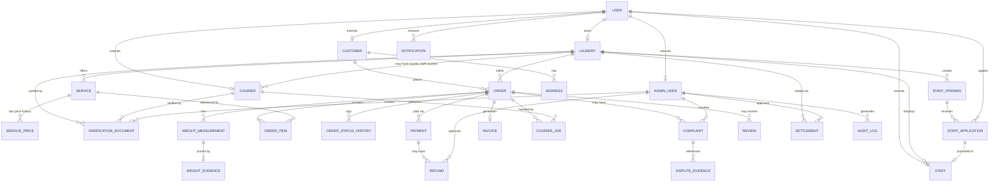

# schema.md — Laundrie

|                         |                                                                                                                                                                                                                                                     |
| ----------------------- | --------------------------------------------------------------------------------------------------------------------------------------------------------------------------------------------------------------------------------------------------- |
| **Fungsi**              | Sumber kebenaran tunggal struktur data. Rujuk file ini sebelum menyebut nama tabel/kolom di kode atau prompt AI.                                                                                                                                    |
| **Diekstrak dari**      | `architecture.md` v1.0 §7.3 (reorganisasi, tidak ada perubahan struktur data)                                                                                                                                                                       |
| **Versi dokumen**       | 1.1                                                                                                                                                                                                                                                 |
| **Status**              | Living document — **sinkronkan setiap ada migration baru**                                                                                                                                                                                          |
| **Terakhir diperbarui** | 23 Agustus 2026                                                                                                                                                                                                                                     |
| **Dokumen terkait**     | `PRD.md` (kenapa data ini ada) · `architecture.md` (bagaimana data dipakai sistem) · `Design.md` (field ini dipakai di layar mana — hubungan dua arah, lihat catatan di header `Design.md`) · `Rules.md` (wajib cek file ini sebelum menulis query) |

> **Catatan penting.** schema.md yang basi lebih berbahaya daripada tidak ada sama sekali — AI akan memperlakukannya sebagai kebenaran mutlak dan menulis query dengan percaya diri penuh ke struktur yang sudah berubah. Setiap migration baru **wajib** memperbarui file ini di PR yang sama (lihat `Rules.md` §8).
>
> Tabel bertanda **🔶 (diusulkan)** belum eksplisit disebutkan di PRD sebagai daftar kolom — field diturunkan dari kebutuhan fungsional terkait dan tipe data dipilih mengikuti konvensi proyek (lihat §1). Tabel tanpa tanda sudah punya daftar field eksplisit dari PRD/architecture.md.

---

## 1. Konvensi Penamaan

- Nama tabel: `snake_case`, **plural** (`orders`, bukan `order`).
- Primary key: selalu `id`, `BIGINT UNSIGNED (PK, AUTO_INCREMENT)`.
- Foreign key: `<nama_singular>_id`, tipe `BIGINT UNSIGNED`, mengacu ke `<tabel>.id`.
- Timestamp standar Laravel: `created_at`, `updated_at` — `TIMESTAMP`, default `CURRENT_TIMESTAMP`, `updated_at` auto-update di level aplikasi.
- Kolom status/enum disimpan sebagai `VARCHAR` dengan daftar nilai valid didokumentasikan di kolom **Keterangan** (bukan native Postgres ENUM, supaya menambah nilai baru tidak perlu migration tipe) — kecuali diputuskan lain oleh tim.
- Uang: `DECIMAL(12,2)` atau `DECIMAL(14,2)` untuk akumulasi (settlement). **Jangan pernah pakai FLOAT/DOUBLE untuk nilai uang atau berat.**
- Berat: `DECIMAL(8,2)`, satuan default `kg`.
- Metadata fleksibel non-relasional: `JSONB` (memakai kapabilitas PostgreSQL, lihat `architecture.md` §4).
- Soft delete **tidak dipakai** secara default kecuali sebuah tabel eksplisit membutuhkannya — status aktif/nonaktif memakai kolom `status`.
- **Casing nilai enum (berlaku untuk kolom bertanda** **`enum:`****, bukan** **`mis:`****):** nilai yang merepresentasikan **status/lifecycle** (kolom `status`, `verification_status`, `role` untuk `staff` — yaitu kolom yang menandai posisi dalam sebuah progresi/state machine) ditulis **UPPER\_SNAKE\_CASE** (mis. `PENDING`, `WEIGHT_REVIEW_REQUIRED`). Nilai yang merepresentasikan **kategori/tipe** (`pricing_model`, `unit`, `job_type`, `measurement_type`, `target_type`, `channel`, `priority`, dst. — kolom yang menandai jenis, bukan posisi progresi) tetap `lowercase snake_case`. Aturan ini berlaku sejak 22 Agu 2026; lihat §7 untuk daftar kolom yang diselaraskan.

---

## 2. ERD Tingkat Tinggi




---

## 3. Daftar Tabel

| Tabel Domain Catatan        |                 |                                                                                                                                                 |
| --------------------------- | --------------- | ----------------------------------------------------------------------------------------------------------------------------------------------- |
| `users`                     | Identity        | Akun login dasar lintas semua tipe aktor                                                                                                        |
| `customers` 🔶              | Identity        | Profil pelanggan                                                                                                                                |
| `staff` 🔶                  | Identity        | Akun staff laundry, terikat ke satu laundry; role tunggal `STAFF`                                                                               |
| `couriers` 🔶               | Identity        | Profil courier; dapat terikat ke laundry (`laundry_staff`) atau freelance                                                                       |
| `admin_users` 🔶            | Identity        | Profil admin platform internal (`OPERATIONS_ADMIN`, `FINANCE_ADMIN`, `SUPER_ADMIN`)                                                             |
| `laundries`                  | Laundry         | Entitas bisnis laundry dan unit operasional laundry                                                                                             |
| `services`                  | Catalog         | Layanan yang ditawarkan sebuah laundry                                                                                                           |
| `service_prices` 🔶         | Catalog         | Riwayat harga berversi per service                                                                                                              |
| `addresses`                 | Customer        | Alamat tersimpan milik customer **saja** |
| `verification_documents` 🔶 | Laundry/Courier | Dokumen verifikasi onboarding laundry & kurir (KTP, izin usaha, SIM, dst.) — lihat §4.26                                                          |
| `orders`                    | Order           | Pesanan inti                                                                                                                                    |
| `order_items`               | Order           | Baris item/layanan dalam satu order                                                                                                             |
| `order_status_histories` 🔶 | Order           | Log transisi status order                                                                                                                       |
| `weight_measurements`       | Trust           | Catatan berat estimasi/aktual                                                                                                                   |
| `weight_evidences`          | Trust           | Bukti foto + metadata penimbangan, immutable                                                                                                    |
| `payments`                  | Finance         | Transaksi pembayaran per order                                                                                                                  |
| `refunds` 🔶                | Finance         | Permintaan dan catatan refund                                                                                                                   |
| `invoices`                  | Finance         | Invoice final yang dihasilkan per order                                                                                                         |
| `settlements` 🔶            | Finance         | Payout ke laundry per periode                                                                                                                   |
| `courier_jobs`              | Logistics       | Penugasan pickup/delivery ke kurir                                                                                                              |
| `complaints`                | Engagement      | Komplain pelanggan terhadap order                                                                                                               |
| `dispute_evidence` 🔶       | Engagement      | Bukti pendukung kasus sengketa                                                                                                                  |
| `reviews` 🔶                | Engagement      | Rating/ulasan terhadap laundry/courier                                                                                                          |
| `notifications` 🔶          | Engagement      | Log notifikasi terkirim                                                                                                                         |
| `audit_logs`                | Platform        | Log audit seluruh tindakan penting sistem                                                                                                       |
| `staff_openings` 🔶         | Recruitment     | Lowongan rekrutmen staff aktif per laundry                                                                                                      |
| `staff_applications` 🔶     | Recruitment     | Lamaran calon staff/staff_courier dari pengguna ke laundry                                                                                       |

---

## 4. Definisi Tabel

### 4.1 `users`

| Kolom Tipe Null Default Keterangan  |                 |     |                    |                                |
| ----------------------------------- | --------------- | --- | ------------------ | ------------------------------ |
| id                                  | BIGINT (PK, AI) | No  | -                  |                                |
| name                                | VARCHAR(150)    | No  | -                  |                                |
| email                               | VARCHAR(150)    | Yes | NULL               | unique bila diisi              |
| phone                               | VARCHAR(20)     | Yes | NULL               | unique bila diisi              |
| password\_hash                      | VARCHAR(255)    | No  | -                  |                                |
| status                              | VARCHAR(20)     | No  | 'ACTIVE'           | enum: ACTIVE, INACTIVE, BANNED |
| last\_login\_at                     | TIMESTAMP       | Yes | NULL               |                                |
| created\_at                         | TIMESTAMP       | No  | CURRENT\_TIMESTAMP |                                |
| updated\_at                         | TIMESTAMP       | No  | CURRENT\_TIMESTAMP |                                |

Field khusus provider autentikasi (mis. OAuth) ditambahkan sebagai tabel terpisah (`user_oauth_providers`), bukan kolom tambahan di `users`.

### 4.2 `customers` 🔶

| Kolom Tipe Null Default Keterangan  |                         |     |                    |                                                                             |
| ----------------------------------- | ----------------------- | --- | ------------------ | --------------------------------------------------------------------------- |
| id                                  | BIGINT (PK, AI)         | No  | -                  |                                                                             |
| user\_id                            | BIGINT (FK -> users.id) | No  | -                  | unique                                                                      |
| name                                | VARCHAR(150)            | No  | -                  |                                                                             |
| phone                               | VARCHAR(20)             | No  | -                  |                                                                             |
| email                               | VARCHAR(150)            | Yes | NULL               |                                                                             |
| notification\_preferences           | JSONB                   | Yes | NULL               |                                                                             |
| avatar\_path                        | VARCHAR(255)            | Yes | NULL               | object key foto profil di storage privat; tampil via signed URL             |
| cover\_photo\_path                  | VARCHAR(255)            | Yes | NULL               | object key foto latar/cover profil di storage privat; tampil via signed URL |
| created\_at                         | TIMESTAMP               | No  | CURRENT\_TIMESTAMP |                                                                             |
| updated\_at                         | TIMESTAMP               | No  | CURRENT\_TIMESTAMP |                                                                             |

> `avatar_path`/`cover_photo_path` mengikuti pola object storage yang sama dengan bukti berat (`architecture.md` §11) — disimpan privat, diakses lewat signed URL, bukan public bucket. Jika kosong, frontend menampilkan avatar/cover default (lihat `Design.md` §3).

### 4.3 `staff` 🔶

| Kolom Tipe Null Default Keterangan  |                            |    |                    |                                       |
| ----------------------------------- | -------------------------- | -- | ------------------ | ------------------------------------- |
| id                                  | BIGINT (PK, AI)            | No | -                  |                                       |
| user\_id                            | BIGINT (FK -> users.id)    | No | -                  | akun user yang menjadi staff          |
| laundry\_id                         | BIGINT (FK -> laundries.id) | No | -                  | laundry tempat staff bekerja         |
| role                                | VARCHAR(20)                | No | 'STAFF'            | enum: STAFF                           |
| status                              | VARCHAR(20)                | No | 'ACTIVE'           | enum: ACTIVE, INACTIVE                |
| created\_at                         | TIMESTAMP                  | No | CURRENT\_TIMESTAMP |                                       |
| updated\_at                         | TIMESTAMP                  | No | CURRENT\_TIMESTAMP |                                       |

> `staff.role` hanya memiliki nilai `STAFF`. Semua staff mempunyai pekerjaan operasional umum yang sama; tidak ada pemisahan role `PENERIMAAN` atau `PEMROSESAN`.

> Pemilik laundry tidak dibuat sebagai row `staff`. User pada `laundries.user_id` otomatis menjadi **Owner/Manager** dan memperoleh seluruh kemampuan staff ditambah kemampuan manajerial.

> Manager dapat menambahkan/mengaitkan akun `users` lain sebagai staff pada laundry miliknya. Satu akun user tidak boleh mempunyai lebih dari satu row staff aktif pada laundry yang sama.

### 4.4 `staff_openings` 🔶

| Kolom | Tipe | Null | Default | Keterangan |
|---|---|---|---|---|
| id | BIGINT (PK, AI) | No | - | |
| laundry_id | BIGINT (FK -> laundries.id) | No | - | laundry pembuka lowongan |
| title | VARCHAR(120) | No | - | judul lowongan |
| description | TEXT | Yes | NULL | penjelasan pekerjaan |
| quota | INTEGER | No | 1 | jumlah staff yang dibutuhkan |
| status | VARCHAR(20) | No | 'OPEN' | enum: OPEN, CLOSED |
| created_at | TIMESTAMP | No | CURRENT_TIMESTAMP | |
| updated_at | TIMESTAMP | No | CURRENT_TIMESTAMP | |

> Lowongan Staff dibuka, diubah, atau ditutup hanya oleh Manager/Owner laundry. Karena tidak ada pemisahan role operasional, lowongan menggunakan satu jenis posisi: `STAFF`. Bila laundry membutuhkan staff yang juga menjadi courier, UI dapat memberi penanda `Membutuhkan Courier` pada konteks lowongan; namun role backend tetap `STAFF` dan profil courier dibuat setelah user diterima sebagai staff.

### 4.5 `staff_applications` 🔶

| Kolom | Tipe | Null | Default | Keterangan |
|---|---|---|---|---|
| id | BIGINT (PK, AI) | No | - | |
| staff_opening_id | BIGINT (FK -> staff_openings.id) | No | - | lowongan yang dilamar |
| laundry_id | BIGINT (FK -> laundries.id) | No | - | denormalisasi terkontrol untuk filtering/authorization |
| user_id | BIGINT (FK -> users.id) | No | - | kandidat |
| application_type | VARCHAR(20) | No | 'staff' | enum: staff, staff_courier |
| message | TEXT | Yes | NULL | pesan/lamaran kandidat |
| status | VARCHAR(20) | No | 'PENDING' | enum: PENDING, ACCEPTED, REJECTED, WITHDRAWN |
| reviewed_at | TIMESTAMP | Yes | NULL | |
| reviewed_by | BIGINT (FK -> users.id) | Yes | NULL | Manager yang meninjau |
| created_at | TIMESTAMP | No | CURRENT_TIMESTAMP | |
| updated_at | TIMESTAMP | No | CURRENT_TIMESTAMP | |

> `application_type = staff` berarti kandidat melamar sebagai staff umum. `application_type = staff_courier` berarti kandidat meminta untuk menjadi Staff sekaligus Courier setelah diterima. Kandidat tidak otomatis menjadi courier ketika melamar; setelah `ACCEPTED`, sistem membuat membership `staff`, dan untuk `staff_courier` juga membuat profil `couriers` dengan `courier_type = laundry_staff` setelah data kendaraan/area dan verifikasi yang diperlukan lengkap.

> Satu user tidak boleh memiliki aplikasi aktif duplikat untuk lowongan yang sama. Application yang `REJECTED`/`WITHDRAWN` tetap dipertahankan sebagai histori.

### 4.6 `couriers` 🔶

| Kolom Tipe Null Default Keterangan  |                              |     |                    |                                                                  |
| ----------------------------------- | ---------------------------- | --- | ------------------ | ---------------------------------------------------------------- |
| id                                  | BIGINT (PK, AI)              | No  | -                  |                                                                  |
| user\_id                            | BIGINT (FK -> users.id)      | No  | -                  | unique                                                           |
| laundry\_id                         | BIGINT (FK -> laundries.id)  | Yes | NULL               | terisi untuk `laundry_staff`; NULL untuk `freelance`            |
| courier\_type                       | VARCHAR(20)                  | No  | -                  | enum: laundry_staff, freelance                                   |
| vehicle\_type                       | VARCHAR(30)                  | Yes | NULL               |                                                                  |
| service\_area                       | JSONB                        | Yes | NULL               | area/polygon layanan                                             |
| payout\_info                        | JSONB                        | Yes | NULL               | data pembayaran; nilai sensitif dimasking di audit\_logs        |
| status                              | VARCHAR(20)                  | No  | 'PENDING'          | enum: PENDING, VERIFIED, ACTIVE, SUSPENDED                       |
| created\_at                         | TIMESTAMP                    | No  | CURRENT\_TIMESTAMP |                                                                  |
| updated\_at                         | TIMESTAMP                    | No  | CURRENT\_TIMESTAMP |                                                                  |

> `courier_type = laundry_staff`: courier adalah Owner/Manager atau Staff aktif dari satu laundry dan `laundry_id` wajib terisi sesuai laundry tersebut.

> `courier_type = freelance`: courier tidak terikat laundry tertentu dan `laundry_id` wajib `NULL`.

> Manager/Staff yang menjadi courier menggunakan akun `users` yang sama; tidak dibuat akun kedua.
### 4.7 `laundries`

| Kolom Tipe Null Default Keterangan  |                         |     |                    |                                                                                |
| ----------------------------------- | ----------------------- | --- | ------------------ | ------------------------------------------------------------------------------ |
| id                                  | BIGINT (PK, AI)         | No  | -                  |                                                                                |
| user\_id                            | BIGINT (FK -> users.id) | No  | -                  | unique; satu user dapat memiliki maksimal satu laundry                       |
| business\_name                      | VARCHAR(150)            | No  | -                  |                                                                                |
| legal\_name                         | VARCHAR(150)            | Yes | NULL               |                                                                                |
| address\_line                       | TEXT                    | No  | -                  | alamat laundry                                                                 |
| latitude                            | DECIMAL(10,7)           | Yes | NULL               |                                                                                |
| longitude                           | DECIMAL(10,7)           | Yes | NULL               |                                                                                |
| operating\_hours                    | JSONB                   | Yes | NULL               |                                                                                |
| capacity\_config                    | JSONB                   | Yes | NULL               |                                                                                |
| status                              | VARCHAR(20)             | No  | 'PENDING'          | enum: PENDING, DOCUMENT_REVIEW, VERIFIED, ACTIVE, REJECTED, SUSPENDED, CLOSED |
| contact\_phone                      | VARCHAR(20)             | No  | -                  |                                                                                |
| contact\_email                      | VARCHAR(150)            | Yes | NULL               |                                                                                |
| created\_at                         | TIMESTAMP               | No  | CURRENT\_TIMESTAMP |                                                                                |
| updated\_at                         | TIMESTAMP               | No  | CURRENT\_TIMESTAMP |                                                                                |

> **Relasi user–laundry.** `laundries.user_id` wajib mengacu ke `users.id` dan **unique**. Kardinalitasnya `USER ||--o| LAUNDRY`: satu user boleh tidak memiliki laundry atau memiliki tepat satu laundry; setiap laundry wajib dimiliki tepat satu user.

> **Owner/Manager otomatis.** User yang direferensikan oleh `laundries.user_id` adalah pemilik sekaligus **Manager otomatis** untuk laundry tersebut. Tidak diperlukan row `staff` tambahan untuk owner.

> **Hak akses.** Manager memiliki seluruh kapabilitas operasional Staff dan seluruh fungsi manajerial yang diizinkan. Staff tidak dapat mengelola staff, layanan, harga, profil/konfigurasi laundry, atau fungsi manajemen lain yang dibatasi Manager.

> **Perubahan struktur.** Entitas `branches` dihapus. Atribut operasional yang sebelumnya berada di `branches` (`address_line`, `latitude`, `longitude`, `operating_hours`, `capacity_config`, dan `status`) dipindahkan langsung ke `laundries`.

> **Pemisahan Alamat Laundry & Alamat User (Manajer).** Alamat operasional laundry disimpan langsung pada entitas `laundries` (`address_line`, `latitude`, `longitude`). Alamat ini dipisahkan secara tegas dari alamat pribadi milik user/manajer yang tersimpan di tabel `addresses`. Perubahan alamat tempat tinggal pribadi manajer tidak memengaruhi alamat operasional laundry, dan sebaliknya.

### 4.8 `services`

| Kolom Tipe Null Default Keterangan  |                            |     |                    |                                                         |
| ----------------------------------- | -------------------------- | --- | ------------------ | ------------------------------------------------------- |
| id                                  | BIGINT (PK, AI)            | No  | -                  |                                                         |
| laundry\_id                          | BIGINT (FK -> laundries.id) | No  | -                  |                                                         |
| name                                | VARCHAR(100)               | No  | -                  |                                                         |
| service\_type                       | VARCHAR(50)                | No  | -                  | mis: wash\_fold, wash\_iron, dry\_clean, express, linen |
| pricing\_model                      | VARCHAR(20)                | No  | -                  | enum: flat, per\_weight, per\_item                      |
| base\_price                         | DECIMAL(12,2)              | No  | 0                  |                                                         |
| price\_per\_unit                    | DECIMAL(12,2)              | Yes | NULL               | dipakai jika pricing\_model = per\_weight/per\_item     |
| unit                                | VARCHAR(10)                | Yes | 'kg'               | enum: kg, pcs                                           |
| minimum\_charge                     | DECIMAL(12,2)              | No  | 0                  |                                                         |
| estimated\_duration                 | INT                        | Yes | NULL               | dalam menit                                             |
| status                              | VARCHAR(20)                | No  | 'ACTIVE'           | enum: ACTIVE, INACTIVE                                  |
| created\_at                         | TIMESTAMP                  | No  | CURRENT\_TIMESTAMP |                                                         |
| updated\_at                         | TIMESTAMP                  | No  | CURRENT\_TIMESTAMP |                                                         |

> Harga wajib diberi versi di implementasi produksi — lihat `service_prices` — supaya invoice historis tetap benar meski harga berubah.
>
> **Hak akses harga.** Pembuatan atau perubahan harga layanan hanya dapat dilakukan oleh Owner/Manager. Staff hanya dapat membaca harga aktif untuk kebutuhan operasional.
>
> **Perbaikan S5 (audit dokumentasi 22 Agu 2026).** `base_price`, `price_per_unit`, `minimum_charge` di tabel ini adalah **salinan (cache) dari entri** **`service_prices`** **yang sedang berlaku** (`valid_until IS NULL`) — bukan kolom independen. Sama seperti pola `orders.actual_weight` (§4.11): sumber kebenaran ada di `service_prices`, penulisan harga baru **wajib** membuat entri baru di `service_prices` terlebih dahulu, baru menyinkronkan tiga kolom ini (`Rules.md` §3 melarang overwrite langsung di `services` tanpa lewat `service_prices`).

### 4.9 `service_prices` 🔶

| Kolom Tipe Null Default Keterangan  |                            |     |                    |                      |
| ----------------------------------- | -------------------------- | --- | ------------------ | -------------------- |
| id                                  | BIGINT (PK, AI)            | No  | -                  |                      |
| service\_id                         | BIGINT (FK -> services.id) | No  | -                  |                      |
| price\_per\_unit                    | DECIMAL(12,2)              | Yes | NULL               |                      |
| base\_price                         | DECIMAL(12,2)              | No  | -                  |                      |
| minimum\_charge                     | DECIMAL(12,2)              | No  | -                  |                      |
| valid\_from                         | TIMESTAMP                  | No  | -                  |                      |
| valid\_until                        | TIMESTAMP                  | Yes | NULL               | NULL = masih berlaku |
| created\_at                         | TIMESTAMP                  | No  | CURRENT\_TIMESTAMP |                      |

### 4.10 `addresses`

| Kolom Tipe Null Default Keterangan  |                             |     |                    |                        |
| ----------------------------------- | --------------------------- | --- | ------------------ | ---------------------- |
| id                                  | BIGINT (PK, AI)             | No  | -                  |                        |
| customer\_id                        | BIGINT (FK -> customers.id) | No  | -                  |                        |
| label                               | VARCHAR(50)                 | Yes | NULL               | mis: Rumah, Kantor     |
| recipient\_name                     | VARCHAR(150)                | No  | -                  |                        |
| phone                               | VARCHAR(20)                 | No  | -                  |                        |
| address\_line                       | TEXT                        | No  | -                  |                        |
| latitude                            | DECIMAL(10,7)               | Yes | NULL               |                        |
| longitude                           | DECIMAL(10,7)               | Yes | NULL               |                        |
| delivery\_notes                     | TEXT                        | Yes | NULL               |                        |
| is\_default                         | BOOLEAN                     | No  | false              |                        |
| status                              | VARCHAR(20)                 | No  | 'ACTIVE'           | enum: ACTIVE, INACTIVE |
| created\_at                         | TIMESTAMP                   | No  | CURRENT\_TIMESTAMP |                        |
| updated\_at                         | TIMESTAMP                   | No  | CURRENT\_TIMESTAMP |                        |

> Visibilitas alamat lengkap dibatasi ke aktor yang butuh secara operasional (kurir yang ditugaskan, staf laundry terkait) — ditegakkan di layer otorisasi, bukan di skema.
>
> **Tabel ini khusus alamat pribadi customer/user** (`customer_id` NOT NULL secara sengaja). Alamat operasional laundry **tidak** disimpan di tabel ini — laundry memiliki alamat operasional fisik tersendiri yang disimpan di `laundries.address_line` (§4.7). Manajer laundry mengelola alamat pribadinya di tabel `addresses` dan alamat operasional bisnisnya tersendiri di `laundries`.

### 4.11 `orders`

| Kolom Tipe Null Default Keterangan  |                             |     |                    |                                                                                       |
| ----------------------------------- | --------------------------- | --- | ------------------ | ------------------------------------------------------------------------------------- |
| id                                  | BIGINT (PK, AI)             | No  | -                  |                                                                                       |
| order\_number                       | VARCHAR(30)                 | No  | -                  | unique, format: `LDR-YYYY-NNNNNN`                                                     |
| customer\_id                        | BIGINT (FK -> customers.id) | No  | -                  |                                                                                       |
| laundry\_id                          | BIGINT (FK -> laundries.id)  | No  | -                  |                                                                                       |
| pickup\_address\_id                 | BIGINT (FK -> addresses.id) | No  | -                  |                                                                                       |
| delivery\_address\_id               | BIGINT (FK -> addresses.id) | No  | -                  |                                                                                       |
| status                              | VARCHAR(30)                 | No  | 'DRAFT'            | lihat daftar status §5                                                                |
| estimated\_weight                   | DECIMAL(8,2)                | Yes | NULL               | kg                                                                                    |
| actual\_weight                      | DECIMAL(8,2)                | Yes | NULL               | kg; didenormalisasi dari `weight_measurements`, penulisan wajib lewat domain Weighing |
| estimated\_total                    | DECIMAL(12,2)               | No  | 0                  |                                                                                       |
| final\_total                        | DECIMAL(12,2)               | Yes | NULL               |                                                                                       |
| currency                            | VARCHAR(3)                  | No  | 'IDR'              |                                                                                       |
| scheduled\_pickup\_start            | TIMESTAMP                   | No  | -                  |                                                                                       |
| scheduled\_pickup\_end              | TIMESTAMP                   | No  | -                  |                                                                                       |
| scheduled\_delivery\_start          | TIMESTAMP                   | Yes | NULL               |                                                                                       |
| scheduled\_delivery\_end            | TIMESTAMP                   | Yes | NULL               |                                                                                       |
| created\_at                         | TIMESTAMP                   | No  | CURRENT\_TIMESTAMP |                                                                                       |
| updated\_at                         | TIMESTAMP                   | No  | CURRENT\_TIMESTAMP |                                                                                       |
| completed\_at                       | TIMESTAMP                   | Yes | NULL               |                                                                                       |

### 4.12 `order_items`

| Kolom Tipe Null Default Keterangan  |                            |     |                    |                                     |
| ----------------------------------- | -------------------------- | --- | ------------------ | ----------------------------------- |
| id                                  | BIGINT (PK, AI)            | No  | -                  |                                     |
| order\_id                           | BIGINT (FK -> orders.id)   | No  | -                  |                                     |
| service\_id                         | BIGINT (FK -> services.id) | No  | -                  |                                     |
| quantity                            | DECIMAL(8,2)               | No  | 1                  | bisa desimal untuk item berbasis kg |
| unit\_price                         | DECIMAL(12,2)              | No  | -                  |                                     |
| estimated\_amount                   | DECIMAL(12,2)              | No  | -                  |                                     |
| final\_amount                       | DECIMAL(12,2)              | Yes | NULL               |                                     |
| metadata                            | JSONB                      | Yes | NULL               |                                     |
| created\_at                         | TIMESTAMP                  | No  | CURRENT\_TIMESTAMP |                                     |
| updated\_at                         | TIMESTAMP                  | No  | CURRENT\_TIMESTAMP |                                     |

### 4.13 `order_status_histories` 🔶

| Kolom Tipe Null Default Keterangan  |                          |     |                    |                                  |
| ----------------------------------- | ------------------------ | --- | ------------------ | -------------------------------- |
| id                                  | BIGINT (PK, AI)          | No  | -                  |                                  |
| order\_id                           | BIGINT (FK -> orders.id) | No  | -                  |                                  |
| from\_status                        | VARCHAR(30)              | Yes | NULL               | NULL untuk baris pertama (DRAFT) |
| to\_status                          | VARCHAR(30)              | No  | -                  |                                  |
| changed\_by                         | BIGINT (FK -> users.id)  | Yes | NULL               | NULL bila dipicu sistem          |
| reason                              | TEXT                     | Yes | NULL               | wajib diisi untuk override admin |
| metadata                            | JSONB                    | Yes | NULL               |                                  |
| created\_at                         | TIMESTAMP                | No  | CURRENT\_TIMESTAMP |                                  |

> Ini adalah pelaksana teknis dari prinsip "riwayat tidak diubah diam-diam" — setiap transisi status tercatat sebagai baris baru, bukan overwrite kolom `orders.status`.
>
> **Perbaikan K1 (audit dokumentasi 22 Agu 2026).** Untuk transisi ke `CANCELLED` yang dikenai biaya pembatalan (kebijakan di `PRD.md` §12, jalur state machine di `architecture.md` §8.3), **tidak ada kolom biaya terpisah di** **`orders`** — `reason` pada baris ini wajib diisi, dan `metadata` menyimpan rincian seperti `{"cancellation_fee": 15000, "fee_currency": "IDR", "policy_phase": "after_pickup_dispatch"}`. Ini menghindari penambahan status baru (mis. `CANCELLED_WITH_FEE`) yang akan memecah enum `orders.status` di §5.

### 4.14 `weight_measurements`

| Kolom Tipe Null Default Keterangan  |                                     |     |                    |                                               |
| ----------------------------------- | ----------------------------------- | --- | ------------------ | --------------------------------------------- |
| id                                  | BIGINT (PK, AI)                     | No  | -                  |                                               |
| order\_id                           | BIGINT (FK -> orders.id)            | No  | -                  |                                               |
| measurement\_type                   | VARCHAR(20)                         | No  | -                  | enum: estimated, actual                       |
| estimated\_value                    | DECIMAL(8,2)                        | Yes | NULL               |                                               |
| actual\_value                       | DECIMAL(8,2)                        | Yes | NULL               |                                               |
| unit                                | VARCHAR(5)                          | No  | 'kg'               |                                               |
| evidence\_id                        | BIGINT (FK -> weight\_evidences.id) | Yes | NULL               |                                               |
| recorded\_by                        | BIGINT (FK -> staff.id)             | Yes | NULL               |                                               |
| recorded\_at                        | TIMESTAMP                           | Yes | NULL               |                                               |
| status                              | VARCHAR(20)                         | No  | 'PENDING'          | enum: PENDING, RECORDED, VERIFIED, SUPERSEDED |
| created\_at                         | TIMESTAMP                           | No  | CURRENT\_TIMESTAMP |                                               |
| updated\_at                         | TIMESTAMP                           | No  | CURRENT\_TIMESTAMP |                                               |

> Catatan pengukuran tidak boleh ditimpa setelah finalisasi tanpa alur koreksi eksplisit (lihat `weight_evidences`).
>
> **Perbaikan S6 (audit dokumentasi 22 Agu 2026) — pola satu-baris-per-tipe.** Satu order punya **dua baris** di tabel ini: satu `measurement_type = 'estimated'` (mengisi `estimated_value`, `actual_value` tetap NULL) dan satu `measurement_type = 'actual'` (mengisi `actual_value`, `estimated_value` tetap NULL). Kolom yang tidak relevan untuk tipe baris tersebut **selalu NULL** — tidak pernah diisi lalu ditimpa silang antar tipe.
>
> **Perbaikan S1 (audit dokumentasi 22 Agu 2026) — alur koreksi.** Jika bukti (`weight_evidences`) perlu dikoreksi (lihat `architecture.md` §10.3), koreksi membuat **pasangan baru**: baris `weight_measurements` baru (`measurement_type = 'actual'`) + baris `weight_evidences` baru yang menunjuk ke `measurement_id` yang baru itu — **bukan** menumpang `measurement_id` lama dengan evidence kedua. Baris `weight_measurements` lama yang digantikan diubah `status = 'SUPERSEDED'`. Ini menjaga kardinalitas ERD `WEIGHT_MEASUREMENT ||--o| WEIGHT_EVIDENCE` (satu measurement maksimal satu evidence) tetap valid.

### 4.15 `weight_evidences`

| Kolom Tipe Null Default Keterangan  |                                        |     |                    |                                         |
| ----------------------------------- | -------------------------------------- | --- | ------------------ | --------------------------------------- |
| id                                  | BIGINT (PK, AI)                        | No  | -                  |                                         |
| order\_id                           | BIGINT (FK -> orders.id)               | No  | -                  |                                         |
| measurement\_id                     | BIGINT (FK -> weight\_measurements.id) | No  | -                  |                                         |
| laundry\_id                          | BIGINT (FK -> laundries.id)             | No  | -                  |                                         |
| staff\_id                           | BIGINT (FK -> staff.id)                | No  | -                  |                                         |
| weight                              | DECIMAL(8,2)                           | No  | -                  |                                         |
| unit                                | VARCHAR(5)                             | No  | 'kg'               |                                         |
| photo\_path                         | VARCHAR(255)                           | No  | -                  | object key di storage privat            |
| photo\_hash                         | CHAR(64)                               | No  | -                  | SHA-256 hex                             |
| captured\_at                        | TIMESTAMP                              | No  | -                  |                                         |
| confirmed\_at                       | TIMESTAMP                              | Yes | NULL               |                                         |
| status                              | VARCHAR(20)                            | No  | 'CAPTURED'         | enum: CAPTURED, CONFIRMED, INVALIDATED  |
| device\_id                          | VARCHAR(100)                           | Yes | NULL               |                                         |
| latitude                            | DECIMAL(10,7)                          | Yes | NULL               | hanya jika dibenarkan hukum/operasional |
| longitude                           | DECIMAL(10,7)                          | Yes | NULL               | idem                                    |
| invalidated\_at                     | TIMESTAMP                              | Yes | NULL               |                                         |
| invalidated\_by                     | BIGINT (FK -> users.id)                | Yes | NULL               |                                         |
| invalidation\_reason                | TEXT                                   | Yes | NULL               | wajib diisi jika status = INVALIDATED   |
| created\_at                         | TIMESTAMP                              | No  | CURRENT\_TIMESTAMP |                                         |
| updated\_at                         | TIMESTAMP                              | No  | CURRENT\_TIMESTAMP |                                         |

> **Constraint aplikasi (bukan constraint DB):** setelah `status = CONFIRMED`, kolom `weight`, `unit`, `photo_path`, `photo_hash`, `captured_at`, `staff_id`, `order_id` bersifat append-only. Koreksi = record baru berstatus CONFIRMED + record lama diubah jadi INVALIDATED dengan `invalidation_reason` wajib diisi. **Koreksi juga membuat baris** **`weight_measurements`** **baru** (`measurement_id` baru, bukan menumpang yang lama) — lihat catatan S1 di §4.14. Lihat `Rules.md` §3 dan `architecture.md` §10.3.

### 4.16 `payments`

| Kolom Tipe Null Default Keterangan  |                          |     |                    |                                                                                                  |
| ----------------------------------- | ------------------------ | --- | ------------------ | ------------------------------------------------------------------------------------------------ |
| id                                  | BIGINT (PK, AI)          | No  | -                  |                                                                                                  |
| order\_id                           | BIGINT (FK -> orders.id) | No  | -                  |                                                                                                  |
| provider                            | VARCHAR(50)              | No  | -                  | mis: midtrans                                                                                    |
| provider\_reference                 | VARCHAR(150)             | No  | -                  | unique; dipakai untuk idempotensi webhook                                                        |
| amount                              | DECIMAL(12,2)            | No  | -                  |                                                                                                  |
| currency                            | VARCHAR(3)               | No  | 'IDR'              |                                                                                                  |
| status                              | VARCHAR(20)              | No  | 'PENDING'          | enum: PENDING, AUTHORIZED, PAID, FAILED, EXPIRED, REFUND\_PENDING, REFUNDED, PARTIALLY\_REFUNDED |
| paid\_at                            | TIMESTAMP                | Yes | NULL               |                                                                                                  |
| metadata                            | JSONB                    | Yes | NULL               | payload respons gateway                                                                          |
| created\_at                         | TIMESTAMP                | No  | CURRENT\_TIMESTAMP |                                                                                                  |
| updated\_at                         | TIMESTAMP                | No  | CURRENT\_TIMESTAMP |                                                                                                  |

### 4.17 `refunds` 🔶

| Kolom Tipe Null Default Keterangan  |                            |     |                    |                                                |
| ----------------------------------- | -------------------------- | --- | ------------------ | ---------------------------------------------- |
| id                                  | BIGINT (PK, AI)            | No  | -                  |                                                |
| order\_id                           | BIGINT (FK -> orders.id)   | No  | -                  |                                                |
| payment\_id                         | BIGINT (FK -> payments.id) | No  | -                  |                                                |
| amount                              | DECIMAL(12,2)              | No  | -                  |                                                |
| reason                              | TEXT                       | No  | -                  |                                                |
| requested\_by                       | BIGINT (FK -> users.id)    | No  | -                  |                                                |
| approved\_by                        | BIGINT (FK -> users.id)    | Yes | NULL               |                                                |
| gateway\_reference                  | VARCHAR(150)               | Yes | NULL               |                                                |
| status                              | VARCHAR(20)                | No  | 'REQUESTED'        | enum: REQUESTED, APPROVED, REJECTED, PROCESSED |
| created\_at                         | TIMESTAMP                  | No  | CURRENT\_TIMESTAMP |                                                |
| updated\_at                         | TIMESTAMP                  | No  | CURRENT\_TIMESTAMP |                                                |

### 4.18 `invoices`

| Kolom Tipe Null Default Keterangan  |                          |     |                    |                                  |
| ----------------------------------- | ------------------------ | --- | ------------------ | -------------------------------- |
| id                                  | BIGINT (PK, AI)          | No  | -                  |                                  |
| order\_id                           | BIGINT (FK -> orders.id) | No  | -                  | unique                           |
| invoice\_number                     | VARCHAR(30)              | No  | -                  | unique                           |
| subtotal                            | DECIMAL(12,2)            | No  | -                  |                                  |
| fees                                | DECIMAL(12,2)            | No  | 0                  | pickup + delivery + platform fee |
| discount                            | DECIMAL(12,2)            | No  | 0                  |                                  |
| tax                                 | DECIMAL(12,2)            | No  | 0                  |                                  |
| total                               | DECIMAL(12,2)            | No  | -                  |                                  |
| currency                            | VARCHAR(3)               | No  | 'IDR'              |                                  |
| status                              | VARCHAR(20)              | No  | 'DRAFT'            | enum: DRAFT, GENERATED, SENT     |
| pdf\_path                           | VARCHAR(255)             | Yes | NULL               |                                  |
| generated\_at                       | TIMESTAMP                | Yes | NULL               |                                  |
| created\_at                         | TIMESTAMP                | No  | CURRENT\_TIMESTAMP |                                  |
| updated\_at                         | TIMESTAMP                | No  | CURRENT\_TIMESTAMP |                                  |

> Invoice adalah representasi teragregasi, bukan source of truth independen — rincian direkonstruksi dari `orders`, `order_items`, dan `weight_measurements`/`weight_evidences` saat PDF dibuat.

### 4.19 `settlements` 🔶

| Kolom Tipe Null Default Keterangan  |                            |     |                    |                     |
| ----------------------------------- | -------------------------- | --- | ------------------ | ------------------- |
| id                                  | BIGINT (PK, AI)            | No  | -                  |                     |
| laundry\_id                          | BIGINT (FK -> laundries.id) | No  | -                  |                     |
| period\_start                       | DATE                       | No  | -                  |                     |
| period\_end                         | DATE                       | No  | -                  |                     |
| gross\_amount                       | DECIMAL(14,2)              | No  | -                  |                     |
| platform\_commission                | DECIMAL(14,2)              | No  | -                  |                     |
| discounts\_funded                   | DECIMAL(14,2)              | No  | 0                  |                     |
| adjustments                         | DECIMAL(14,2)              | No  | 0                  |                     |
| net\_payable                        | DECIMAL(14,2)              | No  | -                  |                     |
| status                              | VARCHAR(20)                | No  | 'PENDING'          | enum: PENDING, PAID |
| paid\_at                            | TIMESTAMP                  | Yes | NULL               |                     |
| created\_at                         | TIMESTAMP                  | No  | CURRENT\_TIMESTAMP |                     |
| updated\_at                         | TIMESTAMP                  | No  | CURRENT\_TIMESTAMP |                     |

### 4.20 `courier_jobs`

| Kolom Tipe Null Default Keterangan  |                            |     |                    |                                                                  |
| ----------------------------------- | -------------------------- | --- | ------------------ | ---------------------------------------------------------------- |
| id                                  | BIGINT (PK, AI)            | No  | -                  |                                                                  |
| order\_id                           | BIGINT (FK -> orders.id)   | No  | -                  |                                                                  |
| courier\_id                         | BIGINT (FK -> couriers.id) | No  | -                  |                                                                  |
| job\_type                           | VARCHAR(10)                | No  | -                  | enum: pickup, delivery                                           |
| status                              | VARCHAR(20)                | No  | 'ASSIGNED'         | enum: ASSIGNED, ACCEPTED, REJECTED, EN\_ROUTE, COMPLETED, FAILED |
| assigned\_at                        | TIMESTAMP                  | No  | CURRENT\_TIMESTAMP |                                                                  |
| accepted\_at                        | TIMESTAMP                  | Yes | NULL               |                                                                  |
| started\_at                         | TIMESTAMP                  | Yes | NULL               |                                                                  |
| completed\_at                       | TIMESTAMP                  | Yes | NULL               |                                                                  |
| pickup\_proof\_path                 | VARCHAR(255)               | Yes | NULL               |                                                                  |
| delivery\_proof\_path               | VARCHAR(255)               | Yes | NULL               |                                                                  |
| created\_at                         | TIMESTAMP                  | No  | CURRENT\_TIMESTAMP |                                                                  |
| updated\_at                         | TIMESTAMP                  | No  | CURRENT\_TIMESTAMP |                                                                  |

> **Perbaikan S4 (audit dokumentasi 22 Agu 2026).** `REJECTED` ditambahkan supaya penolakan kurir (tombol `Tolak` di `Design.md` §7.3) punya representasi eksplisit. `REJECTED` bersifat **terminal** untuk baris job ini — dispatch domain membuat **baris** **`courier_jobs`** **baru** untuk kurir pengganti (§8.4 `architecture.md`), bukan mengubah `courier_id` pada baris yang ditolak, supaya riwayat penugasan tetap utuh.

### 4.21 `complaints`

| Kolom Tipe Null Default Keterangan  |                             |     |                    |                                                                                                             |
| ----------------------------------- | --------------------------- | --- | ------------------ | ----------------------------------------------------------------------------------------------------------- |
| id                                  | BIGINT (PK, AI)             | No  | -                  |                                                                                                             |
| order\_id                           | BIGINT (FK -> orders.id)    | No  | -                  |                                                                                                             |
| customer\_id                        | BIGINT (FK -> customers.id) | No  | -                  |                                                                                                             |
| category                            | VARCHAR(30)                 | No  | -                  | mis: weight\_price, item\_lost, item\_damaged, late\_pickup, late\_delivery, quality, wrong\_order, payment |
| status                              | VARCHAR(20)                 | No  | 'OPEN'             | enum: OPEN, IN\_REVIEW, RESOLVED, REJECTED                                                                  |
| priority                            | VARCHAR(10)                 | No  | 'medium'           | enum: low, medium, high                                                                                     |
| description                         | TEXT                        | No  | -                  |                                                                                                             |
| resolution                          | TEXT                        | Yes | NULL               |                                                                                                             |
| resolved\_by                        | BIGINT (FK -> users.id)     | Yes | NULL               |                                                                                                             |
| resolved\_at                        | TIMESTAMP                   | Yes | NULL               |                                                                                                             |
| created\_at                         | TIMESTAMP                   | No  | CURRENT\_TIMESTAMP |                                                                                                             |
| updated\_at                         | TIMESTAMP                   | No  | CURRENT\_TIMESTAMP |                                                                                                             |

### 4.22 `dispute_evidence` 🔶

| Kolom Tipe Null Default Keterangan  |                              |     |                    |                                                                                                                                                               |
| ----------------------------------- | ---------------------------- | --- | ------------------ | ------------------------------------------------------------------------------------------------------------------------------------------------------------- |
| id                                  | BIGINT (PK, AI)              | No  | -                  |                                                                                                                                                               |
| complaint\_id                       | BIGINT (FK -> complaints.id) | No  | -                  |                                                                                                                                                               |
| evidence\_type                      | VARCHAR(30)                  | No  | -                  | mis: weight\_evidence, pickup\_proof, delivery\_proof, damage\_photo                                                                                          |
| reference\_table                    | VARCHAR(50)                  | Yes | NULL               | nama tabel yang dirujuk — NULL jika `photo_path` diisi                                                                                                        |
| reference\_id                       | BIGINT                       | Yes | NULL               | id baris yang dirujuk — NULL jika `photo_path` diisi                                                                                                          |
| photo\_path                         | VARCHAR(255)                 | Yes | NULL               | object key foto baru yang diunggah langsung di form komplain (private storage); NULL jika merujuk bukti yang sudah ada lewat `reference_table`/`reference_id` |
| added\_by                           | BIGINT (FK -> users.id)      | No  | -                  |                                                                                                                                                               |
| created\_at                         | TIMESTAMP                    | No  | CURRENT\_TIMESTAMP |                                                                                                                                                               |

> Tabel penghubung polymorphic — `reference_table` + `reference_id` mengaitkan komplain ke bukti yang **sudah ada** di tabel lain (`weight_evidences`, `courier_jobs.pickup_proof_path`, dst.) tanpa FK langsung.
>
> **Perbaikan K5 (audit dokumentasi 22 Agu 2026).** Sebelumnya tidak ada tempat untuk foto **baru** yang diambil pelanggan saat mengisi form komplain (bukan referensi ke bukti lama) — padahal `evidence_type` sudah mencantumkan nilai `damage_photo`. `photo_path` ditambahkan untuk kasus ini; `reference_table`/`reference_id` dibuat nullable. **Constraint aplikasi (bukan constraint DB):** tepat satu dari dua pola berikut wajib berlaku per baris — (`reference_table` + `reference_id` terisi, `photo_path` NULL) **atau** (`photo_path` terisi, `reference_table` + `reference_id` NULL). Jangan mengisi keduanya sekaligus.

### 4.23 `reviews` 🔶

| Kolom Tipe Null Default Keterangan  |                             |     |                    |                                                         |
| ----------------------------------- | --------------------------- | --- | ------------------ | ------------------------------------------------------- |
| id                                  | BIGINT (PK, AI)             | No  | -                  |                                                         |
| order\_id                           | BIGINT (FK -> orders.id)    | No  | -                  |                                                         |
| customer\_id                        | BIGINT (FK -> customers.id) | No  | -                  |                                                         |
| target\_type                        | VARCHAR(10)                 | No  | -                  | enum: laundry, courier                          |
| target\_id                          | BIGINT                      | No  | -                  | id laundry atau courier (sesuai `target_type`) |
| rating                              | SMALLINT                    | No  | -                  | CHECK (rating BETWEEN 1 AND 5)                          |
| comment                             | TEXT                        | Yes | NULL               |                                                         |
| status                              | VARCHAR(20)                 | No  | 'PUBLISHED'        | enum: PUBLISHED, HIDDEN — untuk moderasi spam           |
| created\_at                         | TIMESTAMP                   | No  | CURRENT\_TIMESTAMP |                                                         |

> Rating hanya boleh dibuat setelah `orders.status = COMPLETED` — ditegakkan di aplikasi.
>
> **Perubahan S3.** Rating sekarang ditujukan langsung ke entitas `laundries` atau `couriers`. Untuk rating laundry digunakan `target_type = 'laundry'` dan `target_id = laundries.id`. Tidak ada lagi target rating pada level cabang.


### 4.24 `notifications` 🔶

| Kolom Tipe Null Default Keterangan  |                 |     |                    |                                         |
| ----------------------------------- | --------------- | --- | ------------------ | --------------------------------------- |
| id                                  | BIGINT (PK, AI) | No  | -                  |                                         |
| recipient\_type                     | VARCHAR(20)     | No  | -                  | mis: customer, laundry, courier         |
| recipient\_id                       | BIGINT          | No  | -                  |                                         |
| channel                             | VARCHAR(20)     | No  | -                  | enum: push, email, whatsapp, sms        |
| event\_type                         | VARCHAR(50)     | No  | -                  | mis: order\_confirmed, weight\_verified |
| payload                             | JSONB           | No  | -                  |                                         |
| status                              | VARCHAR(20)     | No  | 'QUEUED'           | enum: QUEUED, SENT, FAILED              |
| sent\_at                            | TIMESTAMP       | Yes | NULL               |                                         |
| created\_at                         | TIMESTAMP       | No  | CURRENT\_TIMESTAMP |                                         |

### 4.25 `audit_logs`

> **Tata Kelola Admin Audit:** Seluruh tindakan perubah state oleh Admin (seperti manual override order status, persetujuan/penolakan dokumen verifikasi, invalidasi bukti, persetujuan refund, persetujuan settlement, dan pengubahan role/privilege) **wajib** mencatat entri pada `audit_logs` dengan `actor_type = 'admin'`, `actor_id = users.id`, serta menyertakan alasan tertulis dalam `metadata.reason`.

| Kolom Tipe Null Default Keterangan  |                 |     |                    |                                                  |
| ----------------------------------- | --------------- | --- | ------------------ | ------------------------------------------------ |
| id                                  | BIGINT (PK, AI) | No  | -                  |                                                  |
| actor\_type                         | VARCHAR(20)     | No  | -                  | mis: customer, staff, courier, admin, system     |
| actor\_id                           | BIGINT          | Yes | NULL               | NULL bila aksi dari system/job                   |
| action                              | VARCHAR(100)    | No  | -                  | mis: order.status\_changed, evidence.confirmed   |
| entity\_type                        | VARCHAR(50)     | No  | -                  |                                                  |
| entity\_id                          | BIGINT          | No  | -                  |                                                  |
| old\_values                         | JSONB           | Yes | NULL               | nilai sensitif wajib disamarkan sebelum disimpan |
| new\_values                         | JSONB           | Yes | NULL               | idem                                             |
| metadata                            | JSONB           | Yes | NULL               |                                                  |
| ip\_address                         | VARCHAR(45)     | Yes | NULL               | mendukung IPv6                                   |
| user\_agent                         | VARCHAR(255)    | Yes | NULL               |                                                  |
| created\_at                         | TIMESTAMP       | No  | CURRENT\_TIMESTAMP |                                                  |

### 4.26 `verification_documents` 🔶

> **Perbaikan K3 (audit dokumentasi 22 Agu 2026).** Sebelumnya tidak ada tabel untuk dokumen verifikasi onboarding laundry/kurir, padahal disebut wajib di `PRD.md` §13, `Rules.md` §4.1, dan `architecture.md` §11. Tabel polymorphic ini menjadi tempat penyimpanannya.

| Kolom Tipe Null Default Keterangan  |                         |     |                    |                                               |
| ----------------------------------- | ----------------------- | --- | ------------------ | --------------------------------------------- |
| id                                  | BIGINT (PK, AI)         | No  | -                  |                                               |
| owner\_type                         | VARCHAR(20)             | No  | -                  | enum: laundry, courier, user, staff_application |
| owner\_id                           | BIGINT                  | No  | -                  | id owner sesuai `owner_type` (laundry/courier/user/staff_application) |
| document\_type                      | VARCHAR(50)             | No  | -                  | mis: ktp, nib, foto_lokasi, sim, stnk — nib opsional untuk laundry, ktp wajib untuk staff |
| file\_path                          | VARCHAR(255)            | No  | -                  | object key di storage privat                  |
| status                              | VARCHAR(20)             | No  | 'PENDING'          | enum: PENDING, APPROVED, REJECTED             |
| reviewed\_by                        | BIGINT (FK -> users.id) | Yes | NULL               | staf/admin yang meninjau                      |
| reviewed\_at                        | TIMESTAMP               | Yes | NULL               |                                               |
| rejection\_reason                   | TEXT                    | Yes | NULL               | wajib diisi jika status = REJECTED            |
| created\_at                         | TIMESTAMP               | No  | CURRENT\_TIMESTAMP |                                               |
| updated\_at                         | TIMESTAMP               | No  | CURRENT\_TIMESTAMP |                                               |

> Tabel penghubung polymorphic — pola yang sama dengan `dispute_evidence` (§4.22), memakai `owner_type`/`owner_id` (bukan `reference_table`/`reference_id`) karena relasinya searah (dokumen milik satu entitas), bukan menghubungkan dua entitas lain. Disimpan private + diakses lewat signed URL, mengikuti aturan upload di `Rules.md` §4.1.

### 4.27 `admin_users` 🔶

| Kolom Tipe Null Default Keterangan  |                         |     |                    |                                                  |
| ----------------------------------- | ----------------------- | --- | ------------------ | ------------------------------------------------ |
| id                                  | BIGINT (PK, AI)         | No  | -                  |                                                  |
| user\_id                            | BIGINT (FK -> users.id) | No  | -                  | unique, referensi akun `users` internal          |
| role                                | VARCHAR(30)             | No  | -                  | enum: OPERATIONS_ADMIN, FINANCE_ADMIN, SUPER_ADMIN |
| department                          | VARCHAR(100)            | Yes | NULL               | mis: Operations, Finance, Platform Security      |
| created\_at                         | TIMESTAMP               | No  | CURRENT\_TIMESTAMP |                                                  |
| updated\_at                         | TIMESTAMP               | No  | CURRENT\_TIMESTAMP |                                                  |

> **Fungsi `admin_users`:** Menandai akun `users` yang memiliki hak akses administratif ke Platform Admin Portal (`apps/web-admin`), serta menyimpan peran spesifiknya (`OPERATIONS_ADMIN`, `FINANCE_ADMIN`, `SUPER_ADMIN`) untuk otorisasi RBAC backend.

---

## 5. Nilai Enum Status Order

`orders.status`:

```
DRAFT, PENDING_PAYMENT, CONFIRMED, COURIER_ASSIGNED, PICKUP_EN_ROUTE, PICKED_UP,
RECEIVED_AT_LAUNDRY, WEIGHING_REQUIRED, WEIGHT_REVIEW_REQUIRED, WEIGHT_VERIFIED,
PRICE_FINALIZED, PROCESSING, READY_FOR_DELIVERY, DELIVERY_ASSIGNED,
DELIVERY_EN_ROUTE, DELIVERED, COMPLETED,
CANCELLED, PAYMENT_FAILED, LAUNDRY_EXCEPTION, CUSTOMER_DISPUTE,
DELIVERY_FAILED, REFUND_PENDING, REFUNDED

```

Aturan transisi valid (state machine) ada di `architecture.md` §8 — **schema.md tidak mendefinisikan aturan transisi**, hanya nilai yang sah.

---

## 6. Index yang Disarankan

| Tabel Index Alasan       |                                                               |                                                       |
| ------------------------ | ------------------------------------------------------------- | ----------------------------------------------------- |
| `orders`                 | `order_number` (unique), `customer_id`, `laundry_id`, `status` | Lookup, filter dashboard, pencarian pelanggan         |
| `weight_evidences`       | `order_id`, `staff_id`, `status`                              | Query kepatuhan bukti & anomali per staf              |
| `payments`               | `provider_reference` (unique), `order_id`                     | Idempotensi webhook                                   |
| `audit_logs`             | `entity_type, entity_id`, `created_at`                        | Timeline investigasi admin                            |
| `staff`                  | `user_id, laundry_id, status`                                | Keanggotaan staff dan validasi akses laundry
| `staff_openings`         | `laundry_id, status`                                         | Lowongan staff aktif per laundry dan discovery kandidat         |
| `staff_applications`     | `user_id, laundry_id, status`, `staff_opening_id, user_id` unique aktif | Lamaran staff dan review Manager
| `couriers`               | `user_id` (unique), `laundry_id, courier_type, status`       | Lookup profil courier dan dispatch eligibility        |
| `courier_jobs`           | `courier_id, status`, `order_id`                              | Daftar pekerjaan aktif kurir                          |
| `notifications`          | `recipient_type, recipient_id`, `status`                      | Query inbox & retry gagal kirim                       |
| `verification_documents` | `owner_type, owner_id`, `status`                              | Lookup dokumen per laundry/kurir & antrian review admin |
| `admin_users`            | `user_id` (unique), `role`                                    | Lookup profil admin internal & penegakan RBAC policy |

---

## 7. Riwayat Perubahan Schema

| Tanggal Perubahan PR/Migration  |                                                                                                                                               |                                           |
| ------------------------------- | --------------------------------------------------------------------------------------------------------------------------------------------- | ----------------------------------------- |
| 21 Agu 2026                     | Ekstraksi awal dari `architecture.md` v1.0 §7.3 menjadi schema.md v1.0                                                                        | —                                         |
| 22 Agu 2026                     | Tambah `avatar_path` dan `cover_photo_path` ke `customers` untuk fitur personalisasi profil                                                   | —                                         |
| 23 Agu 2026                     | **[R10]** Tambah `staff_openings` dan `staff_applications` untuk lowongan/lamaran Staff; dukung aplikasi `staff_courier` yang mengarah ke profil courier setelah diterima | user-requested recruitment/profile flow |
| 23 Agu 2026                     | **[R11]** Tambah tabel `admin_users` (§4.27) untuk entitas admin platform internal (`OPERATIONS_ADMIN`, `FINANCE_ADMIN`, `SUPER_ADMIN`)       | penegakan RBAC server-side & kelengkapan skema admin |
| 22 Agu 2026                     | **[R8]** Hapus entitas `branches`; seluruh FK `branch_id` dialihkan menjadi `laundry_id`; atribut operasional dipindahkan ke `laundries` | user-requested schema change |

| 22 Agu 2026                     | **[K3]** Tambah tabel `verification_documents` (dokumen verifikasi onboarding laundry/kurir)                                                    | audit-konsistensi-dokumentasi-laundrie.md |
| 22 Agu 2026                     | **[K4]** Gabung `laundries.verification_status` + `laundries.status` jadi satu kolom `status`                                                   | audit-konsistensi-dokumentasi-laundrie.md |
| 22 Agu 2026                     | **[K5]** Tambah `dispute_evidence.photo_path`, `reference_table`/`reference_id` jadi nullable                                                 | audit-konsistensi-dokumentasi-laundrie.md |
| 22 Agu 2026                     | **[S1/S6]** Tambah status `SUPERSEDED` di `weight_measurements`, perjelas pola satu-baris-per-tipe & alur koreksi                             | audit-konsistensi-dokumentasi-laundrie.md |
| 22 Agu 2026                     | **[S3]** Ubah `reviews.target_type` agar rating ditujukan langsung ke laundry atau courier                                                                                       | audit-konsistensi-dokumentasi-laundrie.md |
| 22 Agu 2026                     | **[S4]** Tambah status `REJECTED` ke `courier_jobs.status`                                                                                    | audit-konsistensi-dokumentasi-laundrie.md |
| 22 Agu 2026                     | **[R7]** Standardisasi casing nilai enum status/lifecycle jadi UPPER\_SNAKE\_CASE di seluruh tabel (lihat §1)                                 | audit-konsistensi-dokumentasi-laundrie.md |
| 23 Agu 2026                     | **[R9]** Owner laundry otomatis menjadi Manager; `staff.role` disederhanakan menjadi `STAFF`; courier mendukung `laundry_staff` dan `freelance` melalui `courier_type` + nullable `laundry_id` | user-requested role/courier model |

> Isi tabel ini setiap kali ada migration yang mengubah struktur data produksi. Jika memungkinkan, generate ulang bagian §4 dari database aktual (mis. via `php artisan schema:dump` atau introspeksi Postgres) alih-alih mengetik manual sekali lalu dibiarkan basi.
