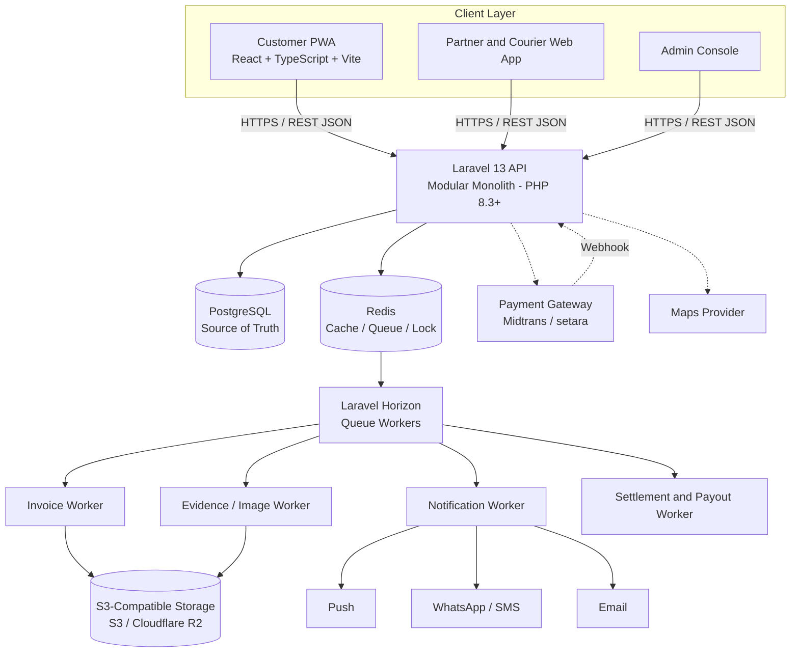
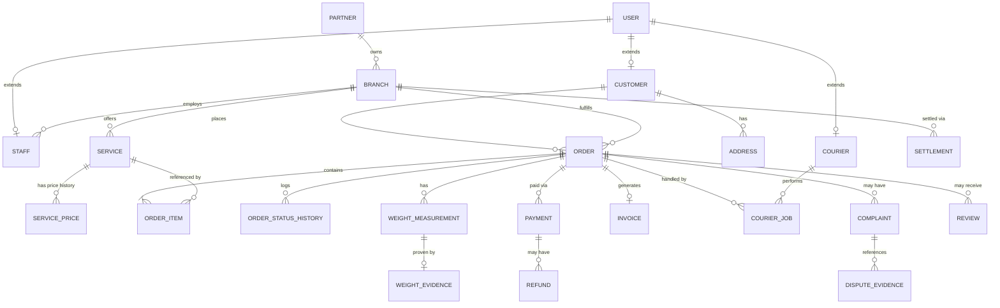
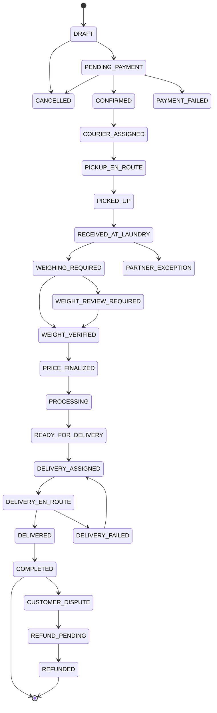
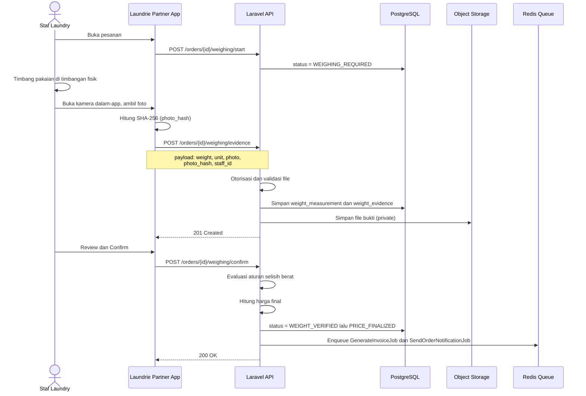
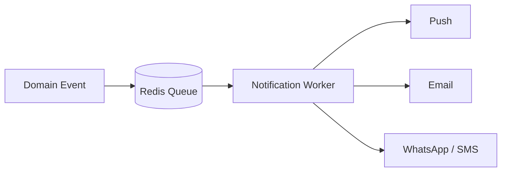

# Architecture Document — Laundrie

| | |
|---|---|
| **Produk** | Laundrie — Penjemputan, Pengantaran & Marketplace Laundry |
| **Diturunkan dari** | PRD Laundrie v2.0 (20 Agustus 2026) |
| **Versi dokumen** | 1.0 |
| **Status** | Draft — siap ditinjau tim engineering |
| **Gaya arsitektur** | Modular Monolith |
| **Terakhir diperbarui** | 20 Agustus 2026 |

## Cara Membaca Dokumen Ini

PRD menjelaskan **apa** yang harus dibangun dan **mengapa**. Dokumen ini menerjemahkannya menjadi **bagaimana** sistem disusun secara teknis: komponen, batas domain, model data, kontrak API, dan keputusan non-fungsional. Konten yang murni product/bisnis (persona, KPI bisnis, daftar layar UI, rencana tim) sengaja tidak diulang di sini — lihat PRD untuk itu.

Dokumen ini ditujukan untuk hidup di `docs/architecture/architecture.md` (lihat Bagian 19) dan diperbarui setiap kali ada keputusan arsitektur baru.

## Daftar Isi

1. Ringkasan Sistem
2. Prinsip dan Batasan Arsitektur
3. Aktor dan System Context
4. Keputusan Teknologi
5. Diagram Arsitektur Tingkat Tinggi
6. Modular Monolith: Batas Domain
7. Arsitektur Data
8. Order Lifecycle (State Machine)
9. Arsitektur API
10. Subsistem Bukti Berat (Trust Layer)
11. Object Storage dan Media
12. Arsitektur Pembayaran
13. Arsitektur Notifikasi
14. Background Processing
15. Autentikasi dan Otorisasi
16. Keamanan
17. Non-Functional Requirements
18. Strategi Pengujian
19. Struktur Repository dan Deployment
20. Evolusi Arsitektur Masa Depan
21. Risiko Teknis dan Mitigasi
22. Referensi

---

## 1. Ringkasan Sistem

Laundrie adalah platform orkestrasi tiga pihak (pelanggan, laundry mitra, kurir) yang meniru kemudahan model pesan-antar makanan, dengan satu pembeda utama: **setiap pesanan berbasis berat harus memiliki bukti foto penimbangan yang tidak dapat diubah** sebelum harga difinalisasi.

Secara arsitektur, sistem ini adalah:

- **Satu backend Laravel** yang diorganisasi per-domain (bukan per-microservice).
- **Satu database transaksional (PostgreSQL)** sebagai source of truth.
- **Redis** untuk queue, cache, dan lock — bukan sumber kebenaran bisnis.
- **Object storage S3-compatible** untuk semua media (bukti, invoice, dokumen).
- Frontend **React/TypeScript/Vite** sebagai PWA untuk pelanggan, dan aplikasi web yang sama untuk mitra/kurir.

Kompleksitas terbesar bukan pada teknologi, tapi pada **menjaga integritas alur operasional**: order → dispatch → pickup → intake → weighing evidence → price finalization → processing → delivery → completion, dengan audit trail penuh di setiap langkah.

---

## 2. Prinsip dan Batasan Arsitektur

### 2.1 Prinsip

| Prinsip | Implikasi Teknis |
|---|---|
| **Monolith-first, extract when proven** | Satu Laravel app dengan batas domain jelas (Bagian 6); ekstraksi ke service terpisah hanya setelah ada bottleneck yang terukur. |
| **Evidence over assertion** | Fakta operasional kritis (berat, pickup, delivery) wajib punya catatan sistem + bukti, bukan sekadar status flag. |
| **Riwayat immutable** | Status pesanan dan bukti yang sudah dikonfirmasi bersifat append-only; koreksi = record baru + invalidasi record lama, bukan overwrite. |
| **Boring technology di core** | Redis, bukan Kafka. Laravel, bukan Go. Sampai data skala membuktikan sebaliknya. |
| **Server adalah otoritas** | Otorisasi, finalisasi harga, dan status pembayaran selalu ditegakkan di server. Tampilan sukses di client tidak pernah jadi source of truth. |
| **Mobile-first untuk permukaan operasional** | Checkout pelanggan, layar penimbangan mitra, dan alur kurir dirancang untuk layar HP dan minim mengetik. |
| **Trust adalah infrastruktur** | Audit trail, hashing, dan timestamp adalah bagian dari desain sistem inti, bukan tooling admin tambahan belakangan. |

### 2.2 Di Luar Cakupan Arsitektur MVP

Komponen berikut secara sengaja **tidak** dirancang di MVP ini, dan tidak boleh diam-diam masuk lewat "sekalian aja":

- Dekomposisi microservices penuh / Kafka event streaming
- Service Go untuk dispatch/tracking (lihat Bagian 20 untuk kondisi pemicunya)
- Optimasi rute real-time / algoritma dispatch lanjutan
- Integrasi timbangan digital (Bluetooth/USB/networked API)
- Machine learning untuk pricing atau deteksi fraud
- Multi-region / multi-currency / multi-tax-jurisdiction
- Warehouse management penuh, robotic automation, deteksi kerusakan/bahan otomatis

---

## 3. Aktor dan System Context

| Aktor | Interaksi Utama dengan Sistem |
|---|---|
| Customer | Browse, order, pay, track, review, complain |
| Laundry Staff | Terima order, timbang, ambil bukti, proses, update status |
| Laundry Manager | Kelola cabang, layanan, staf, harga, laporan |
| Courier | Terima job, pickup, deliver, upload bukti |
| Operations Admin | Kelola order, partner, courier, sengketa |
| Finance Admin | Payment, refund, settlement, rekonsiliasi |
| Super Admin | Konfigurasi dan keamanan tingkat sistem |

Otorisasi untuk seluruh aktor **wajib ditegakkan di server**; menyembunyikan elemen UI di frontend bukan kontrol keamanan.

**Sistem eksternal:**

| Sistem | Peran |
|---|---|
| Payment gateway (Midtrans atau setara) | Memproses pembayaran, mengirim webhook status |
| Maps provider (Google Maps/Mapbox atau setara) | Geocoding alamat, kalkulasi jarak untuk pricing/dispatch |
| Push notification provider | Notifikasi in-app/mobile |
| WhatsApp/SMS gateway | Notifikasi operasional kritis |
| Email provider | Invoice, struk, notifikasi non-urgent |
| Object storage (S3/R2) | Penyimpanan bukti, invoice, dokumen mitra |

---

## 4. Keputusan Teknologi

| Layer | Keputusan MVP | Alasan |
|---|---|---|
| Frontend / PWA | React + TypeScript + Vite | Pengembangan cepat, mobile-first, satu codebase untuk customer/partner/courier UI |
| State management | Ringan, sesuai kebutuhan | Hindari kompleksitas state management berat di MVP |
| Styling | Tailwind CSS atau setara | Konsisten, cepat untuk UI operasional |
| Backend | Laravel 13 / PHP 8.3+ | Application framework matang, delivery MVP cepat: auth, ORM, queue, validation sudah tersedia |
| Arsitektur backend | Modular monolith | Deployment sederhana, batas domain jelas, siap diekstrak nanti |
| Auth | Laravel Sanctum | Cocok untuk pola SPA + PWA + mobile client berbasis token |
| Database | PostgreSQL | Integritas transaksi, relasi matang, JSONB untuk metadata fleksibel |
| Queue & cache | Redis + Laravel Horizon | Cukup untuk volume MVP, visibilitas queue operasional |
| Object storage | S3-compatible (S3 / Cloudflare R2) | Media dan invoice tahan lama, terpisah dari database |
| Payment | Midtrans atau setara | Integrasi pembayaran lokal Indonesia |
| Maps | Google Maps / Mapbox atau setara | Alamat dan kalkulasi jarak operasional |
| Realtime | WebSocket — nanti | Hanya jika kebutuhan operasional terbukti (mis. live tracking kurir) |
| Go | Kandidat service khusus masa depan | Diperkenalkan setelah kebutuhan scaling terukur (Bagian 20) |
| Kafka | Event streaming masa depan | Hanya setelah kebutuhan event terdistribusi nyata (Bagian 20) |

---

## 5. Diagram Arsitektur Tingkat Tinggi



Poin penting dari diagram ini:

- Semua client (customer, partner, courier, admin) berbicara ke **satu** REST API — tidak ada BFF terpisah per client di MVP.
- Redis **tidak pernah** menjadi tempat penyimpanan permanen data pesanan/pembayaran — hanya cache, queue, dan lock.
- Semua proses berat (generate invoice PDF, proses gambar bukti, kirim notifikasi, hitung settlement) berjalan **asynchronous** lewat queue worker, supaya request pelanggan tidak tertahan.

---

## 6. Modular Monolith: Batas Domain

Kode backend diorganisasi per-domain, bukan satu folder `controllers/` raksasa:

```
app/Domain/
  Auth/
  Customer/
  Partner/
  Courier/
  Order/
  Pricing/
  Weighing/
  Evidence/
  Payment/
  Invoice/
  Notification/
  Complaint/
  Settlement/
  Admin/
```

| Domain | Tanggung Jawab |
|---|---|
| Auth | Autentikasi dan manajemen sesi/token lintas semua tipe aktor |
| Customer | Profil pelanggan, alamat, preferensi notifikasi |
| Partner | Onboarding/verifikasi mitra, cabang, manajemen staf |
| Courier | Onboarding/verifikasi kurir, ketersediaan |
| Order | Siklus hidup pesanan, state machine, order item |
| Pricing | Kalkulasi harga estimasi/final, katalog layanan dan harga |
| Weighing | Alur penimbangan, pencatatan berat estimasi vs aktual |
| Evidence | Penyimpanan dan validasi bukti foto, hashing, immutability |
| Payment | Integrasi payment gateway, webhook, status pembayaran, refund |
| Invoice | Pembuatan invoice, penomoran, agregasi data final |
| Notification | Orkestrasi notifikasi lintas channel |
| Complaint | Alur komplain dan sengketa pelanggan |
| Settlement | Perhitungan payout mitra dan kurir |
| Admin | Tooling operasional lintas-domain: override, investigasi, konfigurasi |

Batas domain ini yang membuat ekstraksi ke service terpisah (Bagian 20) memungkinkan di masa depan **tanpa** memaksa microservices sejak hari pertama — setiap domain sudah punya boundary logis, tinggal dipindah jika perlu.

---

## 7. Arsitektur Data

### 7.1 Ringkasan Entitas

> Skema di bawah adalah **skema logis** (nama field, bukan tipe data fisik). Tipe, constraint, index, dan nullability difinalisasi saat desain migration.

| Entitas | Domain | Deskripsi |
|---|---|---|
| `users` | Identity | Akun login dasar untuk semua tipe aktor |
| `customers` | Identity | Profil pelanggan (extends `users`) |
| `staff` | Identity | Akun staf laundry, terikat ke branch |
| `couriers` | Identity | Akun kurir (extends `users`) |
| `partners` | Partner | Entitas bisnis laundry mitra |
| `branches` | Partner | Cabang operasional milik partner |
| `services` | Catalog | Layanan yang ditawarkan sebuah branch |
| `service_prices` | Catalog | Riwayat harga berversi per service *(diusulkan)* |
| `addresses` | Customer | Alamat tersimpan milik customer |
| `orders` | Order | Pesanan inti — pusat dari seluruh alur |
| `order_items` | Order | Baris item/layanan dalam satu order |
| `order_status_histories` | Order | Log transisi status order *(diusulkan)* |
| `weight_measurements` | Trust | Catatan berat estimasi/aktual — detail di Bagian 10 |
| `weight_evidences` | Trust | Bukti foto + metadata penimbangan, immutable — detail di Bagian 10 |
| `payments` | Finance | Transaksi pembayaran per order |
| `refunds` | Finance | Permintaan dan catatan refund *(diusulkan)* |
| `invoices` | Finance | Invoice final yang dihasilkan per order |
| `settlements` | Finance | Payout ke partner per periode *(diusulkan)* |
| `courier_jobs` | Logistics | Penugasan pickup/delivery ke kurir |
| `notifications` | Engagement | Log notifikasi terkirim *(diusulkan)* |
| `complaints` | Engagement | Komplain pelanggan terhadap order |
| `dispute_evidence` | Engagement | Kumpulan bukti pendukung kasus sengketa *(diusulkan)* |
| `reviews` | Engagement | Rating/ulasan terhadap partner/courier *(diusulkan)* |
| `audit_logs` | Platform | Log audit seluruh tindakan penting sistem |

*(diusulkan)* = struktur field belum eksplisit di PRD; diturunkan dari deskripsi fungsional terkait dan perlu dikonfirmasi saat implementasi.

### 7.2 ERD Tingkat Tinggi



### 7.3 Skema Tabel Inti

*(Tabel `weight_measurements` dan `weight_evidences` dibahas lengkap di Bagian 10.)*

**Identity**

`users`
```
id, name, email, phone, password_hash, status, last_login_at, created_at, updated_at
```
Field khusus provider autentikasi (mis. OAuth) sebaiknya ditambahkan sebagai tabel terpisah, bukan kolom tambahan di `users`.

`staff` *(diusulkan)*
```
id, user_id, branch_id, role, status, created_at, updated_at
```
`role` merujuk ke peran staf: penerimaan, pemrosesan, atau manajer (Bagian 15).

`couriers` *(diusulkan)*
```
id, user_id, vehicle_type, service_area, verification_status, status, payout_info, created_at, updated_at
```
Status onboarding kurir: `PENDING → VERIFIED → ACTIVE → SUSPENDED`.

`customers` *(diusulkan)*
```
id, user_id, name, phone, email, notification_preferences, created_at, updated_at
```

**Partner and Catalog**

`partners`
```
id, business_name, legal_name, owner_user_id, verification_status, status, contact_phone, contact_email, created_at, updated_at
```
Status verifikasi mitra: `PENDING → DOCUMENT_REVIEW → VERIFIED → ACTIVE`, dengan cabang `REJECTED / SUSPENDED / CLOSED`.

`branches`
```
id, partner_id, name, address_id, latitude, longitude, operating_hours, status, capacity_config, created_at, updated_at
```

`services`
```
id, branch_id, name, service_type, pricing_model, base_price, price_per_unit, unit, minimum_charge, estimated_duration, status, created_at, updated_at
```
Harga wajib **diberi versi** di implementasi produksi supaya invoice historis tetap benar meski harga berubah — lihat `service_prices`.

`service_prices` *(diusulkan)*
```
id, service_id, price_per_unit, base_price, minimum_charge, valid_from, valid_until, created_at
```

`addresses`
```
id, customer_id, label, recipient_name, phone, address_line, latitude, longitude, delivery_notes, is_default, status, created_at, updated_at
```
Visibilitas alamat lengkap dibatasi hanya ke aktor yang butuh secara operasional (kurir yang ditugaskan, staf cabang terkait).

**Order**

`orders`
```
id, order_number, customer_id, branch_id, pickup_address_id, delivery_address_id, status,
estimated_weight, actual_weight, estimated_total, final_total, currency,
scheduled_pickup_start, scheduled_pickup_end, scheduled_delivery_start, scheduled_delivery_end,
created_at, updated_at, completed_at
```
`actual_weight` di sini bisa didenormalisasi dari `weight_measurements` untuk kemudahan query — jika begitu, penulisan tetap harus lewat domain Weighing agar tidak ada dua source of truth yang bisa berbeda.

`order_items`
```
id, order_id, service_id, quantity, unit_price, estimated_amount, final_amount, metadata, created_at, updated_at
```

`order_status_histories` *(diusulkan)*
```
id, order_id, from_status, to_status, changed_by, reason, metadata, created_at
```
Ini adalah pelaksana teknis dari aturan "status tidak boleh diam-diam berubah" (Bagian 8) — setiap transisi tercatat, bukan hanya overwrite kolom `status`.

**Finance**

`payments`
```
id, order_id, provider, provider_reference, amount, currency, status, paid_at, metadata, created_at, updated_at
```

`refunds` *(diusulkan, berdasarkan kebutuhan data refund di PRD)*
```
id, order_id, payment_id, amount, reason, requested_by, approved_by, gateway_reference, status, created_at, updated_at
```

`invoices`
```
id, order_id, invoice_number, subtotal, fees, discount, tax, total, currency, status, pdf_path, generated_at, created_at, updated_at
```
Invoice adalah **representasi teragregasi**, bukan source of truth independen — rincian per komponen (estimasi vs aktual, biaya pickup/delivery/platform) direkonstruksi dari `orders`, `order_items`, dan `weight_measurements` saat PDF dibuat; tabel ini menyimpan ringkasan finansial + referensi ke bukti berat yang dipakai.

`settlements` *(diusulkan)*
```
id, branch_id, period_start, period_end, gross_amount, platform_commission, discounts_funded, adjustments, net_payable, status, paid_at, created_at, updated_at
```
Formula dasar: `net_payable = gross_amount − platform_commission − discounts_funded_by_platform ± adjustments`. Aturan settlement harus dapat dikonfigurasi dan diberi versi (bukan hardcode).

**Logistics**

`courier_jobs`
```
id, order_id, courier_id, job_type, status, assigned_at, accepted_at, started_at, completed_at, pickup_proof_path, delivery_proof_path, created_at, updated_at
```
`job_type` membedakan job pickup vs delivery untuk order yang sama.

**Engagement**

`complaints`
```
id, order_id, customer_id, category, status, priority, description, resolution, resolved_by, resolved_at, created_at, updated_at
```

`dispute_evidence` *(diusulkan)*
```
id, complaint_id, evidence_type, reference_table, reference_id, added_by, created_at
```
Tabel penghubung yang mengaitkan sebuah komplain ke bukti pendukung lintas domain: timeline order, bukti penimbangan, bukti pickup/delivery, foto kerusakan, catatan mitra.

`reviews` *(diusulkan)*
```
id, order_id, customer_id, target_type, target_id, rating, comment, status, created_at
```
`target_type` adalah `partner` atau `courier`. Rating hanya boleh dibuat setelah order `COMPLETED`, dan perlu moderasi dasar untuk mencegah spam.

`notifications` *(diusulkan)*
```
id, recipient_type, recipient_id, channel, event_type, payload, status, sent_at, created_at
```

**Platform**

`audit_logs`
```
id, actor_type, actor_id, action, entity_type, entity_id, old_values, new_values, metadata, ip_address, user_agent, created_at
```
Nilai sensitif (mis. detail pembayaran) harus disamarkan sebelum masuk `old_values`/`new_values`. Kebijakan retensi ditetapkan sebelum go-live (Bagian 16.4).

---

## 8. Order Lifecycle (State Machine)

### 8.1 Diagram Status



> Jalur utama (`DRAFT` → ... → `COMPLETED`) eksplisit di PRD (Lampiran A). Pengkabelan status pengecualian (`CANCELLED`, `PARTNER_EXCEPTION`, dst.) ke jalur utama di atas adalah **interpretasi arsitektur** berdasarkan aturan di Bagian 8.2 — perlu dikonfirmasi/disempurnakan tim saat implementasi state machine sesungguhnya.

### 8.2 Aturan Transisi

Backend **wajib** menegakkan transisi valid — ini bukan validasi UI. Contoh aturan eksplisit dari PRD:

- `PROCESSING → COMPLETED` tidak boleh terjadi tanpa event delivery yang diperlukan.
- `RECEIVED_AT_LAUNDRY → PROCESSING` tidak boleh terjadi untuk layanan berbasis berat sampai bukti penimbangan dikonfirmasi — **kecuali** override admin, yang harus tercatat eksplisit di `audit_logs`.
- Setiap transisi idealnya menulis satu baris ke `order_status_histories` (Bagian 7.3), bukan hanya meng-update kolom `status`.

### 8.3 Aturan Pembatalan

Aturan bergantung pada status saat ini, dan harus dapat dikonfigurasi (bukan hardcode di kode aplikasi):

| Fase | Kebijakan Default |
|---|---|
| Sebelum kurir ditugaskan | Pelanggan bebas membatalkan |
| Setelah dispatch pickup | Pembatalan bisa dikenai biaya |
| Setelah laundry menerima pakaian | Perlu kebijakan operasional (refund parsial dsb.) |
| Setelah processing dimulai | Umumnya tidak diizinkan kecuali via admin/support |

### 8.4 Dispatch Kurir (MVP)

Penugasan kurir MVP memakai aturan sederhana, bukan optimizer:

```
kandidat = kurir yang AVAILABLE
        DAN service_area mencakup lokasi pickup/delivery
        DAN job aktif saat ini < kapasitas
diurutkan berdasarkan jarak perkiraan
```

Optimasi rute/batching lanjutan sengaja ditunda sampai volume transaksi membenarkannya (lihat Bagian 20 untuk jalur evolusi ke service dispatch Go).

---

## 9. Arsitektur API

### 9.1 Konvensi

- RESTful, JSON, di-versi sejak awal: `/api/v1/...`
- Autentikasi via Bearer token (Sanctum); role/permission dicek di setiap endpoint melalui policy (Bagian 15).
- Endpoint list wajib pagination (Bagian 17).
- Endpoint kritis wajib idempotent terhadap request duplikat (Bagian 14.3).

### 9.2 Route Groups

```
/api/v1/auth
/api/v1/customers
/api/v1/partners
/api/v1/branches
/api/v1/services
/api/v1/orders
/api/v1/payments
/api/v1/courier
/api/v1/evidence
/api/v1/invoices
/api/v1/complaints
/api/v1/admin
```

### 9.3 Contoh Alur — Pesanan

```
POST /api/v1/orders                    → order dibuat (DRAFT)
POST /api/v1/orders/{id}/confirm        → payment/confirmation → dispatch → partner intake
```

### 9.4 Contoh Alur — Bukti Penimbangan

```
POST /api/v1/orders/{order}/weighing/start
POST /api/v1/orders/{order}/weighing/evidence
POST /api/v1/orders/{order}/weighing/confirm
GET  /api/v1/orders/{order}/weighing
```

Detail lengkap subsistem ini ada di Bagian 10.

---

## 10. Subsistem Bukti Berat (Trust Layer)

Ini adalah **bagian paling kritis** dari seluruh arsitektur — pembeda produk (bukan Kafka, bukan Go, bukan microservices) adalah alur operasional yang bisa dipercaya dengan bukti transparan. Order tidak boleh mencapai `PRICE_FINALIZED` tanpa melewati subsistem ini secara benar.

### 10.1 Skema Data

`weight_measurements`
```
id, order_id, measurement_type, estimated_value, actual_value, unit, evidence_id, recorded_by, recorded_at, status, created_at, updated_at
```

`weight_evidences`
```
id, order_id, measurement_id, branch_id, staff_id, weight, unit, photo_path, photo_hash, captured_at, confirmed_at, status,
device_id, latitude, longitude, invalidated_at, invalidated_by, invalidation_reason, created_at, updated_at
```

Field wajib minimum untuk bukti: order ID, partner ID, staff ID, berat terukur, unit, timestamp pengambilan, foto bukti, hash foto, status bukti. Field opsional: device ID, lokasi perkiraan (jika diizinkan), identitas timbangan, session ID pengambilan.

`latitude`/`longitude` hanya disimpan jika ada justifikasi hukum/operasional yang jelas (Bagian 16.3).

### 10.2 Alur Capture

Alur wajib di UI (kamera dalam-app, **bukan** upload dari galeri, untuk mengurangi reuse foto lama yang tidak relevan — ini bukan mencegah kecurangan sepenuhnya, hanya menaikkan biayanya):

```
Open order → Start weighing → Open camera → Capture photo → Preview → Confirm → Submit evidence
```



### 10.3 Immutability dan Alur Koreksi

Setelah bukti dikonfirmasi, record **tidak boleh diedit diam-diam**. Jika terjadi kesalahan (mis. kamera terhalang), alurnya adalah membuat record baru, bukan menimpa yang lama:

```
Evidence #1 → status: INVALIDATED, reason: "Camera obstructed"
Evidence #2 → status: CONFIRMED
```

Kedua record dipertahankan untuk keperluan audit. Secara praktis: field bukti kritis bersifat append-only pasca-konfirmasi; "koreksi" selalu berarti invalidasi + record baru, dicatat dengan `invalidated_by` dan `invalidation_reason`.

### 10.4 Integritas Kriptografis dan Watermark

- Setiap file bukti di-hash dengan **SHA-256** saat capture → `photo_hash`. Ini memberi verifikasi integritas file (kalau file berubah, hash berubah) — **bukan** bukti bahwa timbangan fisiknya sendiri akurat.
- Representasi bukti (yang ditampilkan ke pelanggan) diberi watermark dengan metadata dari catatan sistem — bukan teks manual dari staf:

```
LAUNDRIE
Order: LDR-2026-000183
Weight: 4.60 KG
Captured: 20 Aug 2026 14:32:18
Laundry: CleanWash
Staff: ST-002
Evidence: WE-000183
```

- File asli dan versi tampilan/watermark dikelola sesuai kebijakan retensi (Bagian 16.4), dan disimpan terpisah dari file asli yang immutable.

### 10.5 Storage dan Akses

- File bukti disimpan di object storage **private** (S3/R2), bukan public bucket.
- Akses ke bukti asli selalu lewat **signed URL berumur pendek** setelah otorisasi Laravel — tidak ada URL publik permanen.

```
Customer/staff request evidence → Laravel authorization → Generate short-lived signed URL → Object storage
```

Detail alur upload umum ada di Bagian 11.

### 10.6 Aturan Selisih Berat

Ambang selisih dapat dikonfigurasi; nilai berikut adalah default awal, dikalibrasi ulang dari data pilot:

| Selisih dari Estimasi | Tindakan |
|---|---|
| ≤ 10% | Alur normal — finalisasi otomatis |
| > 10% | Notifikasi pelanggan |
| > 30% | Review manual / konfirmasi eksplisit pelanggan |

```
weight_difference_pct = (actual − estimated) / estimated × 100
```

Dikelompokkan per partner, branch, staff, service, dan tanggal untuk kebutuhan monitoring (10.7).

### 10.7 Audit Trail, Monitoring Kepatuhan, dan Anomali

Setiap event kritis dicatat dengan aktor, timestamp, aksi, entity target, metadata, dan sumber (skema di `audit_logs`, Bagian 7.3):

```
ORDER #LDR-000183
├── 14:21 Courier pickup
├── 14:31 Laundry received
├── 14:32 Weighing started
├── 14:32 Evidence captured (Weight 4.60 KG, Staff ST-002, Evidence WE-000183)
├── 14:33 Customer notified
├── 14:35 Price finalized
└── 14:36 Processing started
```

Dashboard kepatuhan bukti operasional memantau:

```
Evidence Compliance Rate    = valid evidence orders / applicable orders
Weight Dispute Rate         = weight-related disputes / completed orders
Average Weight Variance     = average |actual − estimated| percentage
Evidence Invalidation Rate  = invalidated evidence / submitted evidence
```

Sinyal yang perlu ditinjau manusia (bukan tuduhan otomatis): variansi berat sangat tinggi *atau* sangat rendah secara konsisten, tingkat invalidasi bukti tinggi, kegagalan capture berulang, timestamp mencurigakan, override manual berlebihan, konsentrasi sengketa tidak wajar — disegmentasi per mitra dan staf.

### 10.8 Postur Anti-Fraud

Kontrol yang dipakai bersama-sama (tidak ada satupun yang menjamin sendirian): kamera dalam-app, hash bukti, timestamp sistem, record immutable, identitas staf, metadata perangkat, dashboard anomali, review admin, dan (masa depan) integrasi timbangan digital.

---

## 11. Object Storage dan Media

Semua media disimpan di object storage S3-compatible (S3 atau Cloudflare R2): foto penimbangan, foto kerusakan, bukti pickup/delivery, invoice PDF, dan dokumen verifikasi mitra. **Database hanya menyimpan object key dan metadata**, tidak pernah file biner besar.

Alur upload umum:

```
Mobile camera → Client-side validation → Authenticated upload →
Object storage (temporary/private) → Backend records metadata →
Hash verification → Evidence confirmation → Immutable record
```

Ketentuan keamanan upload spesifik ada di Bagian 16.2. Pola signed-URL untuk bukti berat ada di Bagian 10.5 — pola yang sama berlaku untuk seluruh media privat lain (dokumen mitra, bukti kerusakan, dsb).

---

## 12. Arsitektur Pembayaran

### 12.1 Prinsip Inti

Backend menyimpan payment intent/referensi, relasi order, jumlah, mata uang, status, referensi respons gateway, dan timestamp. **Tampilan sukses pembayaran di client tidak pernah menjadi source of truth** — status resmi hanya berubah lewat webhook yang tervalidasi di server.

### 12.2 Status Pembayaran

```
PENDING → AUTHORIZED → PAID
        → FAILED
        → EXPIRED
PAID → REFUND_PENDING → REFUNDED / PARTIALLY_REFUNDED
```

Status persis bergantung pada kapabilitas gateway yang dipakai.

### 12.3 Webhook

```
Payment Gateway → Webhook → Laravel →
Signature/authenticity validation → Idempotent payment update → Order state update
```

Webhook duplikat **tidak boleh** menghasilkan tagihan atau perubahan status ganda — lihat Bagian 14.3 untuk pola idempotency.

### 12.4 Refund

Data wajib per refund: ID refund, ID order, ID payment, jumlah, alasan, diminta oleh, disetujui oleh, referensi gateway, status, timestamp — lihat skema `refunds` (Bagian 7.3). Seluruh permintaan refund harus dapat diaudit.

### 12.5 Settlement Mitra dan Pendapatan Kurir

```
Partner payable = Gross customer payment
                 − platform commission
                 − discounts funded by platform
                 ± delivery/platform adjustments

Courier payout  = Base delivery fee
                 + distance/zone adjustment
                 + peak bonus (jika aktif)
                 − deductions
```

Aturan settlement harus dapat dikonfigurasi **dan diberi versi**, supaya perhitungan historis tidak berubah ketika aturan baru diterapkan.

---

## 13. Arsitektur Notifikasi

Channel: push notification, WhatsApp/SMS untuk event operasional kritis, email untuk invoice/struk.



Event pemicu utama meliputi: order dikonfirmasi, kurir ditugaskan/tiba, pakaian dijemput/diterima, penimbangan selesai, harga final tersedia, processing dimulai, siap diantar, delivery ditugaskan/selesai, event payment/refund, dan update sengketa.

---

## 14. Background Processing

### 14.1 Peran Redis

```
Laravel
  ├── PostgreSQL → durable business data (source of truth)
  └── Redis
       ├── Queue
       ├── Cache
       └── Lock
```

Redis **bukan** sumber kebenaran utama untuk order atau pembayaran — kalau Redis di-flush, tidak boleh ada data bisnis yang hilang, hanya job yang tertunda/di-retry.

### 14.2 Daftar Job

| Job | Tujuan |
|---|---|
| `GenerateInvoiceJob` | Generate PDF invoice pasca `PRICE_FINALIZED`, simpan ke object storage |
| `SendOrderNotificationJob` | Kirim notifikasi perubahan status order |
| `SendPaymentNotificationJob` | Kirim notifikasi event pembayaran |
| `ProcessEvidenceImageJob` | Proses gambar bukti (resize, watermark) |
| `GenerateSignedEvidenceVariantJob` | Buat varian bukti bertanda-air untuk tampilan pelanggan |
| `PartnerSettlementJob` | Hitung settlement mitra per periode |
| `CourierPayoutJob` | Hitung payout kurir per periode |
| `CleanupTemporaryUploadsJob` | Bersihkan upload sementara yang tidak dikonfirmasi |

Semua job harus **retry-able dan idempotent** — lihat 14.3.

Contoh alur invoice, sebagai ilustrasi kenapa ini async:

```
Order finalized → Event → Redis Queue → Invoice Worker →
Generate PDF → Object Storage → Store invoice path
```

Ini mencegah pembuatan PDF menghambat request checkout/pesanan pelanggan.

### 14.3 Idempotensi

Endpoint dan job berikut wajib idempotent terhadap request/eksekusi duplikat, supaya retry tidak menghasilkan efek bisnis ganda:

- Webhook pembayaran
- Konfirmasi pesanan
- Konfirmasi bukti penimbangan
- Pembuatan refund
- Aksi penugasan kurir

### 14.4 Scheduled Job

Laravel Scheduler menangani: deteksi order stale, pembayaran kedaluwarsa, pembersihan order belum dibayar, pengingat notifikasi, generasi settlement, agregasi analitik harian, dan pembersihan upload sementara.

---

## 15. Autentikasi dan Otorisasi

### 15.1 Role dan Hak Akses

| Role | Hak Akses Utama |
|---|---|
| Customer | Lihat, pesan, bayar, lacak, review, ajukan sengketa |
| Laundry Staff | Terima, timbang, upload bukti, proses, update status |
| Laundry Manager | Kelola cabang, layanan, staf, harga, pesanan, laporan |
| Courier | Lihat job, pickup, deliver, upload bukti |
| Operations Admin | Kelola order, user, partner, courier, sengketa |
| Finance Admin | Payment, refund, settlement, rekonsiliasi |
| Super Admin | Konfigurasi penuh platform |

**Hak akses wajib ditegakkan di server.** Menyembunyikan elemen di frontend bukan kontrol keamanan.

### 15.2 Kontrol Autentikasi

- Password hashing yang aman
- Kedaluwarsa session/token
- Verifikasi email/nomor telepon jika diperlukan
- MFA opsional untuk role dengan hak istimewa
- Rate limiting login
- Manajemen perangkat/session untuk role sensitif

### 15.3 Otorisasi Berbasis Policy

Contoh aturan: pelanggan hanya melihat order miliknya sendiri; staf melihat order yang ditugaskan ke branch-nya; kurir melihat job yang ditugaskan kepadanya; manajer mitra melihat order lintas-branch miliknya; admin mengakses lintas platform sesuai role.

---

## 16. Keamanan

### 16.1 Persyaratan Minimum

HTTPS di seluruh sistem; autentikasi aman; otorisasi sisi server; validasi input; encoding output; proteksi CSRF; rate limiting; validasi upload file aman; strategi pemindaian malware/konten untuk file yang diunggah; manajemen secret; backup database; audit logging; least privilege.

### 16.2 Keamanan Upload File

Upload bukti wajib memvalidasi: pengguna terautentikasi, otorisasi, tipe file, MIME type, ukuran file, dimensi gambar, konsistensi ekstensi/konten, isolasi path penyimpanan. **Jangan pernah mempercayai filename atau MIME type dari client saja.**

### 16.3 Privasi

Sistem menangani data pribadi: nama, nomor telepon, alamat, riwayat pesanan, referensi pembayaran, gambar bukti. Akses dibatasi berdasarkan role dan kebutuhan bisnis. Metadata lokasi (`latitude`/`longitude` pada evidence/address) harus opsional dan diminimalkan kecuali benar-benar diperlukan untuk fitur operasional tertentu.

### 16.4 Retensi Data

Kebijakan retensi perlu ditetapkan **sebelum go-live** untuk: invoice, foto bukti, bukti kurir, audit log, catatan pembayaran, dan komplain — mengikuti persyaratan hukum, akuntansi, kontraktual, dan operasional yang berlaku.

---

## 17. Non-Functional Requirements

### 17.1 Performa (target engineering, bukan jaminan)

- Response API normal umumnya di bawah 500ms, tidak termasuk latensi provider eksternal.
- Upload gambar bersifat asynchronous.
- Generasi invoice tidak boleh menghambat checkout/pemesanan.
- Endpoint list wajib pagination.
- Query database wajib terindeks dan dipantau.

### 17.2 Ketersediaan

Environment produksi dipantau; backup otomatis; health check; monitoring queue; prosedur dasar pemulihan insiden. Investasi infrastruktur multi-region ditunda sampai bisnis benar-benar membutuhkannya.

### 17.3 Observability

Pantau: error API, kegagalan queue, kegagalan webhook pembayaran, kegagalan upload bukti, kegagalan generasi invoice, performa database, error storage, kegagalan notifikasi. Gunakan structured logging dengan request ID/order ID untuk tracing lintas layanan.

### 17.4 Idempotensi

Lihat Bagian 14.3.

---

## 18. Strategi Pengujian

| Level | Cakupan |
|---|---|
| Unit | Aturan harga, kalkulasi selisih berat, transisi status, hak akses, kalkulasi settlement |
| Feature/API | Pembuatan order, webhook payment, alur penimbangan, konfirmasi bukti, trigger invoice, alur komplain |
| Integrasi | Sandbox payment gateway, object storage, Redis queue, provider notifikasi |
| End-to-End | Alur penuh: order → payment → pickup → laundry intake → weighing evidence → processing → delivery → completion |

---

## 19. Struktur Repository dan Deployment

```
laundrie/
├── apps/
│   ├── web/
│   │   ├── src/
│   │   │   ├── features/
│   │   │   │   ├── auth/
│   │   │   │   ├── customer/
│   │   │   │   ├── partner/
│   │   │   │   ├── courier/
│   │   │   │   ├── orders/
│   │   │   │   ├── weighing/
│   │   │   │   ├── evidence/
│   │   │   │   └── invoices/
│   │   │   └── shared/
│   │   └── public/
│   │
│   └── api/
│       ├── app/
│       │   └── Domain/
│       │       ├── Auth/
│       │       ├── Customer/
│       │       ├── Partner/
│       │       ├── Courier/
│       │       ├── Order/
│       │       ├── Pricing/
│       │       ├── Weighing/
│       │       ├── Evidence/
│       │       ├── Payment/
│       │       ├── Invoice/
│       │       ├── Notification/
│       │       ├── Complaint/
│       │       ├── Settlement/
│       │       └── Admin/
│       ├── routes/
│       └── tests/
│
├── infrastructure/
│   ├── docker/
│   └── nginx/
│
├── docs/
│   ├── architecture/     ← dokumen ini
│   ├── api/
│   └── operations/
│
└── README.md
```

> **Catatan koreksi:** Lampiran C pada PRD tidak menyertakan folder `Settlement/` di `app/Domain/`, padahal Bagian 103 PRD dan fungsionalitas settlement mitra/kurir (Bagian 12.5 dokumen ini) jelas membutuhkannya. Folder tersebut ditambahkan di struktur di atas untuk konsistensi.

Detail deployment (topologi container, CI/CD, environment) belum dispesifikasikan di PRD selain penyediaan folder `infrastructure/docker/` dan `infrastructure/nginx/` — runbook operasional sebaiknya disusun terpisah di `docs/operations/` begitu keputusan itu diambil.

---

## 20. Evolusi Arsitektur Masa Depan

### 20.1 Kenapa Bukan Kafka di MVP

Kafka relevan ketika platform butuh event streaming durable berskala besar lintas banyak service dan consumer independen. Untuk MVP, Kafka hanya menambah beban operasional (cluster, topic, consumer, monitoring, deployment) tanpa masalah bisnis yang membenarkannya. Pemicu untuk mempertimbangkannya kembali:

```
Multiple independent services
+ high event volume
+ replayable event streams
+ analytics/event consumers
+ operational need for distributed event architecture
```

### 20.2 Kenapa Bukan Go untuk Backend MVP

Go kuat untuk service concurrent, tapi memakainya sebagai seluruh backend MVP berarti membangun ulang infrastruktur aplikasi yang sudah disediakan Laravel (auth, CRUD, validasi, ORM, queue, notifikasi, scheduled task). Prioritas MVP adalah memvalidasi bisnis, meluncurkan alur operasional, dan mengumpulkan data — bukan memaksimalkan concurrency yang belum terbukti dibutuhkan.

### 20.3 Kandidat Service Go Masa Depan

1. Dispatch kurir
2. Pemrosesan lokasi real-time
3. Optimasi rute
4. Gateway tracking volume tinggi
5. Worker pemrosesan gambar (jika beban CPU meningkat)

Contoh evolusi dispatch:

```
Laravel → Dispatch API/Event → Go Dispatch Service →
Courier availability → Location/route calculations
```

Batas service baru dibuat berdasarkan **masalah scaling yang nyata**, bukan preferensi teknologi.

### 20.4 Realtime

WebSocket ditunda sampai kebutuhan operasional terbukti (mis. live tracking kurir pada volume tinggi) — bukan default MVP.

### 20.5 Integrasi Timbangan Digital

Versi mendatang dapat mengintegrasikan timbangan digital kompatibel via Bluetooth, USB/local gateway, atau API timbangan berjaringan:

```
Digital Scale → Weight reading → Laundrie app → Verified measurement → Evidence capture
```

Ini mengurangi input manual dan meningkatkan integritas pengukuran — pelengkap, bukan pengganti, subsistem bukti di Bagian 10.

---

## 21. Risiko Teknis dan Mitigasi

| Risiko | Mitigasi Arsitektur |
|---|---|
| Bukti berat menambah friksi operasional bagi staf | Alur kamera satu-ketukan, metadata otomatis, minim mengetik, integrasi timbangan digital di masa depan (20.5) |
| Fraud tetap mungkin terjadi meski ada kontrol | Kombinasi evidence + audit trail + monitoring anomali (10.7–10.8); bukan solusi tunggal |
| Engineering menjadi terlalu kompleks terlalu dini | Modular monolith, Redis alih-alih Kafka, Laravel alih-alih Go prematur; ekstraksi service hanya setelah kebutuhan terukur (Bagian 20) |

Risiko bisnis (permintaan pasar, adopsi mitra, ekonomi kurir) dibahas di PRD dan sengaja tidak diulang di sini karena bukan risiko arsitektur.

---

## 22. Referensi

- PRD sumber: `laundrie-prd-v2-id.md` (v2.0, 20 Agustus 2026)
- Lampiran A (State Machine Lengkap), Lampiran B (Urutan Bukti Penimbangan), Lampiran C (Struktur Repository), Lampiran D (Definition of Done), Lampiran E (Keputusan Teknologi), dan Lampiran F (North Star Produk) pada PRD adalah sumber utama sebagian besar diagram dan tabel di dokumen ini.

Dokumen ini sebaiknya diperbarui setiap kali ada keputusan arsitektur baru, dan ditinjau ulang setiap kali PRD naik versi.
